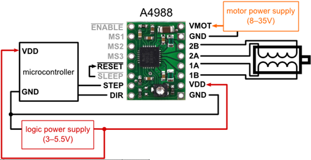

## PROJETO DO SUBSISTEMA DE ELETRÔNICA.

## Motor de Passo

O Motor de Passo é um motor elétrico utilizado para controle de movimentos de forma precisa, este controle é feito através de passos ou graus, com isso é controlar o motor de forma precisa sem o uso de sensores para determinar a posição do motor. Os motores desse tipo são controlados através de sinais digitais enviados para as suas bobinas, possibilitando a rotação fracionada do eixo, sem a necessidade de escovas internas <a href=“../eletronica-energia/Projeto_do_Subsistema_de_Energia.md#ref-1“> [1] </a>.

## Estrutura do Motor de Passo
As características do Motor de Passo, no que diz respeito à velocidade, torque e resolução serão definidas primeiramente pela estrutura do motor, então é importante conhecer os aspectos internos e a função das peças que compõem o motor.

**Figura 1:** Estrutura interna do motor de passo <a href=“../eletronica-energia/Projeto_do_Subsistema_de_Energia.md#ref-1“> [1] </a>..

## Rotor
Uma das partes mais importantes do motor de passo é o rotor, na figura 1, é mostrado  um motor com rotor híbrido, o corpo que representa o rotor híbrido é composto pelos dois rotores e o imã entre eles, utilizado para a polarização do rotor frontal e o traseiro <a href=“../eletronica-energia/Projeto_do_Subsistema_de_Energia.md#ref-1“> [1] </a>..
Existem três configurações possíveis de montagem para o rotor: rotor de imã permanente, rotor de relutância variávele rotor híbrido, o tipo híbrido é o mais comumente utilizado, estas diferenças são apresentadas na tabela 1.

**Tabela 1:** Diferenças entre os rotores

## Estator
O Estator produz o campo magnético que causa a movimentação do rotor. Para análise do estator é necessário tomar nota de alguns pontos como: o número de fases, de par de polos e configuração do fio. A fase ou o par de polos é formado por duplas de bobinas que são energizadas simultaneamente.
A estrutura do estator é formada por polos magnéticos dentados, sendo que cada polo é dotado de uma bobina com o seu par oposto, de forma que os pares são energizados simultaneamente e por consequência são magnetizados com a mesma polaridade, os dois polos formam uma fase. 
O primeiro modelo do exemplo abaixo é do tipo estator bifásico, com fases A e B, enquanto o segundo é do tipo estator trifásico, com fases A, B e C.

**Figura 2:** Modelo de um estator bifásico

**Figura 3:** Estator real

A figura 2, mostra uma representação gráfica da distribuição das bobinas no estator, já a figura 3, mostra uma imagem de um estator real, com seus dentes e bobinas em enrolamento de cobre.

O eixo do motor híbrido é construído com dois grupos dentados de rotores, um deles polarizados com polo sul e outro com polo norte.

**Figura 4:** Modelo do eixo do motor <a href=“../eletronica-energia/Projeto_do_Subsistema_de_Energia.md#ref-1“> [1] </a>.

## Tipos de Polos
Existem dois modelos de acordo com os polos, o bipolar e o unipolar, os termos surgiram de conformidade com os drivers que são utilizados para acionamento desses motores. O polar do termo representa “polaridade” e se refere ao driver utilizado para controle desses motores, utilizaremos as expressões “motor unipolar” e “motor bipolar” por convenção social [1].
 
## Unipolar
O modelo utilizado com o driver Unipolar conta com duas bobinas por fase, formando um par de polos, além disso, há o contato em comum, dessa forma os motores desse tipo podem ter 5, 6 ou 8 fios [1].

**Figura 5:** Driver unipolar <a href=“../eletronica-energia/Projeto_do_Subsistema_de_Energia.md#ref-1“> [1] </a>.

Com o fio central é possível controlar a direção da corrente, no entanto apenas metade da bobina pode ser utilizada, isso faz com que o motor seja menos eficiente se comparado ao bipolar. O fio central é conectado ao Vin do circuito, sendo que se o Mosfet 1 estiver ativo, a corrente fluirá de Am para A+, se o Mosfet ativo for o 2, a corrente fluirá de Am para A-.

**Figura 5:** Diagrama circuito unipolar <a href=“../eletronica-energia/Projeto_do_Subsistema_de_Energia.md#ref-1“> [1] </a>.

## Bipolar
No motor do tipo bipolar, cada bobina é composta por dois fios apenas, sem derivações centrais como as do tipo unipolar, de forma que são motores mais fáceis de serem produzidos.

**Figura 7:** Dirver bipolar <a href=“../eletronica-energia/Projeto_do_Subsistema_de_Energia.md#ref-1“> [1] </a>.

Como não há a derivação central, para controle de direção é necessário utilizar uma ponte H, exigindo um circuito de acionamento mais complexo. Para os motores desse tipo, temos que a corrente flui de A- para A+ quando os Mofets 2 e 3 estão ativos, e flui de A+ para A- quando 1 e 4 estão ativos. Apesar de possuir um acionamento mais complexo, os motores do tipo bipolar são mais comuns, pois permitem que o motor atinja maior torque <a href=“../eletronica-energia/Projeto_do_Subsistema_de_Energia.md#ref-1“> [1] </a>.
 

**Figura 8:** Diagrama circuito bipolar <a href=“../eletronica-energia/Projeto_do_Subsistema_de_Energia.md#ref-1“> [1] </a>.

## Funcionamento de um motor de passo:

O motor de passo é um dispositivo eletromecânico composto por bobinas (indutores) e um rotor magnético (ímã permanente ou imantado). As bobinas convertem energia elétrica em campo magnético, alinhando o rotor a esse campo. A excitação correta das bobinas faz o rotor, que gira em torno de seu eixo, mover-se no sentido desejado, convertendo energia magnética em movimento (energia mecânica). O rotor é rotacionado em pequenos incrementos angulares, chamados de "passos" <a href=“../eletronica-energia/Projeto_do_Subsistema_de_Energia.md#ref-2“> [2] </a>.

O funcionamento básico do motor de passo envolve o uso de bobinas alinhadas dois a dois. Quando energizadas, elas atraem o rotor, alinhando-o com o campo magnético gerado, resultando em uma variação angular pequena, chamada de passo. A velocidade e o sentido de movimento são determinados pela forma como cada bobina é ativada, incluindo a ordem e a velocidade entre cada processo de ativação <a href=“../eletronica-energia/Projeto_do_Subsistema_de_Energia.md#ref-2“> [2] </a>.

As vantagens do motor de passo incluem sua precisão de posicionamento e torque aplicado, além de ter uma resposta excelente na aceleração e desaceleração, devido à sua lógica digital. No entanto, ele pode apresentar baixo desempenho em alta velocidade, requer um certo grau de complexidade para operação e pode sofrer ressonância devido a um controle inadequado <a href=“../eletronica-energia/Projeto_do_Subsistema_de_Energia.md#ref-2“> [2] </a>.

Complementando com o banco de dados, o motor de passo é frequentemente utilizado em aplicações que exigem precisão de posicionamento, como impressoras 3D, máquinas CNC e robótica industrial. Ele oferece um controle preciso sobre o movimento, o que é essencial em muitas aplicações. Além disso, o motor de passo pode ser facilmente controlado por microcontroladores, o que o torna uma escolha popular em projetos eletrônicos e de automação <a href=“../eletronica-energia/Projeto_do_Subsistema_de_Energia.md#ref-2“> [2] </a>.

A figura a seguir mostra como um motor de passo pode ser controlado mediante lógica binária
 

**Figura 9:** Motor de passo controlado pelas entradas To até T3 <a href=“../eletronica-energia/Projeto_do_Subsistema_de_Energia.md#ref-2“> [2] </a>.

## Placa Arduino Uno

O Arduino Uno é uma placa microcontrolada baseada no chip ATmega328. Esta placa é muito utilizada no desenvolvimento de projetos embarcados, é hoje em dia é a mais utilizada e documentada da família Arduino.

	 

**Figura 10:** Placa Arduino Uno, diagrama de barramento e diagrama esquemático. Fonte(Propria)

A placa conta com um chip ATmega328 que é um microcontrolador único desenvolvido pela Atmel, pertencente à família megaAVR. A arquitetura do Arduino Uno segue o padrão Harvard e possui um núcleo de processador RISC de 8 bits customizado.

**Figura 11:** Diagrama de pinos da placa Arduino Uno <a href=“../eletronica-energia/Projeto_do_Subsistema_de_Energia.md#ref-3“> [3] </a>.

 
## Características principais do Arduino Uno

 - A tensão de operação é 5V
 - A tensão de entrada recomendada varia de 7V a 12V
 - A tensão de entrada varia de 6V a 20V
 - 14 pinos de entrada/saída digital
 - 6 pinos analógicos
 - A corrente DC para cada pino de entrada/saída é de 40 mA
 - A corrente DC para o pino de 3,3 V é 50 mA
 - A memória flash é de 32 KB
 - SRAM é 2KB
 - EEPROM é 1 KB
 - A velocidade do CLK é de 16 MHz

 

## Diagrama de pinos do Arduino Uno

A placa do Arduino Uno conta com uma grande variedade de pinos de alimentação, pinos analógicos, ATmega328, conector ICSP, botão Reset, LED de alimentação, pinos digitais, led de teste, pinos TX/RX, interface USB e fonte de alimentação externa, na figura 12, se apresentam estes pinos.

**Figura 12:** Diagrama de Pinos do microcontrolador ATmega328

A seguir se faz a descrição de cada um deles.

## Descrições principais para utilização do Arduino Uno

## Fonte de Alimentação

Esta placa conta com uma grande vantagem e é poder ligar ela de forma externa com ajuda de um cabo USB ou uma fonte de alimentação externa, além disso, as fontes de alimentação externas incluem principalmente um conversor AC para DC, caso contrário, uma bateria. A fonte deve ser inserida no conector de alimentação da placa Arduino. Suas faxas de tensão estão entre 7 e 12 Volts,  conta com um pino GND e conector POWER <a href=“../eletronica-energia/Projeto_do_Subsistema_de_Energia.md#ref-3“> [3] </a>.

 

## Entradas e saídas digitais

O Arduino Uno possui 14 pinos que podem ser usados como entrada ou saída a depender da necessidade do programador. Com a ajuda de funções como pinMode(), digitalWrite() e Digital Read() é possível definir como os pinos serão utilizados <a href=“../eletronica-energia/Projeto_do_Subsistema_de_Energia.md#ref-3“> [3] </a>.

 

## Entradas analógicas

A placa Arduino UNO conta com 6 canais de conversor analógico para digital, nomeadas de A0 a A5. Sendo que a resolução do conversor analógico digital é de 10Bits. Isso significa que este irá mapear tensões entre 0 e a tensão operacional (5V ou 3.3V) para valores inteiros entre 0 e 1023. No Arduino UNO, isso permite uma resolução entre leituras de: 5 volts / 1024 unidades, ou .0049 volts (4.9 mV) por unidade. Essas entradas são nomeadas de A0 a A5. A função analogRead() lê o valor de um pino analógico especificado <a href=“../eletronica-energia/Projeto_do_Subsistema_de_Energia.md#ref-3“> [3] </a>.

 

## Pino (TX) e Pino (RX) (Serial):

Os pinos 0 e 1 são usados para transmitir e receber dados seriais TTL, e estes são conectados aos pinos equivalentes do chip ATmega8U2 USB para TTL Serial <a href=“../eletronica-energia/Projeto_do_Subsistema_de_Energia.md#ref-3“> [3] </a>.

 

## Pinos externos de interrupção:

Os pinos 2 e 3 do Arduino Uno podem desempenhar a função de entrada de sinal para interrupção externa tais funções são nomeadas de INT0 e INT1, respectivamente <a href=“../eletronica-energia/Projeto_do_Subsistema_de_Energia.md#ref-3“> [3] </a>.

 

## Pinos 3, 5, 6, 9, 10 e 11 (PWM):

O Arduino Uno possui 6 pinos para saída PWM, são estes os pinos 3,5,6,9,10 e 11. Para auxiliar na manipulação desses pinos a plataforma possui uma função que auxilia na escrita de valores chamada de “duty cycle” facilitando a utilização do PWM do Arduino Uno, o qual pode ser acoplado com módulos externos <a href=“../eletronica-energia/Projeto_do_Subsistema_de_Energia.md#ref-3“> [3] </a>.

 

## Pinos SPI (Pino-10 (SS), Pino-11 (MOSI), Pino-12 (MISO), Pino-13 (SCK):

SPI (Serial Peripheral Interface) é um protocolo de comunicação serial, a SPI possui uma conexão full duplex, o que significa que os dados são enviados e recebidos simultaneamente. O SPI pode ser utilizado para a comunicação entre dois arduinos <a href=“../eletronica-energia/Projeto_do_Subsistema_de_Energia.md#ref-3“> [3] </a>.

 

## LED Interno Pino 13

A placa do Arduino Uno possui um Led interno conectado ao pino 13(pino digital). Como pino de valor ALTO, o diodo emissor de luz é ativado, sempre que o pino estiver em nível BAIXO <a href=“../eletronica-energia/Projeto_do_Subsistema_de_Energia.md#ref-3“> [3] </a>.

 

## Pino-4 (SDA) e Pino-5 (SCL) (I2C):

Permite comunicação TWI (Two Wire Interface) com a ajuda da biblioteca Wire <a href=“../eletronica-energia/Projeto_do_Subsistema_de_Energia.md#ref-3“> [3] </a>.

 

## AREF (Tensão de Referência):

AREF significa Referência Analógica. Ele permite alimentar o Arduino com uma tensão de referência de uma fonte de alimentação externa para configurar a tensão de referência usada para entrada analógica (ou seja, o valor usado como o topo da faixa de entrada) <a href=“../eletronica-energia/Projeto_do_Subsistema_de_Energia.md#ref-3“> [3] </a>.

## Pino de Reset:

Este pino é usado para resetar (RST) o microcontrolador <a href=“../eletronica-energia/Projeto_do_Subsistema_de_Energia.md#ref-3“> [3] </a>.

 
## Memória

A memória do microcontrolador Atmega328 do Arduino Uno inclui memória flash de 32 KB para armazenamento de código, SRAM-2 KB e EEPROM-1 KB <a href=“../eletronica-energia/Projeto_do_Subsistema_de_Energia.md#ref-3“> [3] </a>.

 

## Comunicação

O Arduino Uno ATmega328 oferece comunicação serial UART TTL e é acessível em pinos digitais como TX (1) e RX (0). O software de um Arduino possui um monitor serial que permite dados fáceis. Existem dois LEDs na placa, como RX e TX, que piscarão sempre que os dados estiverem sendo transmitidos através do USB.

 

A biblioteca SoftwareSerial permite a comunicação serial nos pinos digitais do Arduino Uno e o ATmega328P suporta TWI (I2C), bem como comunicação SPI. O software Arduino contém uma biblioteca cabeada para simplificar a utilização do barramento I2C <a href=“../eletronica-energia/Projeto_do_Subsistema_de_Energia.md#ref-3“> [3] </a>.

 

## Proteção de alta tensão do USB

A placa Arduino Uno possui um fusível que protege a porta USB do PC de sobretensão. Embora a maioria dos PCs tenha sua própria proteção interna, o fusível oferece uma proteção adicional de segurança <a href=“../eletronica-energia/Projeto_do_Subsistema_de_Energia.md#ref-3“> [3] </a>.

 

## Características físicas

As características físicas de uma placa Arduino incluem principalmente comprimento e largura. O comprimento e a largura da placa de circuito impresso do Arduino Uno são 2,7 X 2,1 polegadas, mas o conector de alimentação e o conector USB se estenderão além dessa medida. A placa pode ser fixada na superfície, caso contrário, com os orifícios dos parafusos <a href=“../eletronica-energia/Projeto_do_Subsistema_de_Energia.md#ref-3“> [3] </a>.

## Ponte H, Driver L298N:

Este componente facilita o projeto do controle PWM, por nele encontra-se toda a configuração de portas lógicas, transistores e capacitores para realizar a modulação, ele tem as seguintes especificações segundo o fabricante.

## Especificações:

- Tensão de Operação: 4.5 V a 46 V
- Controle de 2 motores DC ou 1 motor de passo
- Corrente de Operação máxima: 2 A por canal ou 4 A total
- Tensão lógica: 4.5 V a 7 V
- Corrente lógica: 0 a 36 mA
- Limites de Temperatura: -20°C a +135°C
- Potência Máxima: 25 W
- Dimensões: 43 x 43 x 27 mm

As pontes H  utilizam quatro transistores que, ao receber um sinal vindo do microcontrolador, permitem a passagem de corrente para os terminais do motor, fazendo com que ele rotacione no sentido desejado, esta ponde encontra-se no driver L298N utiliza duas pontes H para controlar separadamente dois motores. Porém, além de controlar o sentido de rotação do motor, o driver também é capaz de controlar a velocidade do motor. Utiliza-se um sinal PWM para regular o nível de rotação do eixo. 

A modulação por largura de pulso (PWM) é uma técnica fundamental que envolve a variação da largura dos pulsos em um sinal elétrico para transmitir informações. Em vez de manter um sinal em níveis constantes, o PWM altera a largura dos pulsos, controlando o tempo em que a chave fica ligada e desligada. Isso permite administrar a quantidade média de energia que chega à carga e, consequentemente, a potência elétrica <a href=“../eletronica-energia/Projeto_do_Subsistema_de_Energia.md#ref-4“> [4] </a>.

Essa técnica é amplamente utilizada em diversos equipamentos eletrônicos de potência, como drivers de LED, inversores de frequência e controle de velocidade de motores. No cotidiano, o PWM é encontrado em carregadores, sistemas fotovoltaicos, servo-motores e carros elétricos, entre outros <a href=“../eletronica-energia/Projeto_do_Subsistema_de_Energia.md#ref-7“> [7] </a>.

O ciclo de trabalho, ou Duty Cycle mostrado na figura, é um parâmetro crucial para controlar um sinal PWM. Ele representa a relação entre a largura do pulso e o período, informando o tempo em que o sinal está em nível alto (ligado) e o tempo em que está em nível baixo (desligado). 

O Duty Cycle é expresso em porcentagem e calculado pela fórmula D = (PW / T) x 100%, onde PW é a largura do pulso e T é o período <a href=“../eletronica-energia/Projeto_do_Subsistema_de_Energia.md#ref-5“> [5] </a>. Deste modo, o sinal 255 da placa é convertido para um sinal PWM de 100%, e o sinal 0 da placa é convertido para um sinal PWM de 0%. Portanto um sinal de 127 da placa será convertido para um sinal PWM de 50%. Consequentemente, para um motor, o sinal 0 seria o motor parado, já o sinal 255 seria a sua rotação máxima. Abaixo é possível ver um exemplo com o sinal PWM sendo aplicado em um LED <a href=“../eletronica-energia/Projeto_do_Subsistema_de_Energia.md#ref-5“> [5] </a>.

**Figura 13:** Representação do comportamento do controle PWM

Uma das principais vantagens do PWM é a manutenção do sinal digital em todo o percurso, o que minimiza os efeitos de ruído. Além disso, o PWM oferece maior imunidade ao ruído em comparação ao controle analógico, o que torna essa técnica ideal para comunicações. Em sistemas de freios controlados por modulação, por exemplo, o PWM é utilizado para controlar a pressão exercida pelo freio de acordo com a quantidade de tensão ou corrente aplicada <a href=“../eletronica-energia/Projeto_do_Subsistema_de_Energia.md#ref-4“> [4] </a>.

**Figura 14:** Funcionamento do PWM num led.
Fonte <a href=“../eletronica-energia/Projeto_do_Subsistema_de_Energia.md#ref-5“> [5] </a>.

## Funcionamento do Driver L298N

O módulo L298N utiliza as portas In1, In2 e EnA para controlar o motor "A" (lado esquerdo do diagrama de blocos da imagem da figura 11). Os pinos In1 e In2 são responsáveis pelo direcionamento do sentido do motor, e o pino EnA é responsável pela regulação de velocidade do motor "A", portanto o pino de saída da BlackBoard para o pino EnA do módulo deverá permitir um sinal PWM. 

Da mesma maneira que o motor "A", o motor "B" possui dois pinos de direcionamento de sentido, porém ao invés de serem os pinos In1 e In2, são os pinos In3 e In4. O pino que determina a velocidade do motor "B" é o EnB, que também deve permitir um sinal PWM vindo da BlackBoard. É possível observar o diagrama de blocos do funcionamento do chip L298N figura 15.
 
 

**Figura 15:** Diagrama de blocos do L298M
Fonte <a href=“../eletronica-energia/Projeto_do_Subsistema_de_Energia.md#ref-7“> [7] </a>.

## Módulo Regulador C/LM2596

O circuito precisa de um módulo que permita trabalhar com duas tensões, uma de 12V para alimentar a Ponte H, e um de 5V para alimentar a placa de árduino, para resolver esta situação foi trabalhado com um fonte de 12V e um módulo regular C/LM2596 (ver figura 16 e 17). O Módulo Regulador de Tensão LM2596 trabalha como um conversor DC DC no modo Step Down, sendo capaz de reduzir uma carga de até 3A com ótima eficiência. A tensão de saída pode ser ajustada entre 1,5 a 35v, tendo como entrada 3,2 a 40v. Possui uma velocidade de comutação de 150KHz e pode ser aplicado em circuitos onde a saída de um sensor é superior a 5v, tensão de entrada máxima em um Arduino ou PIC <a href=“../eletronica-energia/Projeto_do_Subsistema_de_Energia.md#ref-8“> [8] </a>.

**Figura 16:** Módulo regular C/LM2596

**Figura 17:** Especificação dos componentes do módulo regulador C/LM2596

Este módulo tem as seguintes carácterísticas:

 
Assim conhecendo todos os componentes, foi montada uma simulação utilizando programa Proteus, a qual é motrada na figura 18. Já na figura 19, encontra-se a representação do circuito realizada utilizando o Fritzing que permite gerar o diagrama esquemático do circuito na figura 20, e o diagrama de barramento na figura 21.
 
 

**Figura 18:** Simulação do Proteus do sistema de motores.

A figura 18 apresenta a simulação realizada no proteus para verificar o funcionamento do motor e um preteste do funcionamento dos motores, seguidamente foi feita a simulação utilizando o Fritzing com o objetivo de criar os diagramas esquemáticos.

 

**Figura 19:** Simulação Arduino do sistema de motores.

Já nas figuras 20 e 21 se apresentam os diagramas de eletrônica de blocos e de barramento respectivamente.

 

**Figura 20** Diagrama de blocos completo do circuito com motores de passo. 
 
  

**Figura 21** Diagrama de barramentos completo do circuito com motores de passo. 

## Descrição Matemática do Motor

Um motor pode ser modelado utilizando um Resistor, um indutor e uma força contra eletromotriz que relaciona o fluxo magnético gerado pelo motor em função do fluxo magnético e do número de espiras que ele tem, sendo assim esta força é modelada pela relação de Faraday como se mostra na equação 1:

A equação que representa a tensão pode ser modelada aplicando a LKT, representada como mostra a equação 2 e a figura 22:

**Figura 22:** Modelo Elétrico do motor DC

O motor pode ser separado em variáveis elétricas e mecânicas, conforme mostra a figura 4, onde a parte ressaltada na cor preto, indica a parte elétrica e a ressaltada na cor vermelho a parte mecânica como.

**Figura 23:** Modelo elétrico e mecânico do motor DC

O campo incidente sobre o motor é chamado campo fixo, esse campo fixo pode ser gerado por uma bobina ou imã permanente, supondo que a corrente elétrica de campo constante, descartando efeitos secundários, em uma máquina rotativa a variação do fluxo magnético sobre a bobina é proporcionar a velocidade angular como mostra a equação 3.

**Figura 24:** Representação do campo magnético no motor

Assim a força contra eletromotriz é proporcional ao fluxo, desta forma pode ser representada como mostra a equação 4:

Como a força exercida nos condutores é proporcional à corrente elétrica que passa pelo condutor, o torque do motor é proporcional à corrente, e se iguala quando se utiliza uma constante de torque \( Kt \), como mostra a equação 5.

Assim a potência é produto do torque pela velocidade angular desenvolvida pelo motor, desta forma:

Outro parâmetro considerado é o torque inercial, o qual tem como trabalho suprimir todas as perdas e ser suficiente para acelerar o motor até um ponto de inércia, ele pode ser representado como a equação 7:

O torque total de atrito do motor ou de arrasto, depende da velocidade angular do motor, ele é dependente do coeficiente de arrasto ou atrito viscoso do motor, assim o torque total do motor é:

Substituindo o torque total, encontra-se a relação de corrente como mostra a equação 9:

Substituído a corrente na equação geral do motor, encontramos a representação da velocidade angular em função da velocidade de entrada do motor, como mostra equação 10:

Realizando procedimentos matemáticos, e derivando o termo do indutor e reagrupando termos é obtida a equação diferencial não homogênea mostrada na equação 11:

A velocidade máxima pode ser calculada como:

Aplicando a transformada de Laplace para a EDO com condições iniciais nulas, encontra-se a função de transferência geral descrita na equação:

## Cálculo dos Parâmetros do Motor
Para calcular os parâmetros do motor, é necessário conhecer as características dele publicadas pelo fabricante, considerando que os motores de passo tem o código NEMA 17 4.2Kgf 1.7A (Stepper Motor 17HS4401).

As especificações são as seguintes:
## ESPECIFICAÇÕES DO MOTOR DE PASSO

- Ângulo do passo: 1.8°
- Tensão de Retenção: 3V
- Tensão nominal: 4,8V
- Resistência: ~1.8 Ohms
- Inércia do Rotor: 38g cm²
- Corrente de Retenção: 1.7A
- Rosca frontal: M3
- Enrolamento: Espiras bifilares
- Temperatura máxima de operação: 80°C
- Temperatura ambiente: -10°C a 50°C
- Classe de isolamento: B
- Torque: 4,2Kgf.cm
- Indutância por Fase: 2,3mH
- Quantidade de fios: 4
- Comprimento do cabo: 100cm
- Comprimento do eixo exposto: 20mm
- Diâmetro do eixo: 5mm
- Dimensões do motor (CxLxA): 42x42x39mm (ignorando o eixo)
- Peso do motor: 280g

Os cálculos feitos são apresentado na seguinte tabela 2:

**Tabela 2:** Cálculos do motor de passo.

Substituindo na função de transferência mostrada na equação 12, é encontrada a representação do motor DC:

A equação diferencial é representada como:

Fazendo uma representação da função de transferência utilizando um degrau unitário, foi encontrado o comportamento mostrado na figura 25.

**Figura 25:** Função de transferência do motor de Passo.

É observado que o comporamento matemático do motor passo tem um comportamento de primeira ordem, más, na equação 12, foi mostrado que este era de segunda ordem, o que indica que o efieto de segunda ordem é pouco relevante para este sistema, por esse motivo foi feita uma aproximação para um modelo de primeira ordem, assim, foi feito um procedimento matemático para encontrar essa aproximação considerando que o termo de segunda ordem está em relação ao indutor, e sua contribuição é pequena, este parâmetro foi aproximado a zero, assim a EDO da equação 11 fica como mostra a equação 13

Fazendo a representação da equação de transferência proposta na equação 15 e comparando com a função de transferência mostrada na equação 14, é verificado, que efetivamente o sistema pode ser representado como um sistema de primeira ordem, pois as duas respostas são idênticas.

**Figura 26:** Compração do sistema de primeira e segunda ordem.

## Diagrama com detalhes dos protocolos de comunicaçãos entre os elementos.
Até o momento no desenvolvimento da pesquisa, no circuito simulado e testado não temos protocolos de comunicação, pois, os dados são uniderecionados e o controle está relacionado com tensão. Foi identificado que estes protocolos de comunicação estão mais relacionados com a etapa de software que trabalhará com a coleta de dados e o processamento dos mesmos.

## REFERÊNCIAS BIBLIOGRÁFICAS:

[1]curto circuito, introdução ao motor de passo, https://curtocircuito.com.br/blog/motor-de-passo/introducao-ao-motor-de-passo,acesso 19:04 hora: 13:17

[2] fpg Paratodos, Controle de motor de passo,http://fpgaparatodos.com.br/2012/03/30/controle-de-um-motor-de-passo/ acesso 19/04/2024 hora 13:16

[3] STA, Sistema de Tecnología aplicada, Ronteck,CARACTERÍSTICAS PRINCIPAIS DO ARDUINO UNO,https://www.sta-eletronica.com.br/artigos/arduinos/caracteristicas-principais-do-arduino-uno, Acesso, 12/04/2024 hora 16:00

[4] O que é PWM e Para que Serve?,  Cristiano Bertulucci Silveira, publicado: novembro 26th, 2016, citisystems, acesso 16/04, hora 13:28, https://www.citisystems.com.br/pwm/
</a>

[5] Robocore, PonteH,https://www.robocore.net/tutoriais/motor-dc-arduino-ponte-h-l298n, Acesso 16/04/2024, hora 13:33.

[6] Datasheet - L298 - Dual full-bridge driver, https://www.st.com/resource/en/datasheet/l298.pdf

[7] Smart kits blog,https://blog.smartkits.com.br/pwm-como-usar/#:~:text=O%20PWM%20opera%20controlando%20o,%2C%20consequentemente%2C%20a%20pot%C3%AAncia%20el%C3%A9trica, Acesso, 16/04/2024, hora 13:26 

[8] Casa da Robótica, egulador de Tensão Step Down - Buck Conversor DC DC LM2596 3A, https://www.casadarobotica.com/fonte-e-conversores/conversores-dc-dc/step-down/

regulador-de-tensao-step-down-buck-conversor-dc-dc-lm2596-3a, acesso 26/04/2024, hora: 20:25