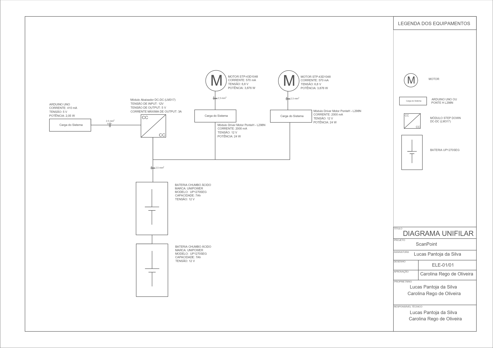

# Projeto do Subsistema de Energia

O subsistema de energia é responsável pela alimentação dos demais subsistemas, garantindo eficiência energética e capacidade de operação. Portanto, o foco da equipe consistiu em dimensionar os gastos energéticos, selecionar componentes eficazes, de baixo consumo e implementar estratégias de gerenciamento de energia em conformidade com as normas de segurança aplicáveis, assegurando a proteção dos usuários e a conformidade com os padrões de qualidade e regulamentações pertinentes.

## Levantamento de carga

Com o intuito de determinar as características energéticas do projeto realizou-se uma análise do consumo estimado dos dispositivos. Para uma margem de segurança foi adicionado  20%  sobre a potência total do projeto.

Tabela 1: Levantamento de carga.

| Componente | Qtd | Corrente [A]|Tensão [V] |Potência [W]|
| ------ | ------ |------ |------ |------ |
|ARDUINO UNO|1|0,41|5,00|2,05|
|L298N (PONTE H)|2|2,00|12,00|48,00|
|Potência Total [W]||||50,05|
|Potência Total com 20% [W]||||60,06|

## Bateria

Para o projeto ScanPoint está estimado em utilizar duas baterias de  12 V de 7Ah, cada.

Figura 1 - Bateria UP1270SEG.

Tabela 2 - Caracteríticas da bateria.

| Marca                             | UNICOBA       |
|------                             | ------        |
|    Modelo                         |UP 1270 SEG    |
|Composição das células da bateria  |Chumbo - Ácido |
|Voltagem                           | 12V           |
|    Amperagem                      |    7Ah        |
|    Dimensões [cm]                 |   8x16x11     |
|    Peso [kg]                       |    2,00       |

Nesse cenário o projeto apresenta uma autonomia de 2 horas e 48 minutos. Devido ao fato de não se ter o conhecimento real da leitura das peças não é possível determinar se o tempo de autonomia é suficiente ou não, assim,  caso haja a necessidade de uma maior autonomia no projeto, serão adicionadas baterias com as mesmas característica a fim de atender o tempo estipulado para a apresentação.
As baterias estarão configuradas em paralelo, visto que na configuração em série a tensão sofreria um aumento, o que não é o desejado, pois os componentes do projeto apresentam uma tensão de alimentação inferior a 12V.

## Cabo

A corrente elétrica solicitada pelo sistema é de  2,41A. A NBR  5410 foi consultada a fim de levar em consideração alguns fatores para o dimensionamento dos cabos elétricos.

Figura 2 - Tipos de linhas elétricas.
Fonte: [NBR 2410, 2004](https://edisciplinas.usp.br/pluginfile.php/5810747/mod_resource/content/1/NBR5410%20-%20Instala%C3%A7%C3%B5es%20el%C3%A9tricas%20de%20baixa%20tens%C3%A3o.pdf).

Ao consultar a Figura 2 foi considerado o Método de Referência B1.

Figura 3 - Fatores de correção para a temperatura.
Fonte: [NBR 2410, 2004](https://edisciplinas.usp.br/pluginfile.php/5810747/mod_resource/content/1/NBR5410%20-%20Instala%C3%A7%C3%B5es%20el%C3%A9tricas%20de%20baixa%20tens%C3%A3o.pdf).

 

Segundo o INMET, as temperaturas no Distrito Federal para o mês de julho ficam entre 20°C e 25°C. Portanto, considerando uma temperatura ambiente de 25°C para uma isolação de PVC, seu fator de correção, previsto na Figura 3, será de 1,06.

Figura 4 - Fatores de correção aplicáveis a condutores. 
Fonte: [NBR 2410, 2004](https://edisciplinas.usp.br/pluginfile.php/5810747/mod_resource/content/1/NBR5410%20-%20Instala%C3%A7%C3%B5es%20el%C3%A9tricas%20de%20baixa%20tens%C3%A3o.pdf).

Considerando 1 para o número de circuitos e B1 como o método, segundo a Figura 4, o fator será 1.

Após a determinação dos fatores diante de um cenário que o projeto se encontrará, será feito os cálculos para corrigir a corrente elétrica em função desses fatores.

 $I_{corrigida}=\frac{I_{sistema}}{F_{temperatura}×F_{agrupameto}}  [I]$

Onde:

 $I_{corrigida} :$ corrente elétrica corrigida;

 $I_{sistema} :$ corrente elétrica do sistema;

 $F_{temperatura} :$ fator de temperatura ambiente;

 $F_{agrupamento} :$ fator de agrupamento do circuito.

Substituídos em [I] os valores determinados anteriormente:

 $I_{corrigida} = \frac{2,41}{(0,87×1)}=2,77 A              [II]$

Assim, tem-se uma corrente corrigida de 2,77 A. A Figura 5 foi analisada para determinar o cabo mais especificado para a corrente elétrica corrigida.

Figura 5 - Capacidade de condução de corrente. 
Fonte: [NBR 2410, 2004](https://edisciplinas.usp.br/pluginfile.php/5810747/mod_resource/content/1/NBR5410%20-%20Instala%C3%A7%C3%B5es%20el%C3%A9tricas%20de%20baixa%20tens%C3%A3o.pdf).

Baseado na corrente corrigida de 2,77 A uma seção nominal de 0,5 mm^2 serviria, entretanto, a própria norma determina que para circuitos de força a seção nominal mínima deva ser de 2,5 mm^2. Assim sendo, a seção nominal selecionada será a de 2,5 mm^2.

## Diagrama Unifilar

A Figura 6 apresenta o diagrama unifilar do projeto, com as características de fluxo de energia, no qual cada componente está identificado com suas respectivas características elétricas, como também as características da bitola do cabo.

Figura 6 - Diagrama unifilar.

## Referências Bibliográficas

[1] Associação Brasileira de Normas Técnicas (ABNT). NBR 5410: Instalações elétricas de baixa tensão. Rio de Janeiro, 2004.

[2] Instituto Nacional de Meteorologia (INMET): Clima. Prognóstico de Tempo (2024). Acesso em: 27 abr. 2024. Disponível em: https://clima.inmet.gov.br/progt.

## Tabela de versionamento

| Versão| Data | Descrição | Responsável|
|-------|------|-----------|------------|
| 1.0 | 28/04/2024 | Criação do documento | Lucas Pantoja |
| 1.1 | 29/04/2024 | Edição de textos, tabelas e imagens | Lucas Pantoja |
| 1.2 | 01/05/2024 | Modificação da tebela 1 | Lucas Pantoja |
| 1.3 | 03/05/2024 | Modificação de texto para padronização | Lucas Pantoja |
| 1.4 | 03/05/2024 | Revisão da Diretoria Técnica | Carolina |
