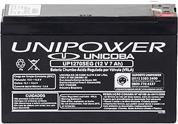
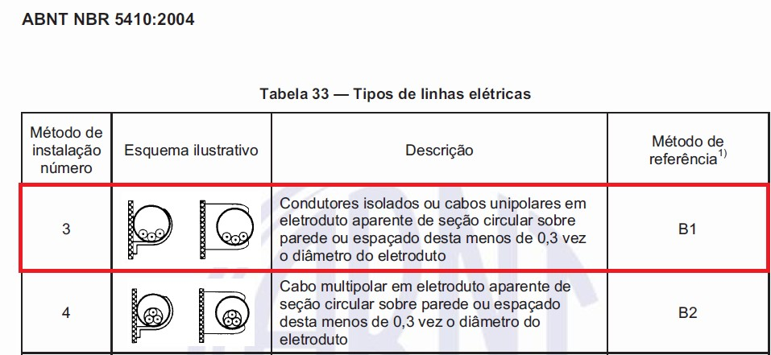
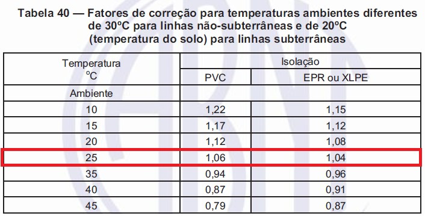
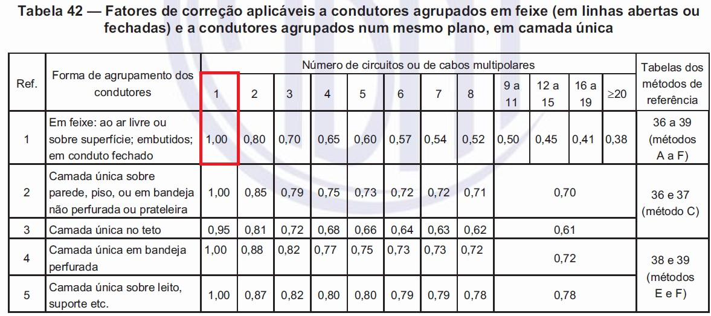
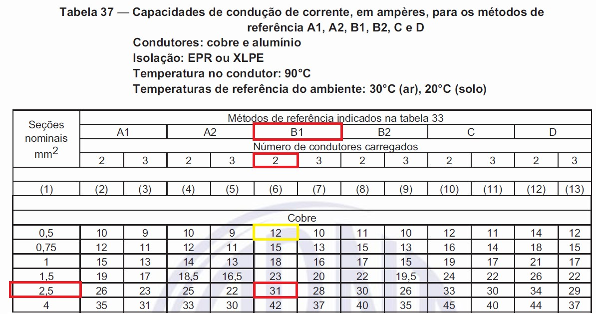
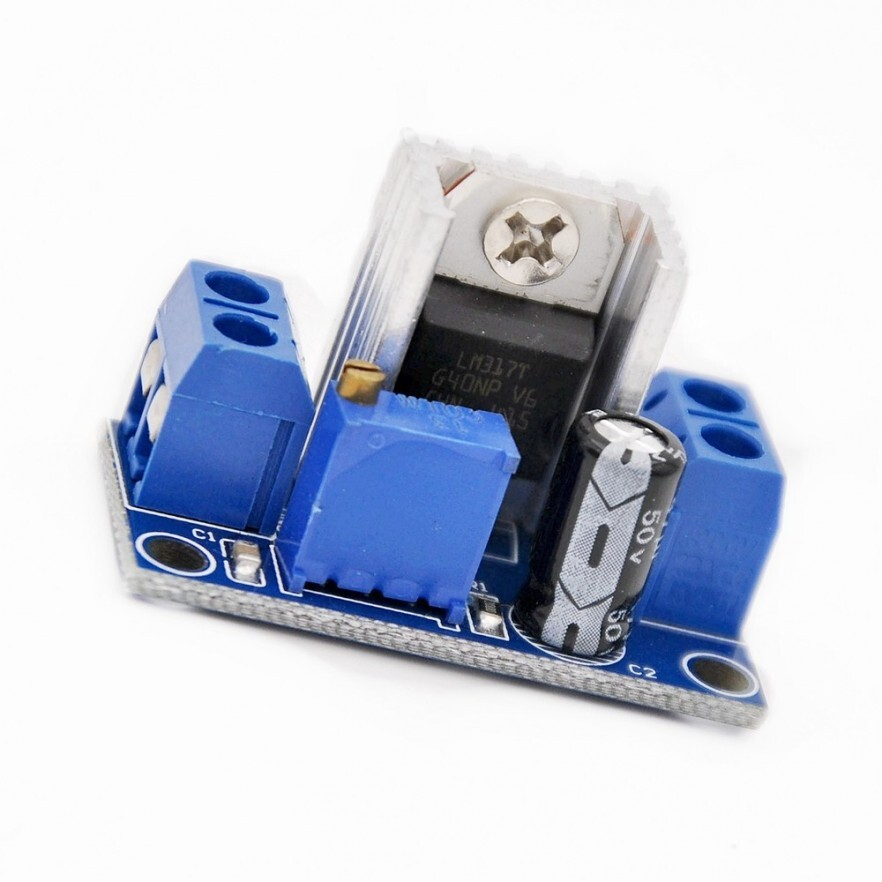
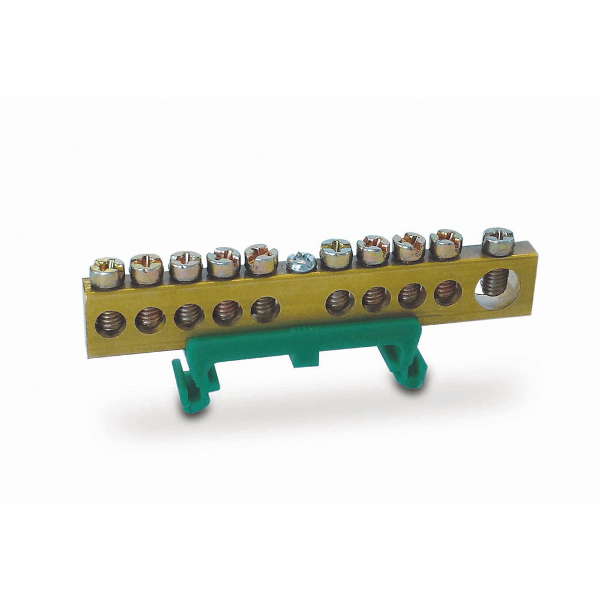
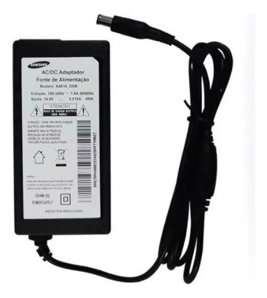
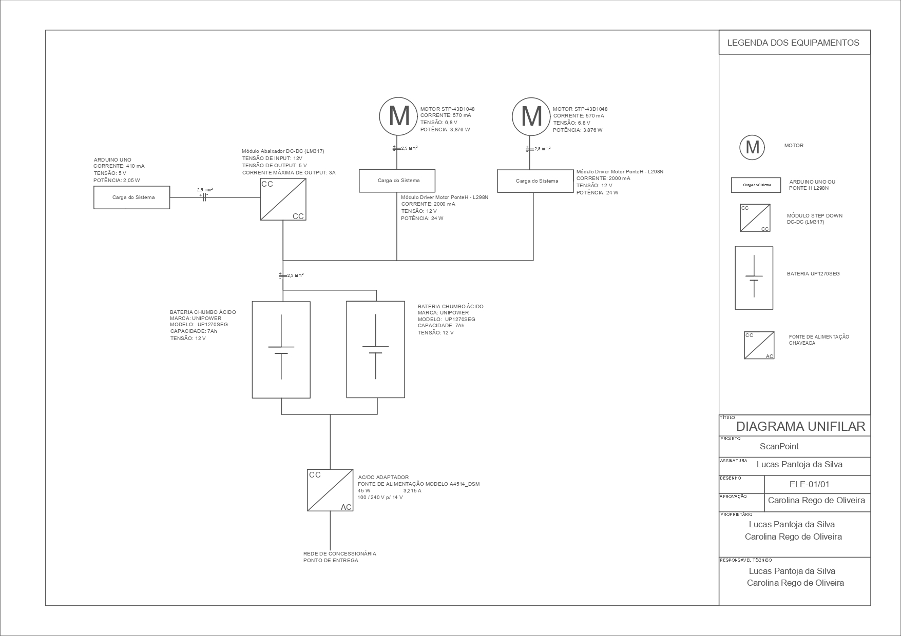
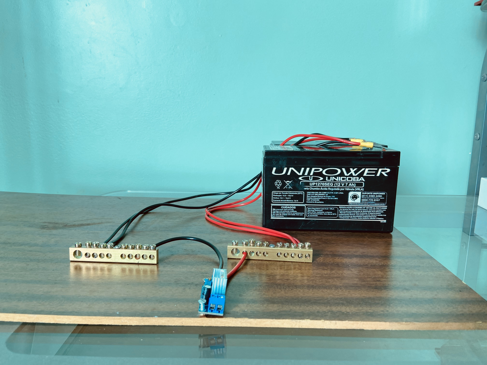

# Projeto do Subsistema de Energia

O subsistema de energia é responsável pela alimentação dos demais subsistemas, garantindo eficiência energética e capacidade de operação. Portanto, o foco da equipe consistiu em dimensionar os gastos energéticos, selecionar componentes eficazes, de baixo consumo e implementar estratégias de gerenciamento de energia em conformidade com as normas de segurança aplicáveis, assegurando a proteção dos usuários e a conformidade com os padrões de qualidade e regulamentações pertinentes.

## 1. Levantamento de carga

Com o intuito de determinar as características energéticas do projeto realizou-se uma análise do consumo estimado dos dispositivos. Para uma margem de segurança foi adicionado  20%  sobre a potência total do projeto.

Tabela 1: Levantamento de carga.

| Componente | Qtd | Corrente [A]|Tensão [V] |Potência [W]|
| ------ | ------ |------ |------ |------ |
|ARDUINO UNO|1|0,41|5,00|2,05|
|L298N (PONTE H)|2|2,00|12,00|48,00|
|Potência Total [W]||||50,05|
|Potência Total com 20% [W]||||60,06|

## 2. Bateria

Para o projeto ScanPoint está estimado em utilizar duas baterias de  12 V de 7 Ah, cada.

Figura 1 - Bateria UP1270SEG.

Tabela 2 - Caracteríticas da bateria.

| Marca                             | UNICOBA       |
|------                             | ------        |
|    Modelo                         |UP 1270 SEG    |
|Composição das células da bateria  |Chumbo - Ácido |
|Voltagem                           | 12 V           |
|    Amperagem                      |    7 Ah        |
|    Dimensões [cm]                 |   8 x 16 x 11     |
|    Peso [kg]                       |    2       |

Nesse cenário o projeto apresenta uma autonomia de 2 horas e 48 minutos. Devido ao fato de não se ter o conhecimento real da leitura das peças não é possível determinar se o tempo de autonomia é suficiente ou não, assim, caso haja a necessidade de uma maior autonomia no projeto, serão adicionadas baterias com as mesmas característica a fim de atender o tempo estipulado para a apresentação.

As baterias são configuradas em paralelo, visto que na configuração em série a tensão sofreria um aumento, o que não é o desejado, pois os componentes do projeto apresentam uma tensão de alimentação inferior ou igual a 12 V.

## 3. Cabos

A corrente elétrica solicitada pelo sistema é de  2,41A. A NBR  5410 foi consultada a fim de levar em consideração alguns fatores para o dimensionamento dos cabos elétricos.

Figura 2 - Tipos de linhas elétricas.
Fonte: [NBR 2410, 2004](https://edisciplinas.usp.br/pluginfile.php/5810747/mod_resource/content/1/NBR5410%20-%20Instala%C3%A7%C3%B5es%20el%C3%A9tricas%20de%20baixa%20tens%C3%A3o.pdf).

Ao consultar a Figura 2 foi considerado o Método de Referência B1.

Figura 3 - Fatores de correção para a temperatura.
Fonte: [NBR 2410, 2004](https://edisciplinas.usp.br/pluginfile.php/5810747/mod_resource/content/1/NBR5410%20-%20Instala%C3%A7%C3%B5es%20el%C3%A9tricas%20de%20baixa%20tens%C3%A3o.pdf).

 

Segundo o INMET, as temperaturas no Distrito Federal para o mês de julho ficam entre 20°C e 25°C. Portanto, considerando uma temperatura ambiente de 25°C para uma isolação de PVC, seu fator de correção, previsto na Figura 3, será de 1,06.

Figura 4 - Fatores de correção aplicáveis a condutores. 
Fonte: [NBR 2410, 2004](https://edisciplinas.usp.br/pluginfile.php/5810747/mod_resource/content/1/NBR5410%20-%20Instala%C3%A7%C3%B5es%20el%C3%A9tricas%20de%20baixa%20tens%C3%A3o.pdf).

Considerando 1 para o número de circuitos e B1 como o método, segundo a Figura 4, o fator será 1.

Após a determinação dos fatores diante de um cenário que o projeto se encontrará, será feito os cálculos para corrigir a corrente elétrica em função desses fatores.

 $I_{corrigida}=\frac{I_{sistema}}{F_{temperatura}×F_{agrupameto}}  [I]$

Onde:

 $I_{corrigida} :$ corrente elétrica corrigida;

 $I_{sistema} :$ corrente elétrica do sistema;

 $F_{temperatura} :$ fator de temperatura ambiente;

 $F_{agrupamento} :$ fator de agrupamento do circuito.

Substituídos em [I] os valores determinados anteriormente:

 $I_{corrigida} = \frac{2,41}{(0,87×1)}=2,77 A              [II]$

Assim, tem-se uma corrente corrigida de 2,77 A. A Figura 5 foi analisada para determinar o cabo mais especificado para a corrente elétrica corrigida.

Figura 5 - Capacidade de condução de corrente. 
Fonte: [NBR 2410, 2004](https://edisciplinas.usp.br/pluginfile.php/5810747/mod_resource/content/1/NBR5410%20-%20Instala%C3%A7%C3%B5es%20el%C3%A9tricas%20de%20baixa%20tens%C3%A3o.pdf).

Baseado na corrente corrigida de 2,77 A uma seção nominal de 0,5 mm² serviria, entretanto, a própria norma determina que para circuitos de força a seção nominal mínima deva ser de 2,5 mm². Assim sendo, a seção nominal selecionada é de 2,5 mm².

## 4. Módulo Abaixador Tensão DC-DC (LM317)

Como observado na Tabela 1, o Arduino Uno necessita uma alimentação de 5 V. Assim, há a necessidade do uso do módulo abaixador de tensão DC-DC a fim de que a tensão de 12 V das baterias seja reduzida para 5 V e assim alimente de forma segura o Arduino.

Figura 6 - Módulo abaixador de tensão DC-DC.

## 5. Barramento

Com a finalidade de ramificar as ligações e assim alimentar os dispositivos do projeto, são utilizados dois barramentos de 80 mm. Um barramento é utilizado para as ligações com a fiação positiva, identificada com cabos de coloração avermelhada, e o outro para a fiação negativa, identificado com cabos da cor preta.

Figura 7 - Barramento 80 mm.

## 6. Carregador da Bateria

Utilizar um carregador adequado é crucial para garantir a longevidade e o desempenho da bateria. Um carregador que fornece uma corrente inadequada pode comprometer a bateria ocasionando danos, reduzindo a vida útil da bateria ou não carregá-la de maneira eficiente. Os carregadores modernos geralmente seguem normas específicas de segurança, como a ABNT NBR IEC 60335-2-29, que garantem que os dispositivos operem de maneira segura e eficiente.

A corrente de carregamento para uma bateria de chumbo-ácido é geralmente expressa como uma fração da capacidade nominal da bateria, conhecida como "C", onde "C" representa a capacidade da bateria em ampere-horas (Ah). Para uma bateria de 14 Ah, a corrente de carregamento é determinada usando valores seguros típicos entre 0,1 C e 0,3 C.

### 6.1. Cálculo da Corrente de Carregamento

A capacidade da bateria em Ah é dada como 14 Ah.

A taxa de carga segura para baterias de chumbo-ácido é tipicamente entre 0,1 C e 0,3 C.

Para uma bateria de 14 Ah:

- 0,1C (corrente de carga baixa): 0,1 x 14 Ah = 1,4 A
- 0,3C (corrente de carga alta): 0,3 x 14 Ah = 4,2 A

Portanto, a corrente de carregamento ideal para uma bateria de 12 V e 14 Ah deve estar na faixa de 1,4 A a 4,2 A.

O carregador que será utilizado no projeto apresenta uma corrente de 3,215 A, encontrando-se dentro da faixa anteriormente calculada.

Figura 8 - Carregador da bateria A4514_DSM.

## 7. Diagrama Unifilar

A Figura 6 apresenta o diagrama unifilar do projeto, com as características de fluxo de energia, no qual cada componente está identificado com suas respectivas características elétricas, como também as características da bitola do cabo.

Figura 9 - Diagrama unifilar.

## 8. Montagem

Antes de iniciar o processo de montagem do subsistema de energia foi desenvolvido pela equipe um diagrama de montagem que, por sua vez, foi revisado e aprovado pelo docente responsável. Também foram revisitadas as normas técnicas relacionadas à solução.

Após aprovação do diagrama e levantamento dos componentes, foi realizada a compra desses materiais e, posteriormente, iniciou-se a montagem do sistema no Laboratório de Eletricidade com auxílio do técnico responsável.

O sistema foi montado por partes. Inicialmente as baterias foram testadas para garantir o fornecimento de 12 V. Em seguida foi realizado o teste do funcionamento do Módulo Abaixador de Tensão sendo alimentado por essas baterias, depois foram adicionados os barramentos e demais cabeamentos de acordo com a disposição do diagrama unifilar e a NBR 5410.

Com auxílio de um multímetro, foi aferida a tensão em todas as conexões entre os componentes, garantindo assim um bom funcionamento do subsistema e qualidade de fornecimento de energia para os demais subsistemas.

A Figura 9 mostra o resultado da montagem do subsistema de energia equipado com os conectores necessários para posterior integração com os subsistemas eletrônico e estrutural.

Figura 10 - Montagem do Subsistema de Energia.

## Referências Bibliográficas

[1] Associação Brasileira de Normas Técnicas (ABNT). NBR 5410: Instalações elétricas de baixa tensão. Rio de Janeiro, 2004.

[2] Instituto Nacional de Meteorologia (INMET): Clima. Prognóstico de Tempo (2024). Acesso em: 27 abr. 2024. Disponível em: https://clima.inmet.gov.br/progt.

[3] ABNT NBR IEC 60335-2-29:2010. Aparelhos eletrodomésticos e similares - Segurança - Parte 2-29: Requisitos particulares para carregadores de baterias. Rio de Janeiro: ABNT, 2010.

## Tabela de versionamento

| Versão| Data | Descrição | Responsável|
|-------|------|-----------|------------|
| 1.0 | 28/04/2024 | Criação do documento | Lucas Pantoja |
| 1.1 | 29/04/2024 | Edição de textos, tabelas e imagens | Lucas Pantoja |
| 1.2 | 01/05/2024 | Modificação da tabela 1 | Lucas Pantoja |
| 1.3 | 03/05/2024 | Modificação de texto para padronização | Lucas Pantoja |
| 1.4 | 03/05/2024 | Revisão da Diretoria Técnica | Carolina |
| 1.5 | 04/05/2024 | Ajustes de alinhamento e fontes | Ana Carolina |
| 1.6 | 02/06/2024 | Modificação de imagens e inserção de tópicos (LM317 e barramento) | Lucas Pantoja |
| 1.7 | 03/06/2024 | Revisão dos novos tópicos e inserção do tópico "Montagem" | Carolina |
| 1.8 | 06/06/2024 | Adição da imagem da montagem | Lucas Pantoja |
| 1.9 | 07/06/2024 | Criação do tópico "Carregador da Bateria" | Lucas Pantoja |
| 2.0 | 07/06/2024 | Revisão final para o PC 2 | Carolina |

