# Projeto do Subsistema de Eletrônica

O subsistema eletrônico desempenha o papel de controle sobre os motores, comunicação com o software, integração dos sensores. Nesse contexto, o foco da equipe consistiu na seleção dos componentes eletrônicos e na implementação de estratégias de gerenciamento em conformidade estrita com as normas de segurança elétrica pertinentes.

## 1. Motor de Passo

O Motor de Passo é um motor elétrico utilizado para controle de movimentos de forma precisa, este controle é feito através de passos ou graus, com isso é possível controlar o motor sem o uso de sensores para determinar posição. Os motores desse tipo são controlados através de sinais digitais enviados para as suas bobinas, possibilitando a rotação fracionada do eixo, sem a necessidade de escovas internas <a href="#ref-1"> [1]</a>.

### 1.1. Estrutura do Motor de Passo

As características do Motor de Passo, no que diz respeito à velocidade, torque e resolução são definidas primeiramente pela estrutura do motor, então é importante conhecer os aspectos internos e a função das peças que compõem o motor.

Figura 1: Estrutura interna do motor de passo <a href="#ref-1"> [1]. </a>

#### 1.1.1. Rotor

Uma das partes mais importantes do motor de passo é o rotor, na Figura 1, é mostrado  um motor com rotor híbrido, o corpo que representa o rotor híbrido é composto pelos dois rotores e o imã entre eles, utilizado para a polarização do rotor frontal e o traseiro <a href="#ref-1"> [1]</a>.

Existem três configurações possíveis de montagem para o rotor: rotor de imã permanente, rotor de relutância variável e rotor híbrido, o tipo híbrido é o mais comumente utilizado, estas diferenças são apresentadas na Tabela 1.

Tabela 1: Diferenças entre os rotores.

#### 1.1.2. Estator

O Estator produz o campo magnético que causa a movimentação do rotor. Para análise do estator é necessário tomar nota de alguns pontos como: o número de fases, de par de polos e configuração do fio. A fase ou o par de polos é formado por duplas de bobinas que são energizadas simultaneamente.

A estrutura do estator é formada por polos magnéticos dentados, sendo que cada polo é dotado de uma bobina com o seu par oposto, de forma que os pares são energizados simultaneamente e por consequência são magnetizados com a mesma polaridade, os dois polos formam uma fase. 

O primeiro modelo do exemplo abaixo é do tipo estator bifásico, com fases A e B, enquanto o segundo é do tipo estator trifásico, com fases A, B e C.

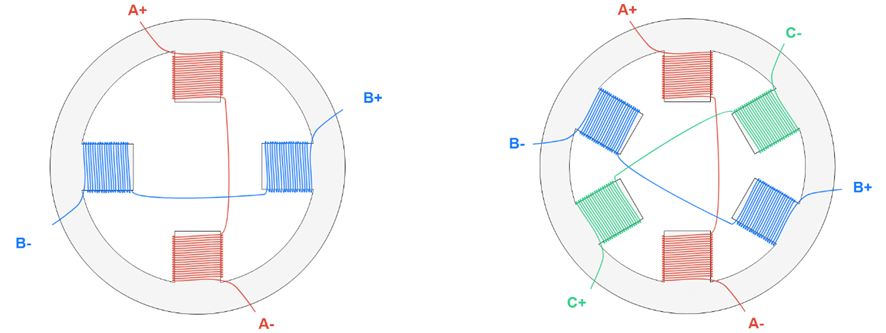

Figura 2: Modelo de um estator bifásico.

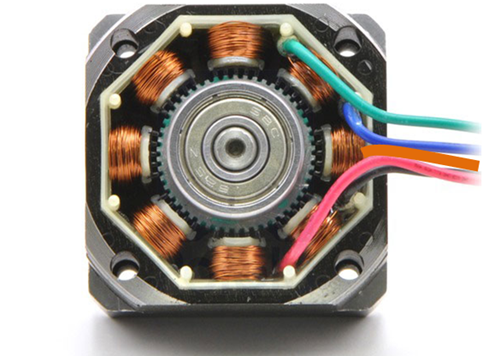

Figura 3: Estator real.

A Figura 2, mostra uma representação gráfica da distribuição das bobinas no estator, já a Figura 3, mostra uma imagem de um estator real, com seus dentes e bobinas em enrolamento de cobre.

O eixo do motor híbrido é construído com dois grupos dentados de rotores, um deles polarizados com polo sul e outro com polo norte.

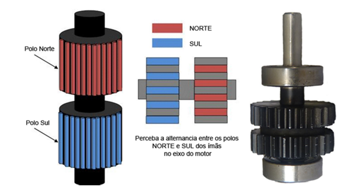

Figura 4: Modelo do eixo do motor <a href="#ref-1"> [1]</a>.

### 1.2. Tipos de Polos

Existem dois modelos de acordo com os polos, o bipolar e o unipolar, os termos surgiram de conformidade com os drivers que são utilizados para acionamento desses motores. O polar do termo representa "polaridade” e se refere ao driver utilizado para controle desses motores, utilizaremos as expressões "motor unipolar” e "motor bipolar” por convenção social <a href="#ref-1"> [1] </a>.

 
#### 1.2.1. Unipolar

O modelo utilizado com o driver Unipolar conta com duas bobinas por fase, formando um par de polos, além disso, há o contato em comum, dessa forma os motores desse tipo podem ter 5, 6 ou 8 fios <a href="#ref-1"> [1] </a>.

Figura 5: Driver unipolar <a href="#ref-1"> [1]</a>.

Com o fio central é possível controlar a direção da corrente, no entanto apenas metade da bobina pode ser utilizada, isso faz com que o motor seja menos eficiente se comparado ao bipolar. O fio central é conectado ao Vin do circuito, sendo que se o Mosfet 1 estiver ativo, a corrente fluirá de Am para A+, se o Mosfet ativo for o 2, a corrente fluirá de Am para A-.

Figura 6: Diagrama circuito unipolar <a href="#ref-1"> [1] </a>.

#### 1.2.2. Bipolar

No motor do tipo bipolar, cada bobina é composta por dois fios apenas, sem derivações centrais como as do tipo unipolar, de forma que são motores mais fáceis de serem produzidos.

Figura 7: Driver bipolar <a href="#ref-1"> [1]</a>.

Como não há a derivação central, para controle de direção é necessário utilizar uma ponte H, exigindo um circuito de acionamento mais complexo. Para os motores desse tipo, temos que a corrente flui de A- para A+ quando os Mofets 2 e 3 estão ativos, e flui de A+ para A- quando 1 e 4 estão ativos. Apesar de possuir um acionamento mais complexo, os motores do tipo bipolar são mais comuns, pois permitem que o motor atinja maior torque <a href="#ref-1"> [1]</a>.

Figura 8: Diagrama circuito bipolar <a href="#ref-1"> [1]</a>.

### 1.3. Funcionamento de um motor de passo:

O motor de passo é um dispositivo eletromecânico composto por bobinas (indutores) e um rotor magnético (ímã permanente ou imantado). As bobinas convertem energia elétrica em campo magnético, alinhando o rotor a esse campo. A excitação correta das bobinas faz o rotor, que gira em torno de seu eixo, mover-se no sentido desejado, convertendo energia magnética em movimento (energia mecânica). O rotor é rotacionado em pequenos incrementos angulares, chamados de "passos" <a href="#ref-2"> [2]</a>.

O funcionamento básico do motor de passo envolve o uso de bobinas alinhadas dois a dois. Quando energizadas, elas atraem o rotor, alinhando-o com o campo magnético gerado, resultando em uma variação angular pequena, chamada de passo. A velocidade e o sentido de movimento são determinados pela forma como cada bobina é ativada, incluindo a ordem e a velocidade entre cada processo de ativação <a href="#ref-2"> [2]</a>.

As vantagens do motor de passo incluem sua precisão de posicionamento e torque aplicado, além de ter uma resposta excelente na aceleração e desaceleração, devido à sua lógica digital. No entanto, ele pode apresentar baixo desempenho em alta velocidade, requer um certo grau de complexidade para operação e pode sofrer ressonância devido a um controle inadequado <a href="#ref-2"> [2]</a>.

Complementando com o banco de dados, o motor de passo é frequentemente utilizado em aplicações que exigem precisão de posicionamento, como impressoras 3D, máquinas CNC e robótica industrial. Ele oferece um controle preciso sobre o movimento, o que é essencial em muitas aplicações. Além disso, o motor de passo pode ser facilmente controlado por microcontroladores, o que o torna uma escolha popular em projetos eletrônicos e de automação <a href="#ref-2"> [2]</a>.

A figura a seguir mostra como um motor de passo pode ser controlado mediante lógica binária:

 
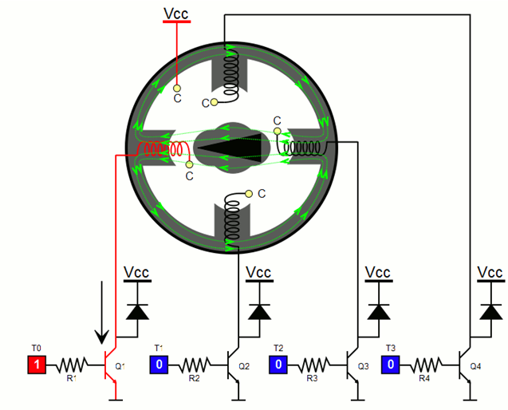

Figura 9: Motor de passo controlado pelas entradas To até T3 <a href="#ref-2"> [2]</a>.

## 2. Placa Arduino Uno

O Arduino Uno é uma placa microcontrolada baseada no chip ATmega328. Esta placa é muito utilizada no desenvolvimento de projetos embarcados, é hoje em dia é a mais utilizada e documentada da família Arduino.

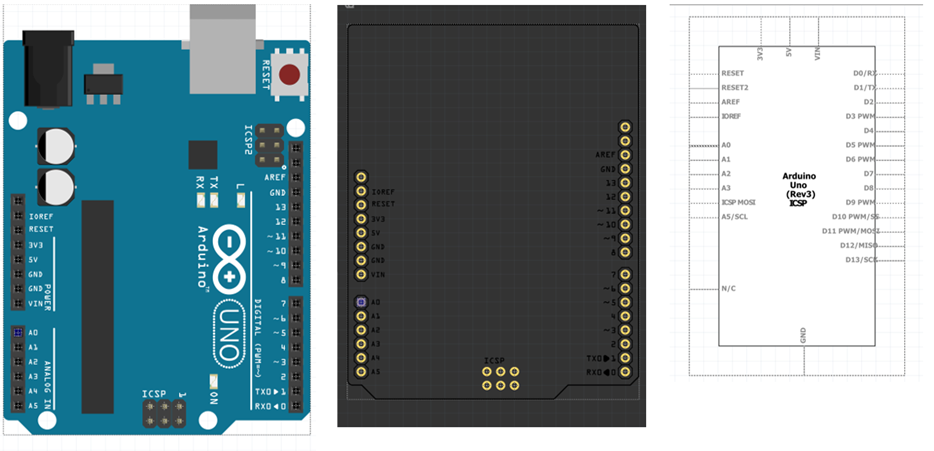   

Figura 10: Placa Arduino Uno, diagrama de barramento e diagrama esquemático. Fonte: Autoria própria.

A placa conta com um chip ATmega328 que é um microcontrolador único desenvolvido pela Atmel, pertencente à família megaAVR. A arquitetura do Arduino Uno segue o padrão Harvard e possui um núcleo de processador RISC de 8 bits customizado.

Figura 11: Diagrama de pinos da placa Arduino Uno <a href="#ref-3"> [3]</a>.

 
### 2.2. Características principais do Arduino Uno

 - A tensão de operação é 5V
 - A tensão de entrada recomendada varia de 7V a 12V
 - A tensão de entrada varia de 6V a 20V
 - 14 pinos de entrada/saída digital
 - 6 pinos analógicos
 - A corrente DC para cada pino de entrada/saída é de 40 mA
 - A corrente DC para o pino de 3,3 V é 50 mA
 - A memória flash é de 32 KB
 - SRAM é 2KB
 - EEPROM é 1 KB
 - A velocidade do CLK é de 16 MHz

### 2.3. Diagrama de pinos do Arduino Uno

A placa do Arduino Uno conta com uma grande variedade de pinos de alimentação, pinos analógicos, ATmega328, conector ICSP, botão Reset, LED de alimentação, pinos digitais, led de teste, pinos TX/RX, interface USB e fonte de alimentação externa, na Figura 12, se apresentam estes pinos.

Figura 12: Diagrama de Pinos do microcontrolador ATmega328.

A seguir se faz a descrição de cada um dos componentes do diagrama na Figura 12.

#### 2.3.1. Descrições principais para utilização do Arduino Uno

##### 2.3.1.1. Fonte de Alimentação

Esta placa conta com uma grande vantagem e é poder ligar ela de forma externa com ajuda de um cabo USB ou uma fonte de alimentação externa, além disso, as fontes de alimentação externas incluem principalmente um conversor AC para DC, caso contrário, uma bateria. A fonte deve ser inserida no conector de alimentação da placa Arduino. Suas faxas de tensão estão entre 7 e 12 Volts,  conta com um pino GND e conector POWER <a href="#ref-3"> [3]</a>.

##### 2.3.1.2. Entradas e saídas digitais

O Arduino Uno possui 14 pinos que podem ser usados como entrada ou saída a depender da necessidade do programador. Com a ajuda de funções como pinMode(), digitalWrite() e Digital Read() é possível definir como os pinos serão utilizados <a href="#ref-3"> [3]</a>.

##### 2.3.1.3. Entradas analógicas

A placa Arduino UNO conta com 6 canais de conversor analógico para digital, nomeadas de A0 a A5. Sendo que a resolução do conversor analógico digital é de 10Bits. Isso significa que este irá mapear tensões entre 0 e a tensão operacional (5V ou 3.3V) para valores inteiros entre 0 e 1023. No Arduino UNO, isso permite uma resolução entre leituras de: 5 volts / 1024 unidades, ou .0049 volts (4.9 mV) por unidade. Essas entradas são nomeadas de A0 a A5. A função analogRead() lê o valor de um pino analógico especificado <a href="#ref-3"> [3]</a>.

#### 2.3.2. Pino (TX) e Pino (RX) (Serial):

  Os pinos 0 e 1 são usados para transmitir e receber dados seriais TTL, e estes são conectados aos pinos equivalentes do chip ATmega8U2 USB para TTL Serial <a href="#ref-3"> [3]</a>.

 

#### 2.3.3. Pinos externos de interrupção:

Os pinos 2 e 3 do Arduino Uno podem desempenhar a função de entrada de sinal para interrupção externa tais funções são nomeadas de INT0 e INT1, respectivamente <a href="#ref-3"> [3]</a>.

 

#### 2.3.4. Pinos 3, 5, 6, 9, 10 e 11 (PWM):

O Arduino Uno possui 6 pinos para saída PWM, são estes os pinos 3, 5, 6, 9, 10 e 11. Para auxiliar na manipulação desses pinos a plataforma possui uma função que auxilia na escrita de valores chamada de "duty cycle” facilitando a utilização do PWM do Arduino Uno, o qual pode ser acoplado com módulos externos <a href="#ref-3"> [3]</a>.

 

#### 2.3.5. Pinos SPI (Pino-10 (SS), Pino-11 (MOSI), Pino-12 (MISO), Pino-13 (SCK):

SPI (Serial Peripheral Interface) é um protocolo de comunicação serial, a SPI possui uma conexão full duplex, o que significa que os dados são enviados e recebidos simultaneamente. O SPI pode ser utilizado para a comunicação entre dois arduinos <a href="#ref-3"> [3]</a>.

 

#### 2.3.6. LED Interno Pino 13

A placa do Arduino Uno possui um Led interno conectado ao pino 13 (pino digital). Como pino de valor ALTO, o diodo emissor de luz é ativado, sempre que o pino estiver em nível BAIXO <a href="#ref-3"> [3]</a>.

 

#### 2.3.7. Pino-4 (SDA) e Pino-5 (SCL) (I2C):

Permite comunicação TWI (Two Wire Interface) com a ajuda da biblioteca Wire <a href="#ref-3"> [3]</a>.

 

#### 2.3.8. AREF (Tensão de Referência):

AREF significa Referência Analógica. Ele permite alimentar o Arduino com uma tensão de referência de uma fonte de alimentação externa para configurar a tensão de referência usada para entrada analógica (ou seja, o valor usado como o topo da faixa de entrada) <a href="#ref-3"> [3]</a>.

#### 2.3.9. Pino de Reset:

Este pino é usado para resetar (RST) o microcontrolador <a href="#ref-3"> [3]</a>.

 
### 2.4. Memória

A memória do microcontrolador Atmega328 do Arduino Uno inclui memória flash de 32 KB para armazenamento de código, SRAM-2 KB e EEPROM-1 KB <a href="#ref-3"> [3]</a>.

### 2.5. Comunicação

O Arduino Uno ATmega328 oferece comunicação serial UART TTL e é acessível em pinos digitais como TX (1) e RX (0). O software de um Arduino possui um monitor serial que permite dados fáceis. Existem dois LEDs na placa, como RX e TX, que piscarão sempre que os dados estiverem sendo transmitidos através do USB.

A biblioteca SoftwareSerial permite a comunicação serial nos pinos digitais do Arduino Uno e o ATmega328P suporta TWI (I2C), bem como comunicação SPI. O software Arduino contém uma biblioteca cabeada para simplificar a utilização do barramento I2C <a href="#ref-3"> [3]</a>.

 

### 2.6. Proteção de alta tensão do USB

A placa Arduino Uno possui um fusível que protege a porta USB do PC de sobretensão. Embora a maioria dos PCs tenha sua própria proteção interna, o fusível oferece uma proteção adicional de segurança <a href="#ref-3"> [3]</a>.

 

### 2.7. Características físicas

As características físicas de uma placa Arduino incluem principalmente comprimento e largura. O comprimento e a largura da placa de circuito impresso do Arduino Uno são 2,7 X 2,1 polegadas, mas o conector de alimentação e o conector USB se estenderão além dessa medida. A placa pode ser fixada na superfície, caso contrário, com os orifícios dos parafusos <a href="#ref-3"> [3]</a>.

## Modulação PWM

A modulação por largura de pulso (PWM) é uma técnica fundamental que envolve a variação da largura dos pulsos em um sinal elétrico para transmitir informações. Em vez de manter um sinal em níveis constantes, o PWM altera a largura dos pulsos, controlando o tempo em que a chave fica ligada e desligada. Isso permite administrar a quantidade média de energia que chega à carga e, consequentemente, a potência elétrica <a href="#ref-4"> [4]</a>.

Essa técnica é amplamente utilizada em diversos equipamentos eletrônicos de potência, como drivers de LED, inversores de frequência e controle de velocidade de motores. No cotidiano, o PWM é encontrado em carregadores, sistemas fotovoltaicos, servo-motores e carros elétricos, entre outros <a href="#ref-7"> [7]</a>.

O ciclo de trabalho, ou Duty Cycle mostrado na figura, é um parâmetro crucial para controlar um sinal PWM. Ele representa a relação entre a largura do pulso e o período, informando o tempo em que o sinal está em nível alto (ligado) e o tempo em que está em nível baixo (desligado). 

O Duty Cycle é expresso em porcentagem e calculado pela fórmula D = (PW / T) x 100%, onde PW é a largura do pulso e T é o período <a href="#ref-5"> [5]</a>. Deste modo, o sinal 255 da placa é convertido para um sinal PWM de 100%, e o sinal 0 da placa é convertido para um sinal PWM de 0%. Portanto um sinal de 127 da placa será convertido para um sinal PWM de 50%. Consequentemente, para um motor, o sinal 0 seria o motor parado, já o sinal 255 seria a sua rotação máxima. Abaixo é possível ver um exemplo com o sinal PWM sendo aplicado em um LED <a href="#ref-5"> [5]</a>.

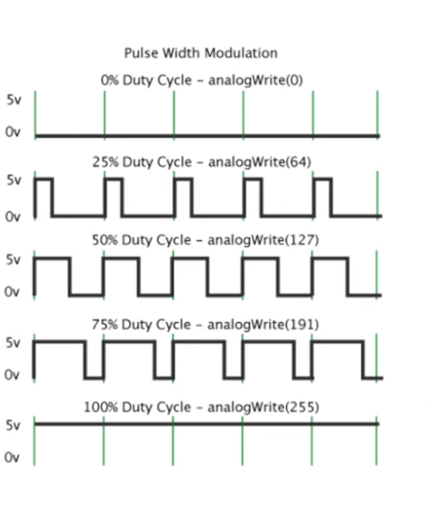

Figura 13: Representação do comportamento do controle PWM.

Uma das principais vantagens do PWM é a manutenção do sinal digital em todo o percurso, o que minimiza os efeitos de ruído. Além disso, o PWM oferece maior imunidade ao ruído em comparação ao controle analógico, o que torna essa técnica ideal para comunicações. Em sistemas de freios controlados por modulação, por exemplo, o PWM é utilizado para controlar a pressão exercida pelo freio de acordo com a quantidade de tensão ou corrente aplicada <a href="#ref-4"> [4]</a>.

Figura 14: Funcionamento do PWM num led.
Fonte <a href="#ref-5"> [5]</a>.

### Driver Motor de Passo A4988
O Driver A4988 é um componente eletrônico utilizado para controlar motores de passo bipolares, com capacidade de pequenos passos (microstepping) para maior suavidade e precisão na movimentação dos motores.  A tensão de operação lógica do driver é de 3-5,5V, que são conectados nos pinos VDD e GND. Pode controlar motores de até 35V e 2A por bobina (picos de 4A), além disso, é capaz de controlar o motor com até 1/16 passos[R]

### Calibração:
Para calibrar o driver de motor faz-se o ajuste do trimpot integrado à placa. Para realizar a calibração deve-se utilizar a seguinte fórmula para cálculo da tensão de referência:

Vref = Imotor x 8 x Rsense

Onde Vref é a tensão de referência que devemos chegar no ajuste do driver, 8 é uma constante arbitrária específica para o A4988, e Rsense é o resistor de detecção de corrente presente no driver e Imotor é a corrente de trabalho no motor.  A corrente máxima de um motor está indicada no seu datasheet, e em geral recomenda-se utilizar até 70% desse valor[R].

###Ajuste do A4988
Com o valor da tensão de referência determinado, precisamos fazer o ajuste do potenciômetro. Não é preciso que o driver esteja conectado na placa da aplicação final, basta ligar os pinos RST e SLP do driver e alimentar parte lógica através dos pinos Vdd e GND do módulo. Com essas ligações, é medido com um multímetro a tensão entre o GND e a parte metálica do trimpot, onde é feito o ajuste. Girar o potenciômetro no sentido horário aumenta a tensão e no sentido anti-horário diminui. O ajuste deve ser feito até a leitura do multímetro coincidir com a tensão calculada [R].

Uso do driver A4988
Para usar o driver é simples, conecte a alimentação do motor aos pinos Vmot e GND e a alimentação da parte lógica aos pintos Vdd e GND. O pino DIR controla a direção em que o motor deve girar e o pino STEP faz o motor dar um passo a cada pulso que recebe [R]. 

### Especificações técnicas do Driver Motor de Passo A4988
– Chip: A4988 (datasheet)
– Controle de passos e direção.
– Tensão lógica: 3-5,5V
– Tensão saída motores: 8-35V
– 5 Resoluções: full-step, half-step, 1/4-step, 1/8-step e 1/16-step.
– Regulador de tensão embutido.
– Proteção conta sobrecarga de corrente e curto-circuito.
 
Figura 11: Diagrama esquemático do drive A4988
 
Figura 12: Drive do motor de passo [5]
Tabela: Conexões do driver A4988 [6]
A4988	Conexão
VMOT	8-35V
GND	Aterramento do motor
SLP	REPOR
RST	SLP
VDD	5V
GND	Terreno lógico
STP	Pino 3
DIR	Pino 2
1A, 1B, 2A, 2B	Motor stepper

##REFERENCIA AQUI

[R] Marker Hero, Driver Motor de Passo A4988
https://www.makerhero.com/produto/driver-motor-de-passo-a4988/, acesso 24/05/2024 hora: 07:30
 
 
 
 
 
### Sensores de Distância Laser VL53L0X
O VL53L0X é um sensor de distância infravermelho de alta precisão, produzido pela STMicroelectronics, conhecido como o menor sensor do mercado. Utiliza um VCSEL (Laser Emissor de Superfície de Cavidade Vertical) com filtros para evitar interferências de luz externa, aumentando seu alcance. Funciona como um sensor Time of Flight (ToF), emitindo uma luz invisível que reflete em obstáculos, e calcula a distância com base no tempo de retorno dessa luz, alcançando até 2 metros [R1].

O módulo VL53L0X, também conhecido como GY-VL53L0XV2, CJVL53L0XV2 ou VL53L0XV2, é compatível com várias placas Arduino. É compacto, preciso, possui regulador de tensão integrado, permitindo alimentação de 3V ou 5V, e vem em várias cores, todas com as mesmas funcionalidades. A comunicação é realizada via interface I2C [R1].
Pinagem
Além de pinos de alimentação (VIN e GND), o módulo VL53L0X possui dois pinos dedicados a comunicação I2C (SCL e SDA), um pino de reset (XSHUT) e um pino de saída de dados (GPIO1) que pode ser utilizado para programar interrupções no microcontrolador ao qual o sensor está ligado [R1].
 
imagem 1 — Módulo VL53L0X [R1].
 
Imagem 2 — Descrição dos pinos do VL53L0X [R1].
•	

## 4. Módulo Regulador C/LM2596

O circuito precisa de um módulo que permita trabalhar com duas tensões, uma de 12V para alimentar a Ponte H, e um de 5V para alimentar a placa de árduino, para resolver esta situação foi trabalhado com um fonte de 12V e um módulo regular C/LM2596 (ver figura 16 e 17). O Módulo Regulador de Tensão LM2596 trabalha como um conversor DC DC no modo Step Down, sendo capaz de reduzir uma carga de até 3A com ótima eficiência. 

A tensão de saída pode ser ajustada entre 1,5 a 35v, tendo como entrada 3,2 a 40v. Possui uma velocidade de comutação de 150KHz e pode ser aplicado em circuitos onde a saída de um sensor é superior a 5v, tensão de entrada máxima em um Arduino ou PIC <a href="#ref-8"> [8]</a>.

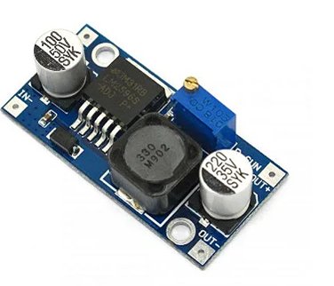

Figura 16: Módulo regular C/LM2596.

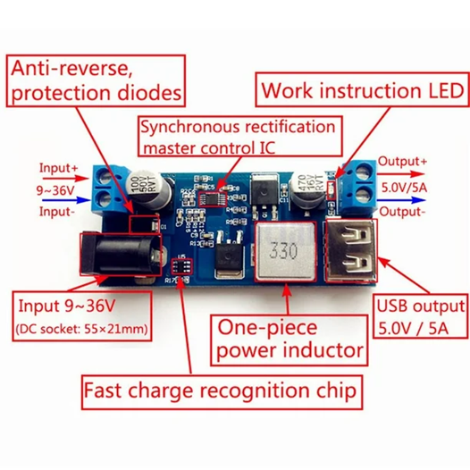

Figura 17: Especificação dos componentes do módulo regulador C/LM2596.

Este módulo tem as seguintes carácterísticas:

Assim conhecendo todos os componentes, foi montada uma simulação utilizando programa Proteus, a qual é motrada na Figura 18. Já na Figura 19, encontra-se a representação do circuito realizada utilizando o Fritzing que permite gerar o diagrama esquemático do circuito na Figura 20, e o diagrama de barramento na Figura 21.

 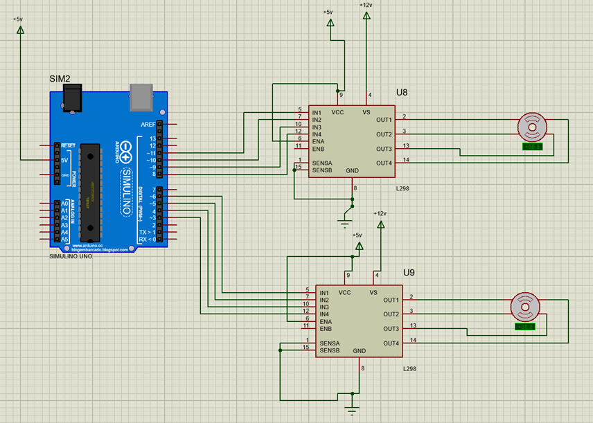

Figura 18: Simulação do Proteus do sistema de motores.

A Figura 18 apresenta a simulação realizada no proteus para verificar o funcionamento do motor e um preteste do funcionamento dos motores, seguidamente foi feita a simulação utilizando o Fritzing com o objetivo de criar os diagramas esquemáticos.

 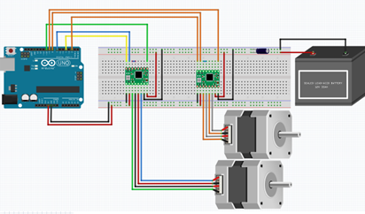

Figura 19: Simulação Arduino do sistema de motores.

Já nas Figuras 20 e 21 se apresentam os diagramas de eletrônica de blocos e de barramento respectivamente.

 

Figura 20: Diagrama de blocos completo do circuito com motores de passo.

 
 
  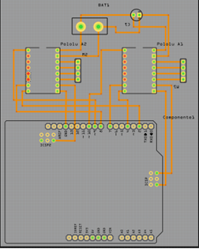

Figura 21: Diagrama de barramentos completo do circuito com motores de passo.

## 5. Descrição Matemática do Motor

Um motor pode ser modelado utilizando um Resistor, um indutor e uma força contra eletromotriz que relaciona o fluxo magnético gerado pelo motor em função do fluxo magnético e do número de espiras que ele tem, sendo assim esta força é modelada pela relação de Faraday como se mostra na equação 1:

A equação que representa a tensão pode ser modelada aplicando a LKT, representada como mostra a equação 2 e a Figura 22:

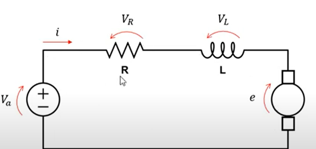

Figura 22: Modelo Elétrico do motor DC.

O motor pode ser separado em variáveis elétricas e mecânicas, conforme mostra a figura 4, onde a parte ressaltada na cor preto, indica a parte elétrica e a ressaltada na cor vermelho a parte mecânica como.

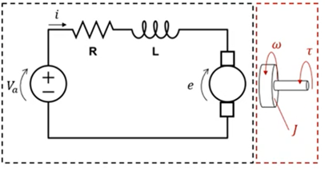

Figura 23: Modelo elétrico e mecânico do motor DC.

O campo incidente sobre o motor é chamado campo fixo, esse campo fixo pode ser gerado por uma bobina ou imã permanente, supondo que a corrente elétrica de campo constante, descartando efeitos secundários, em uma máquina rotativa a variação do fluxo magnético sobre a bobina é proporcionar a velocidade angular como mostra a equação 3.

Figura 24: Representação do campo magnético no motor.

Assim a força contra eletromotriz é proporcional ao fluxo, desta forma pode ser representada como mostra a equação 4:

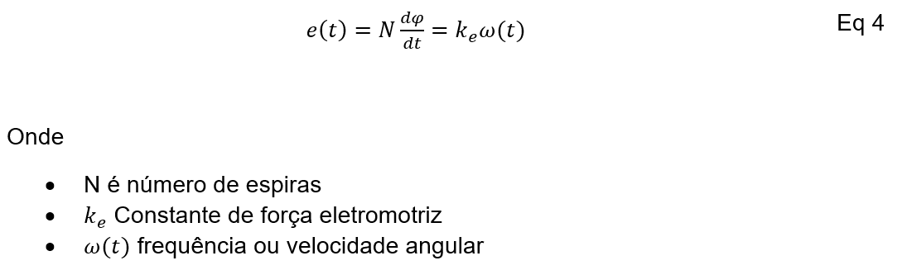

Como a força exercida nos condutores é proporcional à corrente elétrica que passa pelo condutor, o torque do motor é proporcional à corrente, e se iguala quando se utiliza uma constante de torque \( Kt \), como mostra a equação 5.

Assim a potência é produto do torque pela velocidade angular desenvolvida pelo motor, desta forma:

Outro parâmetro considerado é o torque inercial, o qual tem como trabalho suprimir todas as perdas e ser suficiente para acelerar o motor até um ponto de inércia, ele pode ser representado como a equação 7:

O torque total de atrito do motor ou de arrasto, depende da velocidade angular do motor, ele é dependente do coeficiente de arrasto ou atrito viscoso do motor, assim o torque total do motor é:

Substituindo o torque total, encontra-se a relação de corrente como mostra a equação 9:

Substituído a corrente na equação geral do motor, encontramos a representação da velocidade angular em função da velocidade de entrada do motor, como mostra equação 10:

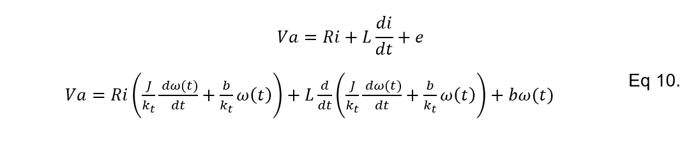

Realizando procedimentos matemáticos, e derivando o termo do indutor e reagrupando termos é obtida a equação diferencial não homogênea mostrada na equação 11:

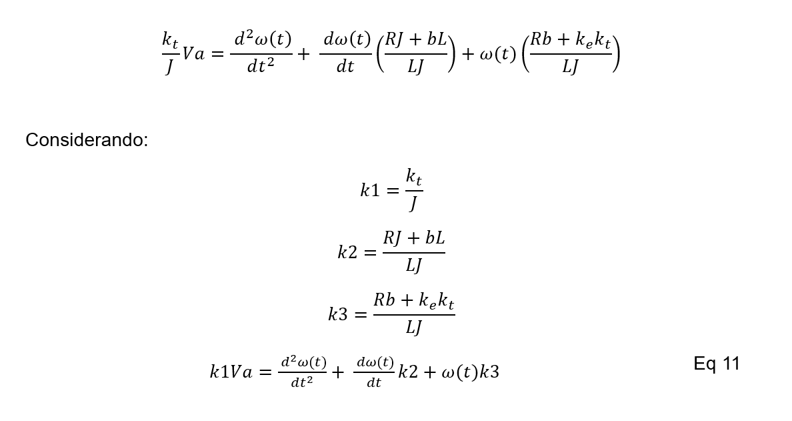

A velocidade máxima pode ser calculada como:

Aplicando a transformada de Laplace para a EDO com condições iniciais nulas, encontra-se a função de transferência geral descrita na equação:

### 6. Cálculo dos Parâmetros do Motor

Para calcular os parâmetros do motor, é necessário conhecer as características dele publicadas pelo fabricante, considerando que os motores de passo tem o código NEMA 17 4.2Kgf 1.7A (Stepper Motor 17HS4401).

### 7. Especificações do Motor de Passo

- Ângulo do passo: 1.8°
- Tensão de Retenção: 3V
- Tensão nominal: 4,8V
- Resistência: ~1.8 Ohms
- Inércia do Rotor: 38g cm²
- Corrente de Retenção: 1.7A
- Rosca frontal: M3
- Enrolamento: Espiras bifilares
- Temperatura máxima de operação: 80°C
- Temperatura ambiente: -10°C a 50°C
- Classe de isolamento: B
- Torque: 4,2Kgf.cm
- Indutância por Fase: 2,3mH
- Quantidade de fios: 4
- Comprimento do cabo: 100cm
- Comprimento do eixo exposto: 20mm
- Diâmetro do eixo: 5mm
- Dimensões do motor (CxLxA): 42x42x39mm (ignorando o eixo)
- Peso do motor: 280g

Os cálculos feitos são apresentado na Tabela 2:

Tabela 2: Cálculos do motor de passo.

Substituindo na função de transferência mostrada na equação 12, é encontrada a representação do motor DC:

A equação diferencial é representada como:

Fazendo uma representação da função de transferência utilizando um degrau unitário, foi encontrado o comportamento mostrado na Figura 25.

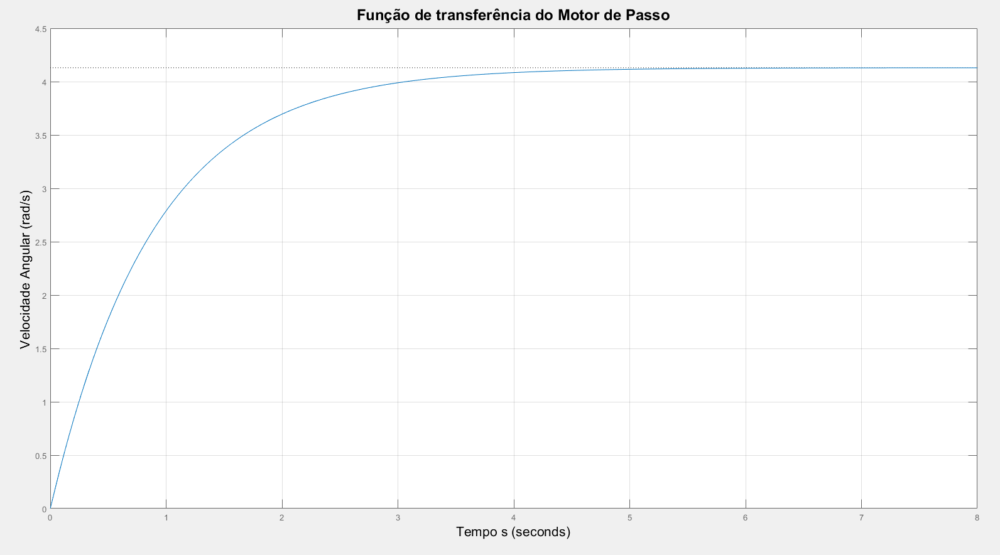

Figura 25: Função de transferência do motor de Passo.

É observado que o comporamento matemático do motor passo tem um comportamento de primeira ordem, más, na equação 12, foi mostrado que este era de segunda ordem, o que indica que o efieto de segunda ordem é pouco relevante para este sistema, por esse motivo foi feita uma aproximação para um modelo de primeira ordem, assim, foi feito um procedimento matemático para encontrar essa aproximação considerando que o termo de segunda ordem está em relação ao indutor, e sua contribuição é pequena, este parâmetro foi aproximado a zero, assim a EDO da equação 11 fica como mostra a equação 13.

Fazendo a representação da equação de transferência proposta na equação 15 e comparando com a função de transferência mostrada na equação 14, é verificado, que efetivamente o sistema pode ser representado como um sistema de primeira ordem, pois as duas respostas são idênticas.

Figura 26: Comparação do sistema de primeira e segunda ordem.

## 8. Diagrama com detalhes dos protocolos de comunicaçãos entre os elementos.

Até o momento no desenvolvimento da pesquisa, no circuito simulado e testado não temos protocolos de comunicação, pois, os dados são uniderecionados e o controle está relacionado com tensão. Foi identificado que estes protocolos de comunicação estão mais relacionados com a etapa de software que trabalhará com a coleta de dados e o processamento dos mesmos.

##  Testes Realizados de Eletrônica

Analisando o diagrama esquemático e as simulações realizadas, foi iniciado o processo de testes reais, inicialmente, foi montado o controle só para um motor de passo, e realizado os testes de velocidade de giro programados, a figura XX apresenta este teste realizado

 
Figura xx; Funcionamento de um motor de passo.

A figura apresenta o motor de passo com o controle proposto, foram feitos vários testes, programando diferentes velocidades de giro e monitoradas com o cronômetro de um celular, foi verificado que os resultados obtidos eram iguais aos simulados.

 

Assim, após ter testado o controle, foi modificado o código para poder controlar dois motores de passo com o mesmo código, porém com velocidades diferentes, pois, um motor vai controlar a mesa giratória e o outro a subida e descida da câmera e estes possivelmente tem velocidades diferentes, assim, usando um driver A4988 para cada motor foi testado  o controle projetado. O modelo real é mostrado na imagem X, retirada da gravação do funcionamento dos motores.

 

Figura X: Modelo real dos motores

Na figura X, observa-se os dois motores funcionando de acordo com o controle. Foi programado para que um motor faça uma volta em um minuto e o segundo duas voltas em dois minutos. A velocidade dos motores é baixa, mas ainda não foi ajustada, pois isso dependerá da precisão na coleta de dados para realizar o escâner. Um motor controlará a mesa de giro e o outro a subida e descida da câmera, que fará a coleta dos dados.

Seguidamente, foi realizado um teste de funcionamento do sensor de distância VL53L0X, o qual foi conectado nos pinos A4 e A5 da placa Arduino, conforme se mostra no circuito da figura XX.

  
Figura xx. Adição do sensor de distância VL53L0X ao projeto.

Este sensor foi adicionado ao projeto, pois foi necessário realizar uma integração entre a parte de eletrônica, energia e Software, o sensor foi testado  para medir a distância do objeto que será colocado na mesa giratório, o teste é apresentado  na figura Y, onde se mostra a calibragem do sensor.

 
Figura Y: Calibragem do sensor VL53L0X

O programa de calibragem foi obtido dos exemplos fornecidos na biblioteca do Arduino para o sensor. O teste foi realizado da seguinte forma, foi colocada uma régua, como mostra a figura e programado o sensor, e seguidamente foi colocado um objeto na frente do sensor seguindo a numeração da régua, onde o sensor mostrava no porto serial a distância do objeto, é importante mencionar que este sensor mede até 2m, após esta distância ele mostra uma mensagem no porto serial de fora de rango de medida.

Após finalizar esse teste de distância, os dois códigos (Motor e sensor de distância) foram combinados com o objetivo de mostrar no porto serial a velocidade dos motores e a distância captada pelo sensor. O objetivo é que o sensor detecte a distância do objeto na mesa e salve essas informações para posteriormente criar uma imagem a partir das distâncias coletadas, que serão processadas pela equipe de software.

 

Figura Z: Sistema completo de teste
 
Figura ZZ: Saída de dados no porto serial.

A figura Z, mostra o circuito montado, esta imagem foi pega da gravação realizada do funcionamento dos motores e sensor, foi testada a mesmas velocidades dos motores e distância que media o sensor, os dados apareceram no porto serial conforme mostra a figura ZZ, onde se observa a distância registrada e a velocidade de cada motor.

Finaliza-se atualizando os digramas circuitais, com a versão que adiciona o sensor VL53L0X pois este não tinha sido considerado inicialmente no projeto, e surgiu em função da necessidade de integrar a parte de eletrônica com a parte de software.

 
Diagrama esquemático com os motores e sensor de distância

 
Diagrama de barramentos com os motores e sensor de distância

## Testes futuros

-Medir a corrente do sistema final, e a corrente proveniente da bateria para dimensionar os condutores (Motor) pois eles podem ter picos de até 2A;

-Repetido os testes com a mesa montada, com o objetivo de testar o torque máximo com o peso máximo que a mesa poderá girar.

-Ajuste das tensões dos sensores, pois o Arduino precisa de 5V, o A4988 de 5V os motores de 12V e o sensor de distância VL53L0X funcionou adequadamente com 3.3V, para este caso sugiro usar as baterias de 12V e uma fonte que fornece 5 e 3,3V e garante uma corrente baixa para evitar danificar os sensores.

## Referências Bibliográficas

[1] Curto circuito, introdução ao motor de passo, https://curtocircuito.com.br/blog/motor-de-passo/introducao-ao-motor-de-passo,acesso 19:04 hora: 13:17

[2] FPG Paratodos, Controle de motor de passo,http://fpgaparatodos.com.br/2012/03/30/controle-de-um-motor-de-passo/ acesso 19/04/2024 hora 13:16

[3] STA, Sistema de Tecnología aplicada, Ronteck,CARACTERÍSTICAS PRINCIPAIS DO ARDUINO UNO,https://www.sta-eletronica.com.br/artigos/arduinos/caracteristicas-principais-do-arduino-uno, Acesso, 12/04/2024 hora 16:00

[4] O que é PWM e Para que Serve?,  Cristiano Bertulucci Silveira, publicado: novembro 26th, 2016, citisystems, acesso 16/04, hora 13:28, https://www.citisystems.com.br/pwm/
</a>

[5] Robocore, PonteH,https://www.robocore.net/tutoriais/motor-dc-arduino-ponte-h-l298n, Acesso 16/04/2024, hora 13:33.

[6] Datasheet - L298 - Dual full-bridge driver, https://www.st.com/resource/en/datasheet/l298.pdf

[7] Smart kits blog,https://blog.smartkits.com.br/pwm-como-usar/#:~:text=O%20PWM%20opera%20controlando%20o,%2C%20consequentemente%2C%20a%20pot%C3%AAncia%20el%C3%A9trica, Acesso, 16/04/2024, hora 13:26 

[8] Casa da Robótica, egulador de Tensão Step Down - Buck Conversor DC DC LM2596 3A, https://www.casadarobotica.com/fonte-e-conversores/conversores-dc-dc/step-down/regulador-de-tensao-step-down-buck-conversor-dc-dc-lm2596-3a, acesso 26/04/2024, hora: 20:25.

## Tabela de versionamento

| Versão| Data | Descrição | Responsável|
|-------|------|-----------|------------|
| 1.0 | 03/05/2024 | Subindo o arquivo com dados do motor de passo | Miguel Munoz |
| 1.2 | 03/05/2024 | Atualização do documento de acordo com o template | Miguel Munoz |
| 1.3 | 03/05/2024 | Revisão da Diretoria Técnica para padronização | Carolina |
| 1.4 | 04/05/2024 | Ajustes de fontes e alinhamentos | Ana Carolina |
| 1.5 | 04/05/2024 | Atualização da formatação | Carolina |