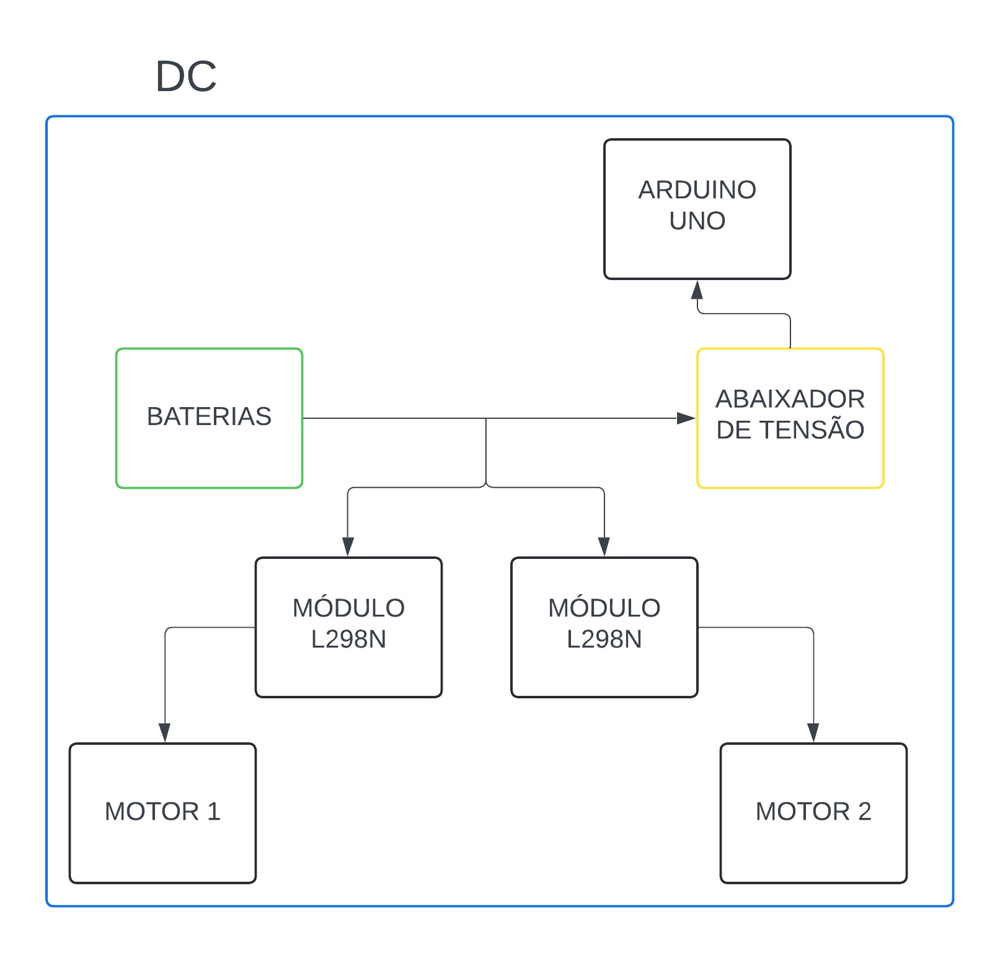

# Arquitetura do Subsistema de Energia

 A energia elétrica necessária para a operação do produto ScanPoint será fornecida por duas baterias de chumbo-ácido, todo o sistema estará operando em corrente contínua. As baterias fornecerão energia para as cargas (um  microcontrolador, um sensor de infravermelho e dois módulos L298N). Os motores, necessários para a rotação da mesa e movimentação do sensor de infravermelho, receberão energia de forma indireta, o módulo L298N estará sendo alimentado e assim alimentando os motores. Dessa forma, temos o seguinte diagrama representando a arquitetura: 

Figura 1 - Arquitetura de Energia. Fonte: Autoria própria <a href="#ref-1"> [1]. </a>

## Tabela de versionamento

| Versão| Data | Descrição | Responsável|
|-------|------|-----------|------------|
| 1.0 | 28/04/2024 | Criação do documento | Lucas Pantoja |
| 1.1 | 29/04/2024 | Edição de texto e imagem | Lucas Pantoja |
| 1.2 | 03/05/2024 | Atualização para padronização do documento| Lucas Pantoja |
| 1.3 | 04/05/2024 | Ajustes de alinhamento e formatação | Ana Carolina |
