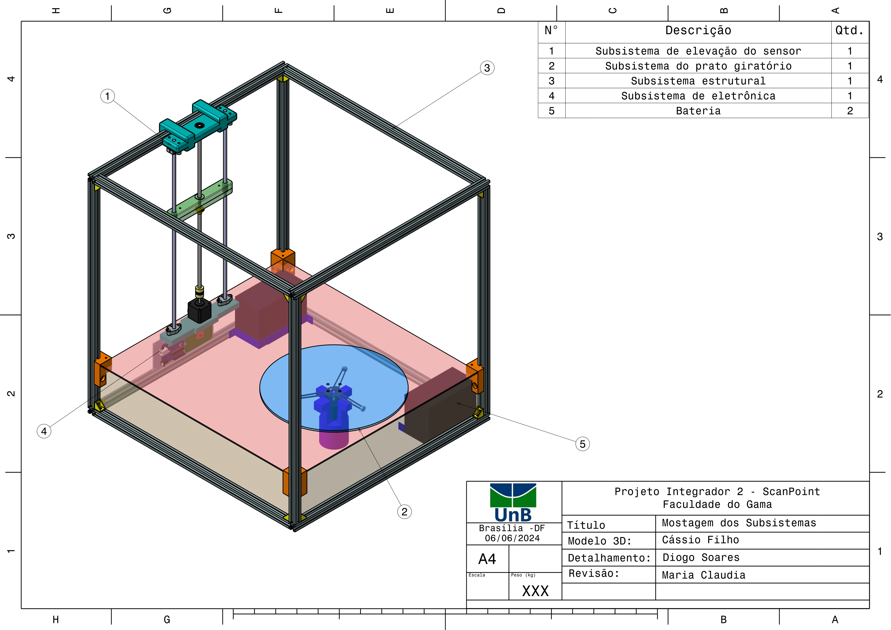
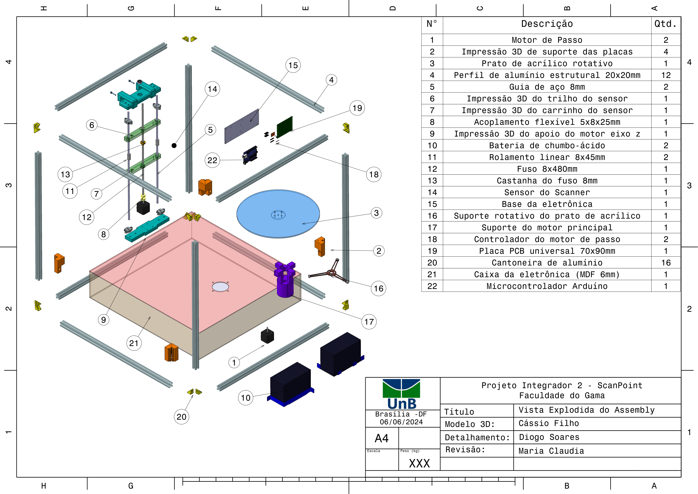
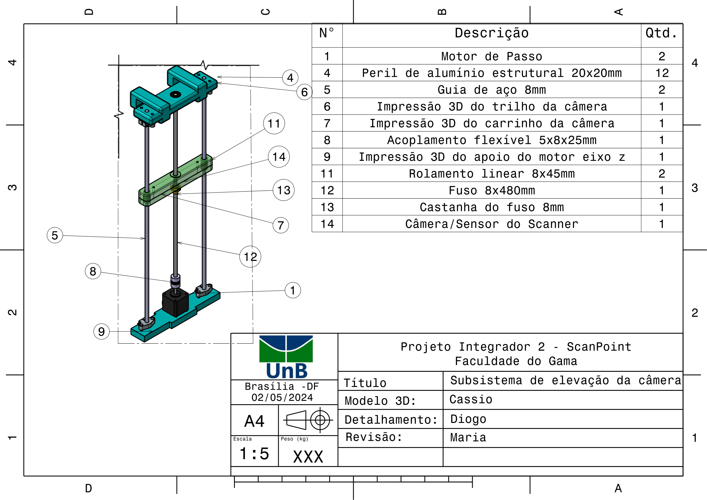
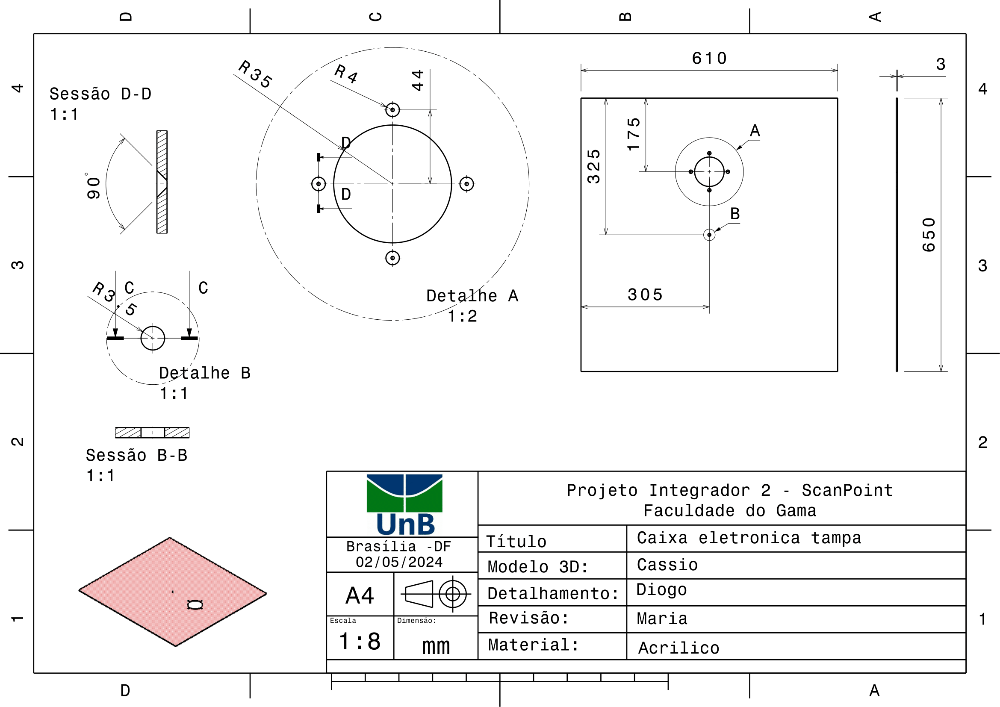
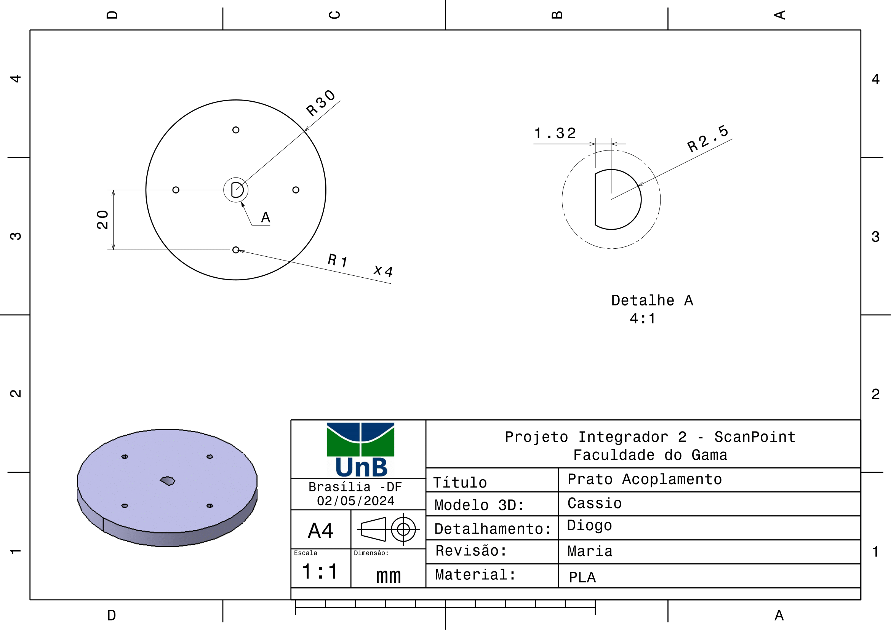
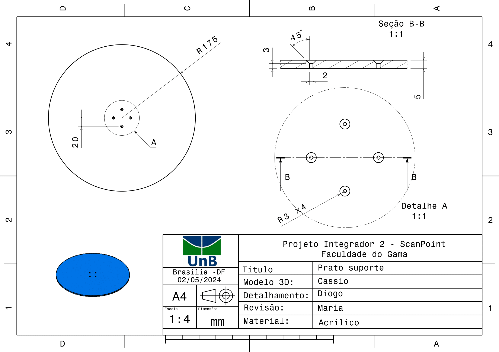
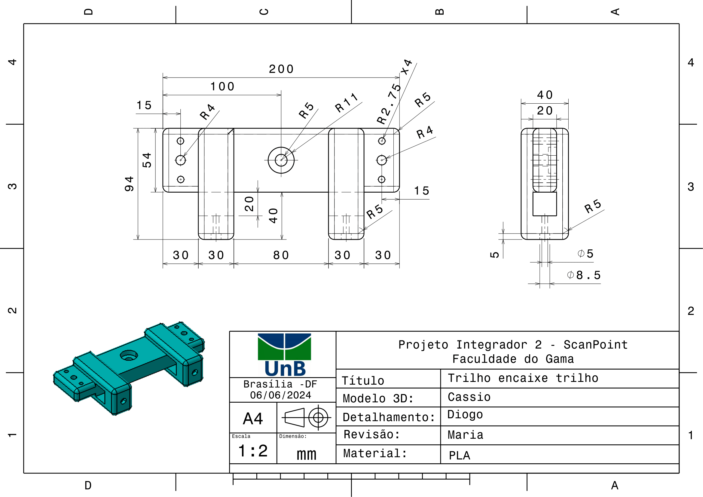

# Desenho Técnicos

## Sistema Montado

<!---->

## Sistema Explodido

## Subsistema Estrutural

<!---->

## Subsistema elevação do sensor 

## Subsistema Prato Giratório

## DTs Componentes 

