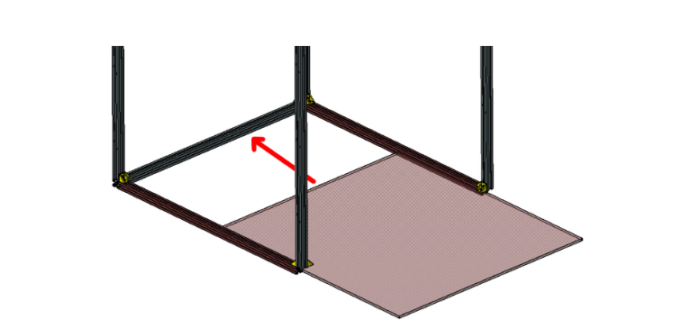
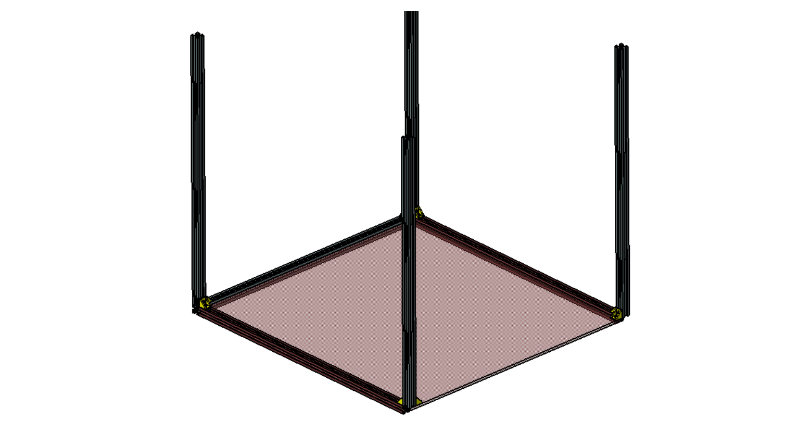
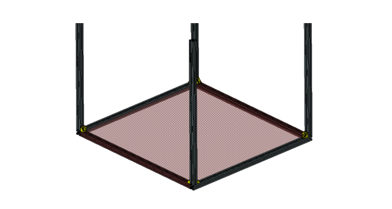

# Manual de Montagem

## Etapa 1

Para a montagem da estrutura, é recomendável que se inicie pela base de alumínio. Tal componente será usado de gabarito para posicionamento da caixa de madeira e junção geral da estrutura. A base de alumínio leva apenas:

* 8 perfis de alumínio,
* 8 cantoneiras de alumínio e 
* 16 parafusos m4 com porcas martelo.

Note no detalhamento que os perfis destacados em marrom devem ser posicionados internamente, já os demais são posicionados externamente na estrutura.

## Etapa 2

 Após a montagem, deve-se escolher um dos dois perfis externos da base e desmontar para a inclusão da base de madeira. A base de madeira é a peça de maiores dimensões (662mm x 622mm) e deve correr entre os vincos dos perfis de forma que fique fixa em todas as direções. As figuras abaixo representa tal processo:

 Por fim, o perfil de alumínio removido é fixado novamente em sua posição de origem, impedindo o movimento da placa de madeira da base:

## Etapa 3

 A terceira etapa do processo de montagem é o subsistema da caixa da eletrônica. A caixa da eletrônica é composta de 5 peças principais sendo elas: 

* 2 Paredes laterais menores (598mm x 140mm)
* 2 Paredes laterais maiores (650mm x 140mm)
* c1 Base (662mm x 622mm)

Para a montagem desse subsistema serão necessárias: 

* cianoacrilato (mais conhecido como adesivo instantâneo ou CA) 
* ou cola de madeira.

 Note que a base (662mm x 622mm) já está posicionada entre os perfis. Assim, inicia-se o processo de montagem colando as paredes laterais maiores paralelas à maior medida da base. As paredes laterais devem ficar rentes as dobradiças e as paredes menores devem ir internamente às maiores, conforme mostra a figura:

Podemos observar no detalhamento acima que a parede lateral menor deve ir internamente à parede lateral maior.

## Etapa 4

Deve-se, agora, posicionar as duas tampas (610mm x 325mm), que não devem ser coladas, a fim de permitir alguma eventual manutenção interna dos componentes. Para tanto, utilizaremos:

* 4 dobradiças;
* 2 fechos de caixa de madeira;
* 16 parafusos M4 com porcas. 

Iniciaremos o processo de montagem unindo ambas as tampas por meio de duas dobradiças, conforme a imagem:

A fixação das dobradiças será realizada com os parafusos e porcas M4.

Para seguir essa etapa, devemos agora posicionar mais duas dobradiças na menor lateral da placa não furada:

Por fim, posicionamos a peça fêmea dos fechos nas laterais opostas às dobradiças: 

Um componente essencial dessa montagem é o motor de passo e seu suporte, que deve ser fixado na parte debaixo da tampa, centralizado com o furo da placa e parafusado utilizando :

Ainda na parte inferior da tampa, porém agora na metade não furada, devemos posicionar centralizada a peça de suporte das guias, também impressa, representada de azul na figura, o motor de passe deve ser parafusado acima com parafusos M3, respeitando a furação já existente:

Finalmente a tampa deve ser fixada na caixa da eletrônica, através de 4 parafusos M4 para as dobradiças e do conjunto macho do fecho com seus parafusos:

## Etapa 5

Partindo agora para a fixação final da tampa na estrutura de alumínio, de cima para baixo, desliza-se as peças impressas em 3D, da maneira como está descrita na imagem e atentando-se para o posicionamento individual de cada uma, após isso realiza-se a fixação com parafusos M4, porcas e arruelas, partindo do topo da peça impressa até a parede da tampa, repetindo para os 4 cantos da estrutura. Atente-se para posicionar uma porca martelo em cada um dos slots da peça impressa, como destacado em verde na primeira figura:

Por fim, utilizando parafusos M4 e arruelas, deve-se parafusar as peças impressas diretamente nos perfis de alumínio, com auxílio das porcas-martelo, já posicionadas anteriormente.

## Etapa 6

Respeitando a furação da peça azul, deve-se agora posicionar os encaixes de alumínio das guias, as guias e, com um acoplador de 8mm, o fuso no motor do eixo:

Após, desliza-se o suporte do sensor com os rolamentos lineares atráves da guia, rotacionando o fuso na castanha para que o sistema desça uniformemente:

Finalizando o conjunto do trilho, adiciona-se a peça superior impressa ao conjunto, com os apoios de alumínio e o rolamento posicionado, essa peça é deslizada em um perfil de alumínio que é fixado aos perfis verticais, conforme a representação:

## Etapa 7

Finalizando a estrutura, posicionamos os perfis de alumínio restantes, juntamente com as cantoneiras e o prato de acrílico, com o acoplador de impressão 3D e o apoio do prato:

## Versionamento
| Versão | Data | Modificação | Autor |
|--|--|--|--|
| 1.0 | 07/06/2024 | Entrega | Cássio Filho |