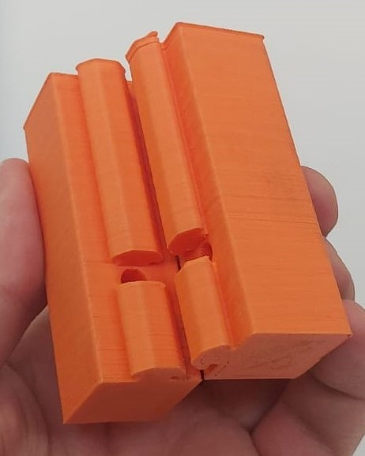
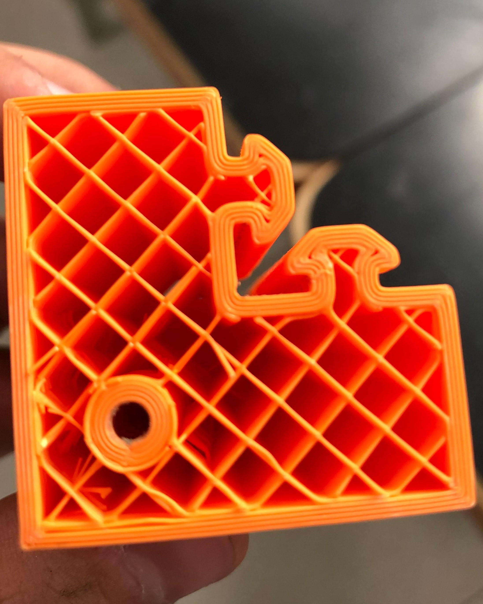
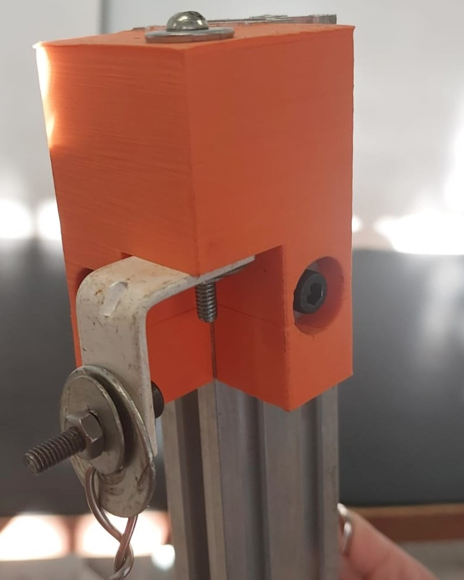
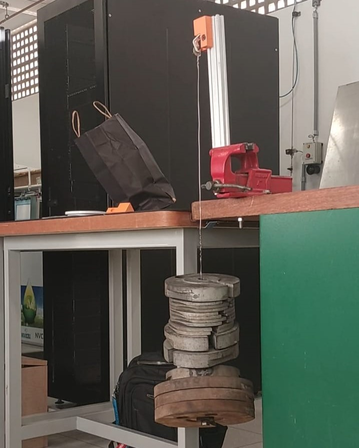
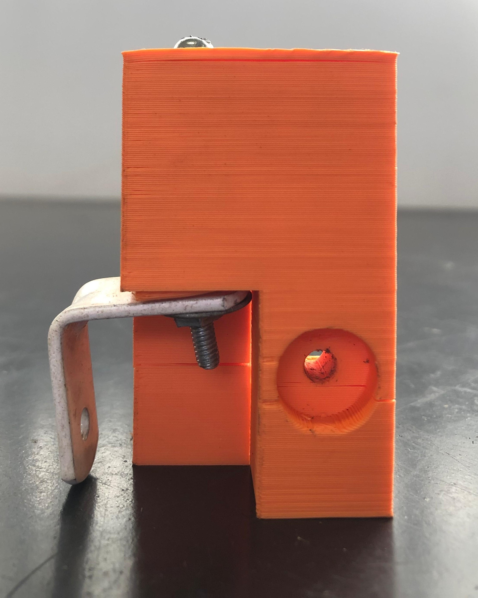
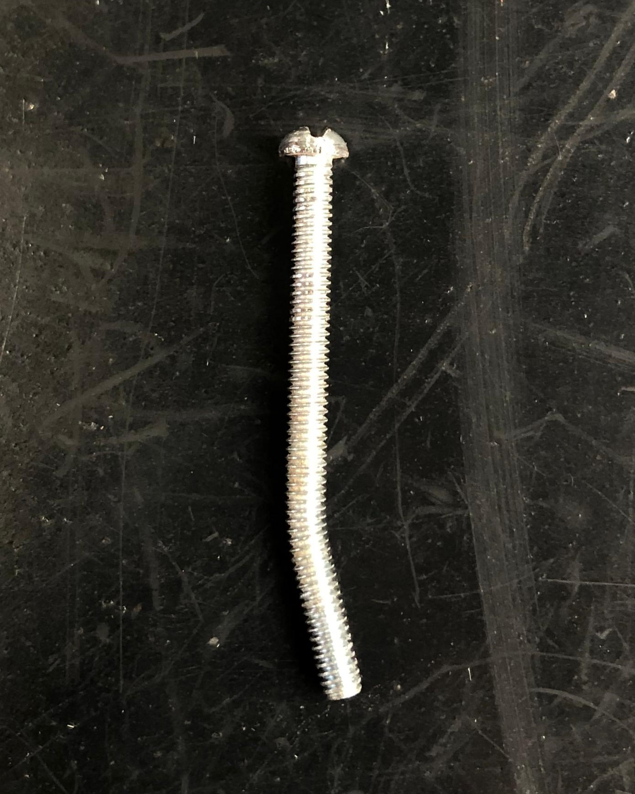
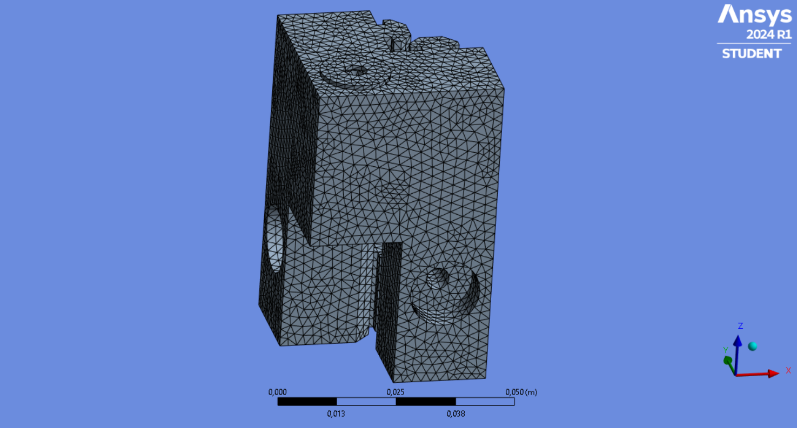
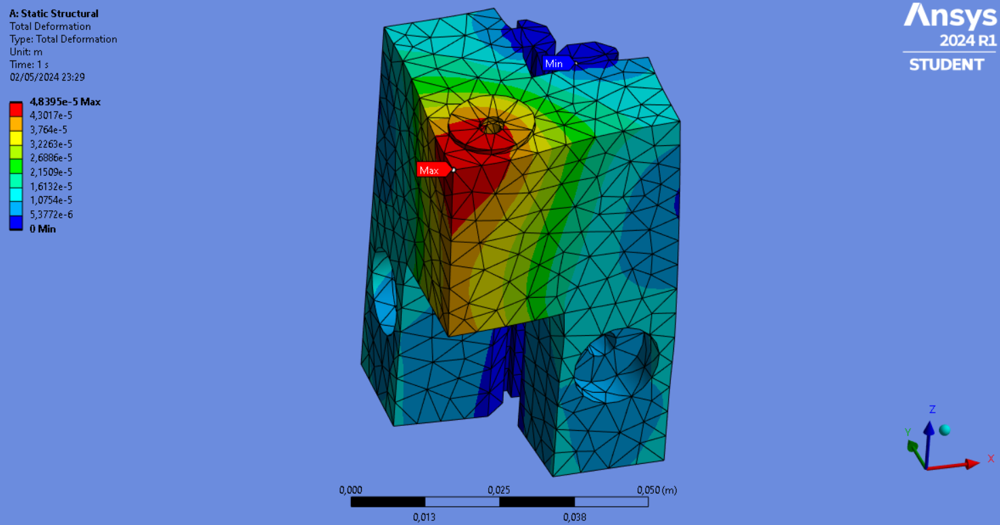

# Projeto do Subsistema de Estruturas

## Materiais

texto

## Análise Estrutural

texto

### Ensaios Estruturais

Graças aos pontos de restrição a quantidade de normas e trabalhos em peças em impressão 3D, optou-se pela realização de um ensaio para avaliação de integridade estrutural simples onde uma peça de testes foi elaborada e submetida a diversas quantidades de cargas com o intuito de validar seu uso para a aplicação desejada no projeto. A peça em estudo foi fabricada a partir do material PLA (biopolímero ácido poliláctico), com configuração de densidade de preenchimento de 10% do tipo zigue-zague e com 4 paredes de 0,88mm de espessura.

<!---->

<!-- -->

Com o auxílio de um perfil de alumínio e anilhas, a peça foi fixada e submetida continuamente a cargas cada vez maiores. A carga máxima aplicada à peça foi de 51,5 Kg, por não haver possibilidade de acréscimo a esta, não representando sua capacidade máxima de submissão suportada. 

Como resultado, tem-se que apesar de não ter sido observado o colapso estrutural do material, foram observadas deformações consideráveis na estrutura a partir de 35kg, carga que foi considerada máxima para o retorno da estrutura a suas condições iniciais. Após a definição de um fator de segurança de 2, definindo assim uma carga total por componente impresso de 16kg, calculado da seguinte forma:

$Fs = \frac{Cf}{Cmax}$

Onde Fs é o fator de segurança, Cf é a Carga de fratura e Cmax é a Carga máxima admissível considerando o fator de segurança definido.

 
Assim, avaliando a composição da estrutura com 4 peças impressas em 3D, a carga máxima admissível para o projeto, já considerando o fator de segurança, seria de 64Kg no total, satisfazendo de maneira superdimensionada as condições iniciais e de requisitos do projeto, o que apresenta margem suficiente para simplificação e reduções de rigidez, custos e complexidade dos materiais para as próximas análises de dimensionamentos e de otimização.

### Simulações numéricas

Para complementação e representação do apresentado até então através do ensaio prático estrutural, foi realizada através do software Ansys Workbench uma simulação numérica da peça. 

Possuindo as mesmas dimensões, a peça foi submetida as condições de contorno de força e apoio, sendo aplicada uma carga de 500N na direção do eixo z e apoios onde a peça foi fixada, considerando as faces em contato com o perfil de alumínio que foi utilizado. Foi determinado, pela limitação do software, um tamanho de malha de 5mm, e foram utilizados 10765 nós e 6447 elementos na mesma.

Como resultado, tem-se a deformação máxima de aproximadamente 4,84E-05m. Pode-se notar que o resultado mostrou-se visualmente bem próximo ao obtido pelo método anterior e que a deformação ocorre próximo a região de apoio onde foi inserido o parafuso e a ruela para apoio das cargas no objeto em questão.

