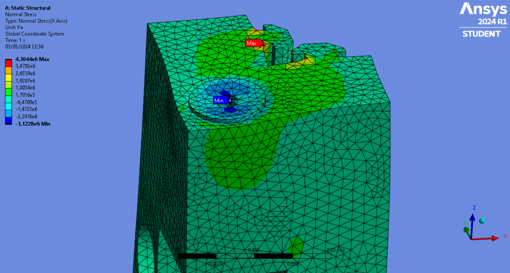
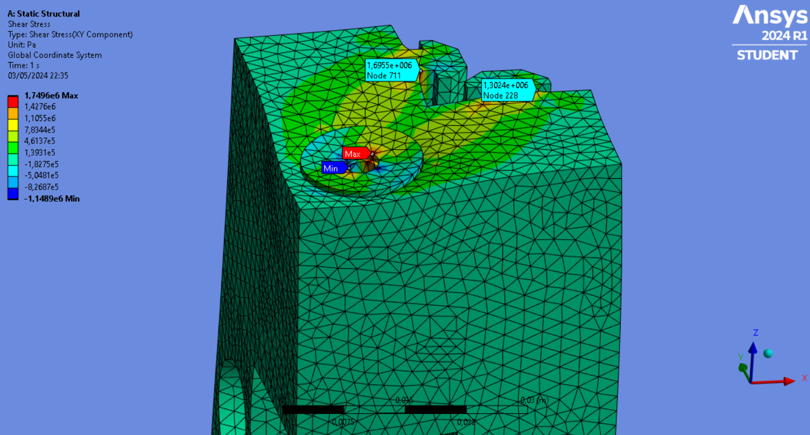

# Projeto do Subsistema de Estruturas

## Materiais

### Definição de critérios de avaliação dos materiais

Partindo dos requisitos, foram definidos critérios de análise que implicam em sua validação, para cada critério foi avaliado o peso, seguindo sua influência para cada um dos requisitos. Por exemplo, o critério de disponibilidade do material no laboratório recebe um ponto para o requisito de viabilidade econômica como sua veracidade ou não afeta diretamente o custo dos protótipos e do projeto final para o grupo, já o critério de embasamento estrutural literário apresenta nota 0 para esse mesmo requisito pois não gera nenhuma influência sobre os custos do projeto e simultaneamente sobre o requisito RN 1.

Abaixo estão listados os critérios definidos as pontuações para cada requisito e por fim o peso definido pela soma das pontuações:

| Critério                                    | RF1 | RF2 | RF3 | RF4 | RN1 | RN2 | Peso |
|---------------------------------------------|-----|-----|-----|-----|-----|-----|------|
| Possui normas nacionais para especificar seu uso? |  1  |  1  |  1  |  1  |  0  |  0  |  4   |
| Possui embasamento literário extenso para os cálculos? |  1  |  1  |  1  |  1  |  0  |  0  |  4   |
| Objeto disponível no laboratório?           |  0  |  0  |  0  |  0  |  1  |  1  |  2   |
| Possui vasta aplicação industrial no contexto de estruturas? |  1  |  1  |  1  |  1  |  1  |  1  |  6   |

### Lista e definição de materiais

Após a análise dos requisitos funcionais e não funcionais foi feito um levantamento de materiais disponíveis no laboratório, resultando na seguinte relação:

| Material                                       | Qtd. Disponível |
|------------------------------------------------|-----------------|
| Perfil de alumínio estrutural 20x20mm          |        12       |
| Fuso 8x480mm                                   |        1        |
| Motores de passo                               |        4        |
| Acoplador do motor de passo                    |       ~10       |
| Cantoneiras de alumínio                        |       ~70       |
| Guias de aço 8x600mm                           |        2        |
| Rolamento linear 8mm                           |        2        |
| Suporte de alumínio para eixo linear           |       ~10       |

## Análise Estrutural Preliminar

A análise estrutural preliminar foi dividida em duas partes: A análise geral do problema, buscando os parâmetros para atender aos requisitos do projeto e a análise individual, realizada para os componentes elencados como críticos para o projeto.

Para a análise geral foram realizadas simulações preliminares através da simplificação dos modelos, buscando uma noção inicial das cargas, deslocamentos e esforços sobre os quais a estrutura estará submetida.

Para a análise individual foi utilizada a metodologia de matriz de preferência descrita na oitava edição do livro: *Administração de produção e operações*, onde foram atribuídas notas para cada componente da estrutura de acordo com os critérios definidos.

Os materiais com maior probabilidade de apresentar falhas ou problemas em relação aos demais foram chamados de componentes críticos e são, na matriz de preferência, aqueles com as menores notas. As notas foram atribuídas de 0 até 1, sendo as possibilidades:

- 0,0 (Totalmente falso);
- 0,3 (Parcialmente falso/Pobre de informações);
- 0,6 (Parcialmente verdadeiro/Aceitável em informação) e
- 1,0 (Verdadeiro).

Cada uma das perguntas realizadas como critério de avaliação dos componentes estruturais principais e seus respectivos pesos estão descritas na tabela abaixo:

|         Critério                                             |  Peso    | Perfis de alumínio estrutural | Placa de madeira | Impressão 3D | Motores |
|--------------------------------------------------------------|----------|-------------------------------|------------------|--------------|---------|
| Possui normas nacionais para especificar seu uso?            | 4        | 1,0                           | 1,0             | 0            | 1,0     |
| Possui embasamento literário extenso para os cálculos?       | 4        | 1,0                           | 0,6             | 0,3          | 1       |
| Objeto disponível no laboratório?                            | 2        | 0,6                           | 0               | 0            | 1       |
| Possui vasta aplicação industrial no contexto de estruturas? | 6        | 1,0                           | 1,0             | 0,3          | 1,0     |
| Total                                                        | 16       | 3,6                           | 2,6             | 0,6          | 4       |
| Total com pesos                                              | 28       | 15,2                          | 12,4            | 3            | 16      |

Dessa forma como material crítico para a análise foi escolhida a impressão 3D que recebeu nota 3 considerando os pesos e os critérios de cada peso, diante, principalmente, da dificuldade de se encontrar material teórico acerca do assunto e da sua relativa recência em termos de aplicação industrial, quando comparado com os demais componentes do projeto.

A partir de tal definição foram realizados ensaios estruturais e simulações par a validação do componente crítico definido anteriormente. 

### Ensaios Estruturais

Graças aos pontos descritos anteriormente, optou-se pela realização de um ensaio para avaliação de integridade estrutural simples onde uma peça de testes foi elaborada e submetida a diversas quantidades de cargas com o intuito de validar seu uso para a aplicação desejada no projeto. A peça de estudo foi fabricada a partir do material PLA (biopolímero ácido poliláctico), com configuração de densidade de preenchimento de 10% do tipo zigue-zague e com 4 paredes de 0,88mm de espessura.

Figura 1 - Geometria de preenchimento da peça  
Fonte: Autores.

Foi realizada uma montagem preliminar de um sistema análogo ao subsistema estrutural, formado por um perfil de alumínio, porcas, arruelas e parafusos e, claro, a peça estrutural de impressão 3D,além disso foi incluido no sistema uma cantoneira de aço para facilitar a aplicação de carga. A simplificação do subsistema de estruturas pode ser visualizada na imagem abaixo:

Figura 2 - Fixação da peça para o ensaio  
Fonte: Autores.

Com o auxílio de anilhas, a peça foi fixada e submetida continuamente a cargas cada vez maiores. O objetivo inicial da análise era a aplicação de carga até o colapso da estrutura, porém, a carga máxima aplicada à peça foi de 51,5 Kg, por não haver possibilidade de acréscimo a esta, não representando sua capacidade máxima de submissão suportada, porém fornecendo base suficiente para a análise.

Figura 3 - Aparato com aplicação de carga 
Fonte: Autores.

Como resultado, tem-se que apesar de não ter sido observado o colapso estrutural do material, foram observadas deformações consideráveis na estrutura a partir de 35kg, carga que foi considerada máxima para o retorno da estrutura a suas condições iniciais. Após a definição de um fator de segurança de 2, definindo assim uma carga total por componente impresso de 16kg, calculado da seguinte forma:

Fs = Cf/Cmax

Onde Fs é o fator de segurança, Cf é a Carga de fratura e Cmax é a Carga máxima admissível considerando o fator de segurança definido.

Figura 4 - Estrutura da peça após o ensaio 
Fonte: Autores.

Figura 5 - Parafuso de fixação após o ensaio 
Fonte: Autores.

 
Assim, avaliando a composição da estrutura com 4 peças impressas em 3D, a carga máxima admissível para o projeto, já considerando o fator de segurança, seria de 64Kg no total, satisfazendo de maneira superdimensionada as condições iniciais e de requisitos do projeto, o que apresenta margem suficiente para simplificação e reduções de rigidez, custos e complexidade dos materiais para as próximas análises de dimensionamentos e de otimização.

### Simulações numéricas

Para complementação e representação do apresentado até então através do ensaio prático estrutural, foi realizada através do software Ansys Workbench uma simulação numérica da peça. 

Figura 6 - Malha de elementos utilizada na simulação 
Fonte: Autores.

Possuindo as mesmas dimensões, a peça foi submetida as condições de contorno de força e apoio, sendo aplicada uma carga de 500N na direção do eixo z e apoios onde a peça foi fixada, considerando as faces em contato com o perfil de alumínio que foi utilizado. Foi determinado, pela limitação do software, um tamanho de malha de 2mm, e foram utilizados 116744 nós e 79896 elementos na mesma.

Figura 8 - Face superior da peça real após o ensaio 
Fonte: Autores.

Como pode ser observado nas imagens das simulações de tensão normal e de cisalhamento e nos pontos de interesse representados pelas setas azuis, as regiões analisadas representam possíveis regiões de fratura para a peça em questão. Apesar de as simulações não representarem a situação obtida no ensaio estrutural , visto que a peça utilizada tem características difíceis de se simular, como preenchimento não maciço e camadas de filamento sobrepostas, as análises computacionais servem de boa base para identificação de possíveis pontos críticos da estrutura e, posteriormente, realizar comparações entre os materiais pretendidos para cada componente.

Figura 9 - Tensão normal 
Fonte: Autores.

Figura 10 - Tensão de cisalhamento 
Fonte: Autores.

Por fim, realizando a comparação entre o material simulado e o ensaio estrutural podemos verificar que as condições estabelecidas pelo Ansys para pontos críticos da estrutura foram validadas, já que, como observado na figura abaixo, os pontos críticos representados pelo Ansys condizem com os pontos de ruptura e deformação da peça durante ensaio estrutural.

# Referências

* KRAJEWSKI, Lee J.; RITZMAN, Larry P.; MALHOTRA, Manoj K. Administração de produção e operações. 8. ed. São Paulo: Pearson, 2012. xiv, 615 p. ISBN 9788576051725.

* ASSOCIAÇÃO BRASILEIRA DE NORMAS TÉCNICAS. ABNT NBR 08403: Aplicação de linhas em desenhos - Tipos de linhas - Larguras das linhas Rio de Janeiro, 1984.

* ASSOCIAÇÃO BRASILEIRA DE NORMAS TÉCNICAS. ABNT NBR 10067 - Princípios Gerais de Representação em Desenho Técnico, 1995

* ASSOCIAÇÃO BRASILEIRA DE NORMAS TÉCNICAS. ABNT NBR 10068 - Folha de Desenho - Leiaute e Dimensões, 1987
 
* ASSOCIAÇÃO BRASILEIRA DE NORMAS TÉCNICAS. ABNT NBR 10126 - Cotagem em Desenho Técnico, 1987

## Versionamento
| Versão | Data | Modificação | Autor |
|--|--|--|--|
| 0.1 | 30/04/2024 | Criação do documento | Cássio Filho; Diogo Soares e Maria Claudia |
| 0.2 | 02/05/2024 | Adicionando arquivos de simulação | Cássio Filho; Diogo Soares e Maria Claudia|
| 1.0 | 03/05/2024 | Atualizações finais |Cássio Filho; Diogo Soares e Maria Claudia|
