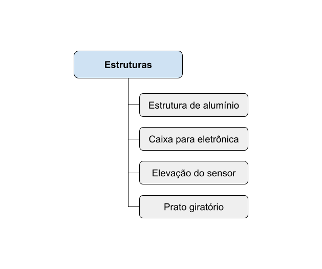
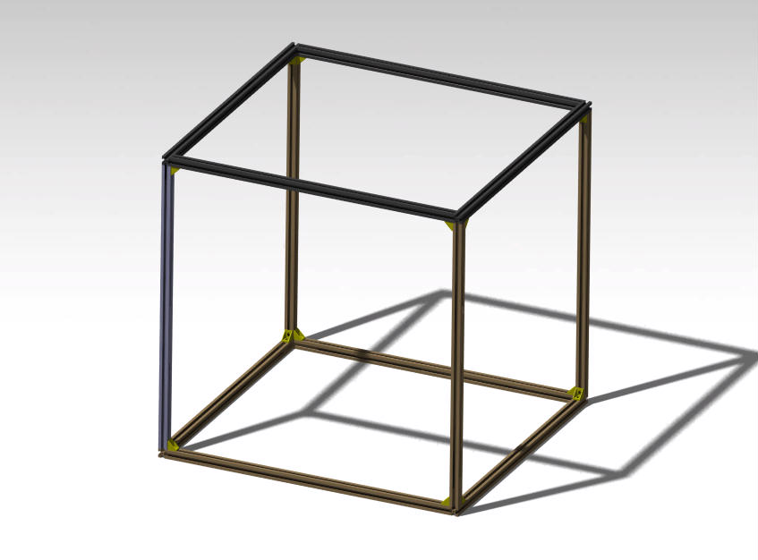
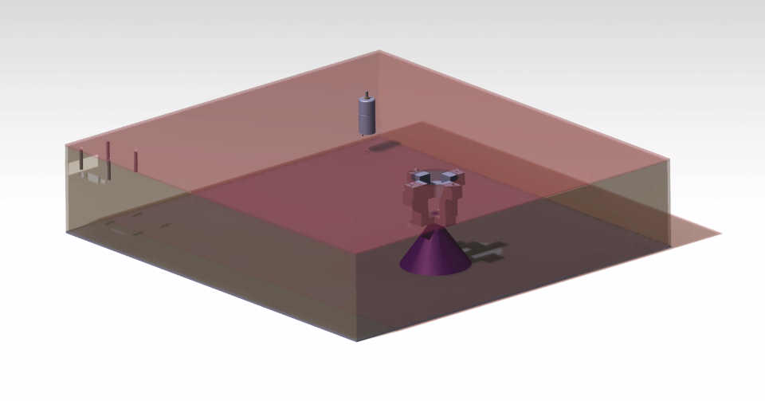
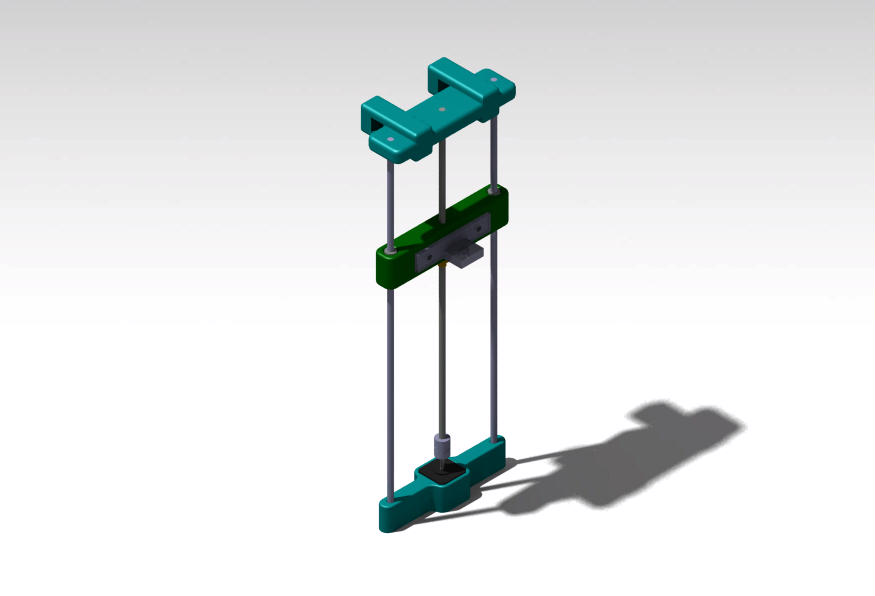
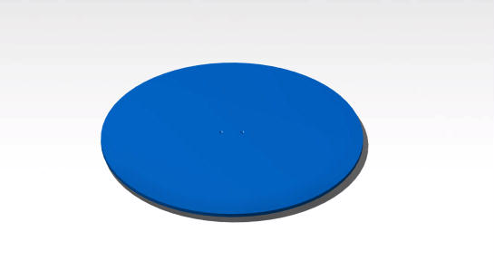

# Arquitetura do Subsistema de Estruturas

A Estrutura do projeto Scain Point é dividida em quatro partes, sendo elas a estrutura de alumínio, o prato giratório, o suporte para o sensor e a caixa de eletrônica. 

## Estrutura de alumínio

A parte estrutural externa é composta de perfis de alumínio que abrangerão todos os componentes físicos do projeto. 

## Caixa para eletrônica

A caixa de eletrônica serivirá para armazenar os componentes de eletrônica como bateria, motores, arduino, que serão essenciais para o controle do prato e do sensor. Ela foi pensada de forma a otimizar o espaço de acordo com os componentes que estarão nela, assim como deixar espaço para possíveis atualizações de eletrônica/energia ou software.

## Elevação do sensor

A elevação do sensor acontece através de dois eixos guias e sua movimentação ocorre a partir de um encaixe para o sensor em um fuso ligado ao motor. Aqui serão utilizadas algumas peças em Impressão 3D para auxiliar na fabricação das partes de fixação dos fusos e do sensor.

## Prato giratório

O prato giratório servirá para auxiliar na movimentação da peça em questão que estará sendo escaneada. Ele foi projetado de acordo com os requisitos de tamanho da peça e peso máximo, além de possuir suporte para fixação do motor e apoio com rodinhas para aumento de estabilidade durante a movimentação.

