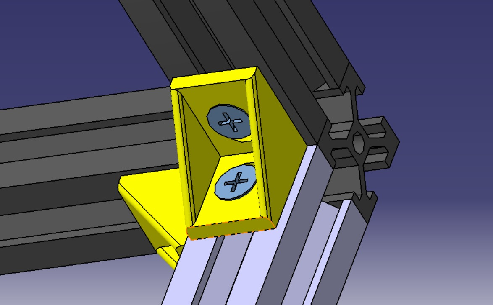

# Arquitetura do Subsistema de Estruturas

A Estrutura física do projeto **ScainPoint** foi pensada para comportar, de forma eficiente, todos os componentes eletrônicos do sistema. Para isso, o protótipo foi dividido em quatro subsistemas: estrutura de alumínio, prato giratório, elevação do sensor e a caixa da eletrônica (empacotamento da eletrônica). 

Figura 1 - Diagrama de componentes da arquitetura de estruturas  
Fonte: Autores.

## Estrutura de alumínio

Para a parte estrutural externa, foi pensado o uso de 12 perfis de alumínio estrutural, com dimensões de 20mmx20mm e comprimento de 700mm, ligados entre si por meio de cantoneiras e conjuntos de parafusos M4 com o auxílio de porca martelo. Assim formando uma estrutura em formato cuco, sendo os perfil as arestas, dando o apoio necessário para os demais subsistemas. 

Figura 2 - Estrutura externa de alumínio  
Fonte: Autores.

Figura 3 - Cantoneiras utilizadas na fixação de estruturas  
Fonte: Autores.

## Caixa para eletrônica

A Caixa da eletrônica foi pensada para armazenar todos os componentes eletrônicos do projeto como bateria, motor, componentes de controle como o Arduino, PCBs, cabos e demais equipamentos. Ela foi pensada de forma a otimizar o espaço de acordo com os componentes preliminares, esconder componentes cimo cabos e fios, dando melhor acabamento ao projeto, assim como deixar espaço suficiente para possíveis atualizações de eletrônica, energia ou software.

Figura 4 - Caixa utilizada para o armazenamento dos componentes de eletrônica  
Fonte: Autores.

## Elevação do sensor

O subsistema de elevação do sensor é feito com o auxilio de peças em impressão 3D, uma barra roscada fuso, barras guias, motor de passo, e o sensor de distância. Tais peças em impressão 3D são feitas em PLA, facilitando sua fabricação e servem como suportes para os demais componentes do subsistema. A elevação do sensor acontece através uma peça guiada por 2 eixos e sua movimentação ocorre a partir da barra fuso ligado ao motor de passo. 

Figura 5 - Trilho para movimentação do sensor  
Fonte: Autores.

## Prato giratório

O prato giratório servirá para auxiliar na movimentação da peça em questão que estará sendo escaneada. Ele foi projetado de acordo com os requisitos de tamanho da peça e peso máximo, além de possuir suporte para fixação do motor e apoio com roldanas para aumento de estabilidade durante a sua movimentação.

Figura 6 - Prato utilizado para a rotação do objeto a ser escaneado  
Fonte: Autores.

## Versionamento
| Versão | Data | Modificação | Autor |
|--|--|--|--|
| 0.1 | 25/04/2024 | Criação do documento | Maria Claudia |
| 0.2 | 30/04/2024 | Adicionando textos e imagens | Maria Claudia e Diogo|
| 1.0 | 30/04/2024 | Atualização de drawings |Diogo|