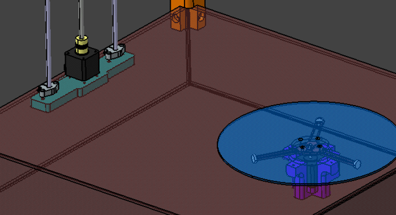
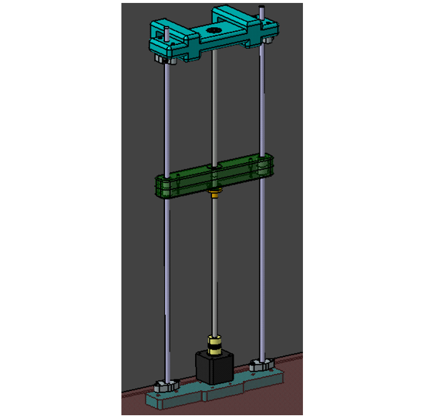

# Integração dos subsistemas

O projeto ScanPoint envolve a integração de componentes eletrônicos, software e estrutura física para criar um sistema de escaneamento preciso e eficiente. 

Na parte eletrônica, o sistema é composto por dois motores de passo, dois drivers A4988 e um sensor de distância a laser VL53L0X, que trabalham em conjunto para controlar os movimentos do scanner. 

O software desempenha um papel crucial no processamento dos dados capturados pelo sensor. Utilizando comunicação via porta serial, os dados de distância são enviados para serem analisados e convertidos em um modelo digital tridimensional. Este processo requer algoritmos sofisticados para assegurar a precisão e a fidelidade da malha gerada em relação ao objeto escaneado.

A estrutura física do scanner é projetada para acomodar todos os componentes eletrônicos de maneira organizada e eficiente. É essencial que a estrutura ofereça um acesso adequado ao componentes eletrônicos e mantenha uma estética limpa, escondendo a fiação. A precisão no design da estrutura é fundamental para garantir que os movimentos dos motores sejam suaves e coordenados, permitindo uma análise detalhada e sem erros do objeto.

## Estrutura e energia

A integração dos subsistemas de energia e estrutura do projeto consiste na construção de uma caixa para abrigar componentes dos subsistemas de energia e eletrônica. Feita em madeira MDF, os componentes estarão
apoiados diretamente neste material, já que o mesmo possui baixa condutividade.
Assim como as baterias, os barramentos e cabos também estarão fixados na caixa, para evitar um possível curto-circuito causado pelo contato desses componentes.

Visando a construção de um protótipo mais compacto, a escolha das baterias foi pensada para não ocupar muito espaço e não pesar sobre a estrutura. Além disso, a caixa foi projetada de forma a abrigar a quantidade atual de baterias com possibilidade incluir mais baterias a fim de estender o tempo de funcionamento do escaner.

## Estrutura e eletrônica

A área de eletrônica se integra à área estrutural por ser importante conhecer o peso, tamanho e características dos componentes para que a equipe possa projetar e montar corretamente o sistema.

A parte eletrônica precisa de um espaço ventilado para acomodar a placa que conterá os sensores e motores,devendo ser algo considerado para evitar o superaquecimento dos componentes. Além disso, a equipe deve prezar pela estética, escondendo a fiação dentro da estrutura.

Quanto aos motores, a integração deles com a estrutura do scanner deve permitir um controle suave e coordenado dos movimentos, garantindo a precisão necessária na análise dos dados rotacionais e de elevação do sensor. Essa precisão é crucial para minimizar erros e assegurar que o objeto escaneado corresponda fielmente à malha gerada.

O funcionamento dos motores é o seguinte:

O motor 1 controla o prato, conforme mostrado na Figura 1, onde será colocado o objeto a ser escaneado. O motor 1 gira a uma volta por minuto, realizando 200 passos de 1,8 graus cada para completar uma rotação completa.

    Figura 1 - Prato acoplado ao Motor 1

 

O motor 2, que estará acoplado a uma barra de giro conforme mostrado na Figura 2, permanecerá parado até que o motor 1 complete sua rotação. Assim que o motor 1 finalizar sua volta, o motor 2 realizará um giro completo em 1 segundo. A função deste motor é elevar a câmera que fará o escaneamento, movimentando-se em passos de um minuto. Na câmera, estará instalado o sensor de distância a laser VL53L0X, responsável por medir a distância entre o objeto e a câmera.

    Figura 2 - Acoplamento do Motor 2 a barra que subirá a câmera

 

O Sensor de distância enviará os dados utilizando o porto serial da placa Arduino uno, para ser processados pela equipe de software, que gerará o arquivo para ser impresso pela impressora 3D.

## Energia e eletrônica

O subsistema de energia é responsável por fornecer as tensões e correntes adequadas para alimentar os componentes do subsistema de eletrônica. Com isso em mente, a montagem de ambos os subsistemas foi realizada já considerando a fase de integração. Foram instalados conectores no final do subsistema de energia, os quais podem ser conectados diretamente ao Arduino e à Ponte H, recebendo, respectivamente, 12 V e 5 V.

## Software e eletrônica

Como definido na arquitetura, a comunicação entre o Software e eletrônica está sendo feito a partir da entrada serial. Com isso, a aplicação em Electron se comunicará com o Arduíno pela entrada USB conectada diretamento no computador, sendo a conexão bidirecional, isto é, tanto o arduíno recebe sinais da aplicação, como a aplicação também recebe sinais do Arduíno.

Assim, a comunicação é dividida em dois pontos, a inicialização do processo de escaneamento e a comunicação das medições do Sensor infravermelho.

### Inicialização

Para que o arduíno possa começar a fazer o processo de medição, ele precisará receber um sinal da aplicação, chamando assim, o loop de escaneamento.

Com isso o código para a comunicação é dividido no envio da mensagem pela aplicação e no recebimento dessa informação:

- Envio da mensagem: A aplicação deve instânciar um Port, definindo o baudRate, em seguida, chama um port.write com a mensagem a ser mandada ao Arduíno.

- Recebimento da mensagem: Após instânciar o Serial, faz a leitura dessa mensagem até identificar o fim da mensagem, ao receber a mensagem de início, se chama o código para leitura;

### Medição do Sensor

Para fazer o processo de escaneamento e processamento da nuvem de pontos, os dados coletados pelo arduíno devem ser transmitidos para a aplicação, esse processo é mais simples, sendo necessário apenas que a aplicação leia o que o Arduíno está implimindo na entrada serial, usando o Serial.println(), na aplicação, após instânciar o port, podemos usar o parser-readline para ler os dados da entreda serial, assim recebendo os dados e processando-os como necessário na aplicação.

# Tabela de versionamento
|Versão| Data | Responsável | Descrição|
|------|------|-------------|----------|
| 0.1 | 07/06/2024 | Carla R. Cangussú | Esqueleto do documento |
| 0.2 | 07/06/2024 | Artur de Sousa | Adicionado integração software e eletrônica |
| 0.3 | 07/06/2024 | Maria Claudia e Carolina | Adicionado integração estruturas e energia |
| 0.4 | 07/06/2024 | Carolina | Adicionado integração energia e eletrônica |
| 0.5 | 07/06/2024 | Brenda | Ajustes |