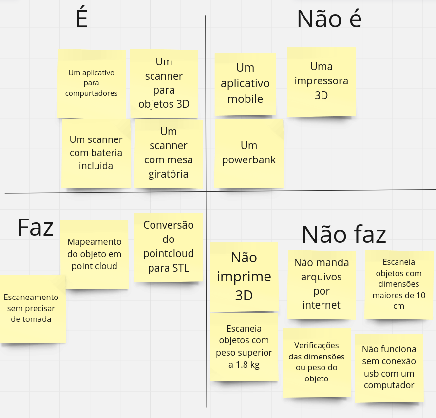

# Documento de Visão

## 1. Introdução

 No contexto atual da fabricação digital, a demanda por soluções que simplifiquem e aprimorem o processo de digitalização 3D está em constante crescimento. No âmbito da disciplina de Projeto Integrador 2 da Universidade de Brasília, cujo objetivo é integrar as engenharias eletrônica, energia, aeroespacial, automotiva e de software do campus Gama, surgiu a iniciativa de desenvolver um projeto que viabilize a construção de um scanner. A abordagem escolhida é baseada na utilização de sensores infravermelhos para capturar pontos de distância de objetos físicos, concentrando o controle dos sensores e motores em apenas um Arduino. Posteriormente, os pontos identificados são enviados para um computador, onde são processados para formar uma nuvem de pontos (point cloud), que, por sua vez, é utilizada para gerar um modelo tridimensional.

 Este projeto representa uma abordagem que utiliza tecnologias como o Arduino e sensores infravermelhos, tornando o projeto mais acessível e disponível para uma gama mais ampla de usuários, reduzindo as barreiras de entrada para a digitalização 3D. A versatilidade e a capacidade de processamento do Arduino em conjunto com a precisão dos sensores infravermelho são responsáveis pela captura dos pontos de distância do objeto em questão, e, assim, o sistema cria uma representação digital precisa da sua superfície, sem a necessidade de equipamentos complexos ou de alto custo. 

 Ao adotar uma abordagem que combina acessibilidade, simplicidade e, futuramente, eficiência ao realizar o escaneamento e digitalização 3D, este projeto tem o potencial de democratizar esse processo e torná-lo utilizável a uma ampla gama de usuários, desde entusiastas e estudantes até profissionais e empresas. Além disso, ao utilizar tecnologias de código aberto, incentiva-se a colaboração e o desenvolvimento contínuo, criando um ecossistema de inovação compartilhado. Este documento tem como objetivo apresentar o ScanPoint em detalhes, destacando seus recursos, benefícios e aplicações. 
 

## 2. Definição do Produto

 O ScanPoint é composto por uma mesa escaner e um aplicativo desktop. A mesa escaner foi desenvolvida com um Arduino e sensores infravermelhos, capazes de realizar leituras de objetos em tempo real. Esses dados são enviados para o aplicativo desktop, que permite o acompanhamento do processamento dos pontos capturados e serve de interface para a disponibilização do arquivo em formato STL e seu download. O processo de modelagem envolve a captura e processamento de dados para criar um modelo virtual o mais preciso possível. Esses modelos podem ser salvos e exibidos para o usuário, permitindo que reinicie o processo caso não esteja satisfeito antes de realizar o download. 

### 2.1. Perspectiva do Produto

 O foco central do projeto é simplificar e agilizar o processo de digitalização de objetos físicos para posterior impressão em 3D. O objetivo primordial é oferecer uma interface intuitiva que permita a captura eficiente de dados, o processamento otimizado desses dados e a geração de arquivos 3D prontos para impressão. Em paralelo, busca-se estabelecer um sistema robusto e confiável, capaz de realizar o escaneamento com precisão e reproduzir fielmente o objeto físico em formato digital. Essa abordagem visa não apenas tornar a tecnologia de digitalização 3D mais acessível, mas também garantir resultados de alta qualidade e confiabilidade para uma ampla gama de aplicações. 

### 2.2. Resumo dos Recursos

 Os recursos do ScanPoint foram pensados para garantir uma experiência intuitiva para o usuário e simplificada, desde a captura inicial dos pontos até a criação do modelo 3D pronto para impressão. Para isso, destacam-se cinco componentes essenciais da solução:  

* **Interação com o usuário:** Sistema para interação com usuário, dando explicações iniciais necessárias, permitindo iniciar o processo, acompanhar aproximadamente quanto tempo falta até o fim do processo, cancelar e pré-visualizar o resultado do que será enviado para impressão.

* **Captura dos pontos:** Realiza a captura dos pontos do objeto físico a ser escaneado.

* **Processamento:**  O sistema processa pontos capturados pelo infravermelho. 

* **Pré visualização do resultado:** Após o processamento do objeto, o sistema oferece uma pré-visualização do resultado final do modelo 3D gerado, permitindo ao usuário revisar e confirmar antes de prosseguir para o download ou a impressão.

* **Download do arquivo:** O usuário tem a opção de baixar o arquivo 3D gerado para impressão posterior, garantindo flexibilidade e conveniência no uso do sistema.

## 3. Restrições

 As restrições impostas pelo ScanPoint podem ser críticas para os desenvolvedores e usuários. Essas limitações podem afetar diretamente a eficácia e a utilidade do equipamento, tornando importante entender e gerenciar esses fatores. Algumas das principais restrições observadas são: 

### 3.1. Restrições de Implementação

 Considerando as restrições de implementação para o produto, podemos identificar várias áreas que podem influenciar seu desenvolvimento e produção: 

* **Recursos financeiros:** Desenvolver e fabricar um produto pode exigir investimentos significativos em pesquisa e desenvolvimento, além de custos associados aos materiais para a construção do scanner. Limitações de orçamento podem influenciar a seleção de materiais, tecnologias e métodos de produção.

* **Tecnologia disponível:** A qualidade da nuvem de pontos gerada pelo ScanPoint pode ser limitada pela precisão dos sensores e algoritmos utilizados na captura dos dados de distância. Restrições relacionadas à resolução e calibração dos sensores podem afetar diretamente a fidelidade e a completude da nuvem de pontos resultante.

* **Materiais:** As restrições relacionadas aos materiais podem incluir a necessidade de selecionar materiais que sejam leves, duráveis e capazes de suportar o peso dos objetos a serem digitalizados. Além disso, os materiais selecionados devem ser compatíveis com as tecnologias de digitalização e não interferir na qualidade dos resultados.

* **Prazos:** Restrições de tempo podem ser impostas por demandas da disciplina para cumprir os prazos estipulados pela ementa e plano de ensino, podendo influenciar o escopo e a complexidade do projeto.

### 3.2. Restrições de Uso

 Em relação às principais restrições de uso do produto, podem ser observadas: 

* **Tamanho do objeto:** Objetos muito grandes podem não se adequar à área de digitalização ou ultrapassar a capacidade de carga do sistema de rotação, o que restringe a versatilidade do equipamento. Essa restrição tem sua origem no tamanho da estrutura do projeto, a qual foi cuidadosamente dimensionada para permitir a construção e os testes dentro dos parâmetros estabelecidos pela disciplina. Além disso, essa escolha visa manter o custo do projeto acessível e garantir a facilidade de transporte para o usuário final.

* **Espessura do objeto:** A espessura máxima do objeto que pode ser digitalizado também é uma restrição importante. Objetos muito finos podem não ser detectados corretamente pelo ScanPoint, resultando em dados imprecisos ou incompletos que poderiam trazer frustração ao usuário.

* **Peso do objeto:** A restrição relacionada à capacidade de carga da ScanPoint é fundamental para garantir o bom funcionamento e a durabilidade do equipamento. Os usuários devem estar cientes desse limite para evitar danos ao dispositivo e garantir a precisão dos resultados de digitalização. 

* **Tipo de material do objeto:** Materiais que não refletem adequadamente a luz do scanner podem resultar em dados de baixa qualidade, comprometendo a precisão da digitalização. Além disso, materiais transparentes ou altamente reflexivos podem apresentar desafios adicionais, exigindo ajustes específicos no processo. Portanto, os usuários devem selecionar cuidadosamente os materiais dos objetos a serem digitalizados para garantir os melhores resultados possíveis.

* **Ambiente:** É essencial que os usuários evitem expor a ScanPoint a altas temperaturas, devido à sensibilidade dos materiais utilizados em sua construção. O calor excessivo pode causar deformações em algumas das peças envolvidas, comprometendo o desempenho e a precisão do equipamento. 

## 4. Identificação de solução comerciais
<!-- TODO: [TROCAR AMANHA] -->

| Solução     | Descrição | Principais especificações |
|:------------|------| :------- | 
| Scanner 3D Einscan SE - Shining 3D | O modelo conta com uma mesa giratória que facilita a digitalização 360°C de um objeto e com um "braço" estático que sustenta a câmera responsável pelas capturas das imagens. O resultado da digitalização desse equipamento pode ser exportado nos formatos OBJ, STL e ASC, além da possibilidade de ser processado em aplicações de manufatura aditiva e outros. | Peso máximo do objeto: 5kg, dimensões: 570 x 210 x 210 mm, consumo de energia: 50 W |
| Artec 3D - Artec Turntable | Plataforma giratória inteligente totalmente automatizada e integrada ao software Artec Studio. Alimentado por Bluetooth para digitalização 3D pronta para uso, normalmente é usada para complementar o scanner 3D portátil de ultra-resolução Artec Space Spider.| Peso máximo do objeto: 3kg, dimensões: 250 x 250 x 45 mm, consumo de energia: 12V, 4.66 W |

## 5. Objetivo geral do projeto

 O objetivo geral do projeto ScanPoint é desenvolver um sistema que simplifique o processo de escaneamento e reprodução 3D de objetos físicos. O sistema visa oferecer uma solução abrangente que permita aos usuários processar objetos para gerar modelos 3D e, em seguida, criar arquivos prontos para impressão 3D. Por meio do ScanPoint, pretende-se facilitar e agilizar o processo de digitalização de objetos físicos, tornando-o acessível aos usuários de cad. 

## 6. Objetivo específicos do projeto

-  **Criação e Aprovação de Protótipo:** Desenvolver um protótipo funcional de alta fidelidade do sistema que o usuário terá contato ao iniciar e acompanhar o processamento. Esse protótipo será projetado para oferecer uma experiência de usuário próxima da realidade, permitindo a validação de conceitos, fluxos de trabalho e usabilidade.

- **Definição da Arquitetura dos Sistemas**: Estabelecer uma arquitetura de software robusta e escalável para o sistema ScanPoint, que permita uma integração eficiente de todos os módulos e componentes. Isso inclui a definição de interfaces de comunicação entre os diferentes subsistemas e a escolha das tecnologias adequadas para implementação.

- **Desenvolvimento dos Sistemas Específicos**: Implementar os sistemas específicos necessários para o funcionamento do ScanPoint, incluindo o sistema de captura pontos infravermelho, o sistema de processamento do objeto, o sistema de controle de hardware e o sistema de interface do usuário. Cada um desses sistemas será projetado e desenvolvido de forma a atender aos requisitos específicos do projeto.

- **Testes de Integração**: Realizar testes de integração para garantir que todos os componentes do sistema ScanPoint funcionem harmoniosamente juntos. Isso envolverá a verificação da comunicação entre os diferentes sistemas, a detecção e correção de possíveis conflitos e a garantia de que o sistema como um todo atenda aos requisitos estabelecidos.

- **Validação do Sistema**: Submeter o sistema ScanPoint a testes de validação para garantir que ele atenda aos objetivos e requisitos estabelecidos. Isso incluirá a verificação da precisão do escaneamento, a confiabilidade de hardware e software, e a usabilidade geral do sistema.

- **Documentação**: Preparar documentação detalhada sobre o funcionamento e operação do sistema ScanPoint, bem como materiais de treinamento para usuários e técnicos. Isso garantirá que os usuários estejam devidamente capacitados para utilizar o sistema de forma eficaz e segura.

## 7. É/Não é e Faz/Não faz

 O "É/Não é e Faz/Não faz" são conceitos que ajudam a delinear limites e características de determinado tema, objeto ou situação. Enquanto o "É/Não é" se refere à identificação do que algo é ou não é, o "Faz/Não faz" diz respeito às ações que estão associadas ou não àquilo em questão. Ambos são ferramentas de análise que proporcionam clareza e precisão na compreensão de diversos projetos.

Fonte: Autoria Própria.

## 8. Posicionamento

### 8.1. Oportunidade de Negócio

 O ScanPoint é um serviço especializado em escaneamento por point cloud de objetos físicos. Nosso objetivo é oferecer uma solução abrangente que simplifique o processo de escaneamento de objetos de cad. Com essa tecnologia, a ideia é auxiliar usuários de cad a transformar objetos físicos em modelos digitais precisos. 

### 8.2. Instrução de Posição do Produto

* **Para:** Pessoas interessadas em reprodução CAD ou impressões 3D
* **Que:**  Desejam reproduzir objetos de pequeno porte
* **O ScanPoint:**  É um aplicativo desktop  
* **Que:** Permite que o usuário acesse a pré-visualização do objeto escaneado e baixe o arquivo gerado
* **Diferente de:** Aplicações similares que não possuem um aplicativo e exigem alto custo para fornecer produtos similares 
* **Nosso produto:** Oferece uma interface amigável para iniciar e acompanhar o processamento do objeto a um baixo custo, além de permitir re-iniciar e cancelar o processo, possibilita o download do arquivo gerado para ser utilizado em impressões 3D. 

### 8.3. Ambiente do Usuário

 A aplicação poderá ser acessada por meio de computadores, sendo necessário conexão com a internet apenas para seu download e atualização. Para uso da aplicação não é necessário conexão com a internet, todo o processo de escaneamento e geração do arquivo será realizado no ScanPoint e localmente na máquina do usuário. 

## 9. Viabilidade de Mercado

O ScanPoint apresenta diversas características que o tornam viável no mercado:

* 
 Simplicidade de Uso: Ao oferecer uma solução composta por uma mesa escaner e um aplicativo desktop, o ScanPoint torna o processo de digitalização 3D mais acessível para um público mais amplo. A interface amigável do aplicativo desktop facilita a interação do usuário, desde a captura dos objetos até o processo de download do arquivo STL.

* 
Custo Acessível: Utilizando componentes como Arduino e sensores infravermelhos, o projeto pode ser desenvolvido com custos relativamente baixos em comparação com outras soluções de digitalização 3D disponíveis no mercado. Isso torna o ScanPoint uma opção atraente para pequenas empresas, instituições educacionais e entusiastas que buscam uma solução acessível para digitalizar objetos em 3D.

* 
Flexibilidade e Customização: O uso de um Arduino permite que o ScanPoint seja facilmente adaptado e personalizado de acordo com as necessidades específicas do usuário ou do mercado. Além disso, o aplicativo desktop pode ser atualizado e aprimorado com novos recursos e funcionalidades à medida que o projeto evolui.

* 
Potencial de Mercado: Com o crescente interesse em tecnologias de digitalização 3D e impressão 3D, o ScanPoint tem um amplo mercado-alvo que inclui desde empresas de design e engenharia até artistas e hobistas. Além disso, o projeto pode encontrar aplicações em áreas como arquitetura, medicina, conservação do patrimônio cultural e muito mais.

* 
Suporte à Economia Circular: A capacidade de digitalizar e reproduzir objetos físicos em 3D pode contribuir para a redução do desperdício de materiais, incentivando práticas mais sustentáveis e apoiando a economia circular.

## 10. Referências

IBM Knowledge Center - Documento de Visão: A estrutura de tópicos do documento de visão. Disponível em: https://www.ibm.com/support/knowledgecenter/pt-br/SSWMEQ_3.0.1/com.ibm.rational.rrm.help.doc/topics/r_vision_doc.htm. Acesso em: 23 abr. 2024;

MIGUEL, Alexandre; ALVES, Dani; GUEDES, Gabriela; GOULART, Helena; ROBSON, João; MENEZES, Leticia; GUILHERME, Luiz; SCHADT, Renan; VINICIUS, Rômulo; HUGO, Victor. Projeto translate.me: Documento de Visão. Disponível em: https://translate-me.github.io/docs/documentos/projeto/doc_de_visao/. Acesso em: 23 abr. 2024;

Souza, P. (2014). Lean Inception: Como Alinhar Pessoas e Construir o Produto Certo. São Paulo: Editora Casa do Código. Acesso em: 04 mai. 2024;

## 11. Histórico de Revisão

| Versão | Data | Descrição | Autor |
|----|----|----|----|
| 1.0 | 19/04/2024 | Versão inicial do documento com topicos adicionais | Brenda e Ana |
| 2.0 | 23/04/2024 | Ajuste da Introdução, inclusão das soluções comerciais e alteração da instrução de posição do produto | Ana |
| 3.0 | 23/04/2024 | Preenchimento dos tópicos 8.3 ao 8.5, ajustes na formatação e na instrução de posição do produto  | Carla |
| 4.0 | 25/04/2024 | Revisão e ajustes do documento  | Brenda |
| 5.0 | 02/05/2024 | Refatoração dos nomes e explicações  | Ana |
| 6.0 | 03/05/2024 | Refatoração total do documento  | Ana Carolina, Brenda, Carla |
| 7.0 | 03/05/2024 | Inclusão do É/Não é e Faz/Não faz, feito pelo Ciro| Carla |
| 8.0 | 04/05/2024 | Ajuste de alinhamento, padronização do histórico e inclusão da definição do É/Não é e Faz/Não faz| Ana Carolina |
| 8.1 | 08/06/2024 | Ajustes | Brenda |