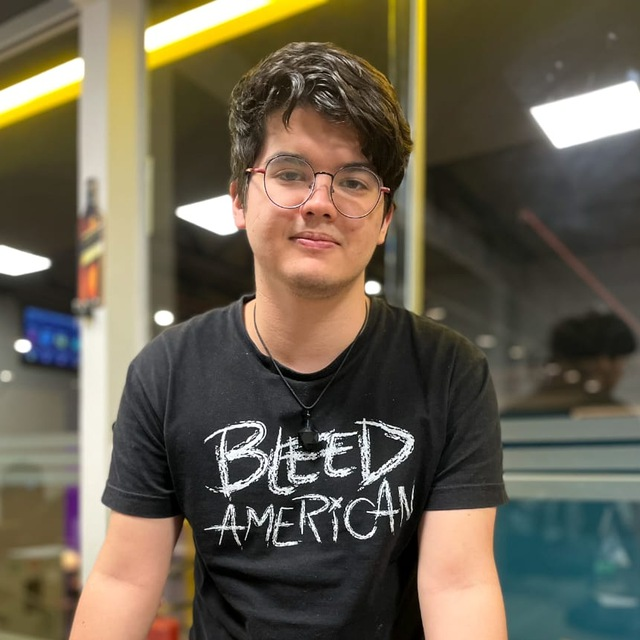

  

  
  <h3 style="color: #000000; text-align: center">

No mundo contemporâneo, a integração entre dispositivos inteligentes e processos automatizados tem revolucionado diversos setores, impulsionando a eficiência e a produtividade. Nesse contexto, surge o projeto ScanPoint como uma resposta inovadora para simplificar e aprimorar o processo de digitalização 3D e reprodução tridimensional de objetos físicos.

O ScanPoint é composto por uma mesa escaner e um aplicativo desktop. A mesa scaner foi desenvolvida com um Arduino e sensores infravermelhos, capazes de realizar leituras de objetos em tempo real. Esses dados são enviados para o aplicativo desktop, que permite o acompanhamento do processamento dos pontos capturados e serve de interface para a disponibilização do arquivo em formato STLe seu download. O processo de modelagem envolve a captura e processamento de dados para criar um modelo virtual o mais preciso possível. Esses modelos podem ser salvos e exibidos para o usuário, permitindo que reinicie o processo caso não esteja satisfeito antes de realizar o download.

Essa solução pode ser aplicada em diversos setores, como manufatura, engenharia, design de produtos e educação. A aceleração da produção é uma das principais vantagens, permitindo que modelos 3D sejam desenvolvidos rapidamente a partir de leituras instantâneas, aumentando a precisão, reduzindo custos e o tempo de produção. Por exemplo, na engenharia, o sistema pode ser utilizado para criar protótipos e peças com maior rapidez e precisão.

A adaptabilidade e versatilidade do ScanPoint são características fundamentais. O sistema é projetado para se ajustar a diferentes ambientes, desde residências até laboratórios e fábricas, tornando-o uma solução escalável e eficiente. Desenvolver um scanner 3D funcional a partir de componentes básicos, como um Arduino e sensores infravermelhos, apresenta desafios técnicos significativos, especialmente em termos de implementação do software e de calibração e funcionamento da estrutura, que podem afetar diretamente a qualidade/precisão da modelagem. Contudo, o projeto está focado em superar esses desafios para garantir a funcionalidade e a confiabilidade do sistema.

Além disso, há uma preocupação com o impacto ambiental e a sustentabilidade do processo de fabricação digital. O ScanPoint visa otimizar o uso de materiais e reduzir o desperdício através de algumas estratégias. O sistema permite a reutilização das peças utilizadas e, unido ao design modular, facilita a atualização e substituição de componentes individuais, prolongando a vida útil do dispositivo e reduzindo a necessidade de descarte total.

Para promover ainda mais a sustentabilidade, o ScanPoint pode ser compatível com materiais de impressão 3D ecológicos, como plásticos biodegradáveis ou reciclados, pois algumas das peças utilizadas na montagem da estruturas foram criadas a partir de impressões. Além disso, o projeto pode incluir iniciativas de reciclagem para o descarte adequado de componentes eletrônicos ao final de sua vida útil. Essas práticas contribuem para uma produção digital mais sustentável e ambientalmente responsável, alinhando-se com as melhores práticas de conservação ambiental e eficiência de recursos.

  </h3>

<h1 style="color: #000000; font-weight: bold; text-align: center"> Documentações e Código fonte </h1>

<a href="https://gitlab.com/lappis-unb/fga-pi2/semestre-2024-1/grupo-08/scanpoint/-/tree/main/docs?ref_type=heads">
  

	
  

	<h4 class="legenda">Geral</h4>
	<h6 class=legenda>Relatórios e informações gerais</h6>
</a>
<a href="https://gitlab.com/lappis-unb/fga-pi2/semestre-2024-1/grupo-08/scanpoint/-/tree/main/docs/software?ref_type=heads">
  

	
  

	<h4 class="legenda">Software</h4>
	<h6 class=legenda>Documentos e código fonte</h6>
</a>
<a href="https://gitlab.com/lappis-unb/fga-pi2/semestre-2024-1/grupo-08/scanpoint/-/tree/main/docs/eletronica-energia?ref_type=heads">
  

	
  

	<h4 class="legenda">Eletrônica/Energia</h4>
	<h6 class=legenda>Documentos e código fonte</h6>
</a>
<a href="https://gitlab.com/lappis-unb/fga-pi2/semestre-2024-1/grupo-08/scanpoint/-/tree/main/docs/estruturas?ref_type=heads">
  

	
  

	<h4 class="legenda">Estruturas</h4>
	<h6 class=legenda>Documentos e modelos</h6>
</a>

<h1 style="color: #000000; font-weight: bold; text-align: center"> Equipe </h1>
<h2 style="color: #000000; text-align: center"> Software </h2>

<a class="pessoa" href="https://gitlab.com/brendavsantos">
  

    
  

  <h4 class="legenda">Brenda Santos</h4>
</a>
<a class="pessoa" href="https://gitlab.com/dennielwilliam">
  

    
  

  <h4 class="legenda">Denniel William</h4>
</a>
<a class="pessoa" href="https://gitlab.com/Carlacangussu">
  

    
  

  <h4 class="legenda">Carla Rocha</h4>
</a>
<a class="pessoa" href="https://gitlab.com/pemiinem">
  

    
  

  <h4 class="legenda">Pedro Menezes</h4>
</a>
<a class="pessoa" href="https://gitlab.com/AnaCarolinaRodriguesLeite">
  

    
  

  <h4 class="legenda">Ana Carolina</h4>
</a>
<a class="pessoa" href="https://gitlab.com/GuilhermeBES">
  

    
  

  <h4 class="legenda">Guilherme Basílio</h4>
</a>
<a class="pessoa" href="https://gitlab.com/art_42">
  

    
  

  <h4 class="legenda">Artur de Souza</h4>
</a>
<a class="pessoa" href="https://gitlab.com/ciro-c">
  

    
  

  <h4 class="legenda">Ciro Costa</h4>
</a>
<a class="pessoa" href="https://gitlab.com/viniciusvieira00">
  

    
  

  <h4 class="legenda">Vinicius Vieira</h4>
</a>

<h2 style="color: #000000; text-align: center"> Energia </h2>

<a class="pessoa" href="https://gitlab.com/carolinaroliveira02">
  

    
  

  <h4 class="legenda">Carolina Oliveira</h4>
</a>
<a class="pessoa" href="https://gitlab.com/lcs.pantoja.silva">
  

    
  

  <h4 class="legenda">Lucas Pantoja</h4>
</a>

<h2 style="color: #000000; text-align: center"> Eletrônica </h2>

<a class="pessoa" href="https://gitlab.com/migueleparra">
  

    
  

  <h4 class="legenda">Miguel Munoz</h4>
</a>

<h2 style="color: #000000; text-align: center"> Aeroespacial </h2>

<a class="pessoa" href="https://gitlab.com/mariaclaudialgaspar">
  

    
  

  <h4 class="legenda">Maria Cláudia</h4>
</a>
<a class="pessoa" href="https://gitlab.com/Calcioft">
  

    
  

  <h4 class="legenda">Cássio Filho</h4>
</a>

<h2 style="color: #000000; text-align: center"> Automotiva </h2>

<a class="pessoa" href="https://gitlab.com/soaressc321">
  

    
  

  <h4 class="legenda">Diogo Soares</h4>
</a>

