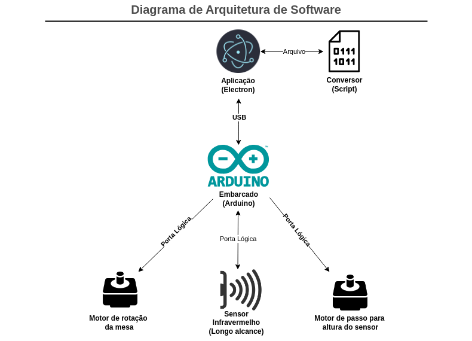

# Arquitetura de Software

 Esta sessão elenca todos os itens de arquitetura de software, como os componentes utilizados, sua comunicação e as tecnologias utilizadas.

## Componentes 

A arquitetura de software está dividida nos seguintes componentes:

- Aplicação: Desenvolvida em Electron, cuida de toda a interação com usuário e sinais para comunicação com o embarcado. Ela possui um front-end com opções iterativas para o usuário controlar o sistema;
- Script de conversão: Vai converter o arquivo de texto com as informações espaciais do objeto e transformar em .stl(formato para impressão 3D)
- Embarcado: Usando uma Arduino, ela faz a comunicação com os componentes do sistema e retorna o arquivo de texto com os dados espaciais do objeto;
- Sensor Infravermelho: Irá fazer a leitura de distâncias, mapeando o objeto;
- Motor de rotação: Irá girar a mesa onde o item está posicionado, possibilitanto a leitura do objeto em 360 graus;
- Motor de regulação de altura: Irá possibilitar a regulação da altura do sensor infravermelho, assim passando por todo o comprimento do objeto;

A relação entre os componentes está elencada no diagrama abaixo:

## Metas e Restrições Arquiteturais
### Metas
- O aplicativo deve ser de fácil utilização
- O aplicativo deve garantir o escaneamento do objeto posto na mesa
- O aplicativo não precisa de conexão a internet
- O aplicativo deve desempenhar suas funções de forma eficiente

### Restrições
- A aplicação deverá ser disponibilizada por meio um aplicativo de computador
- É necessário possuir um desktop ou notebook para utilização.
- Para funcionamento pleno ele deve estar conectado ao scanner.
- Deve ser desenvolvida em JavaScript (Interface), Python(Processamento de pontos de nuvem) e C(Sistema embarcado).

## Diagrama de arquitetura de software 

Fonte: [Diagrama de Arquitetura de Software](https://app.diagrams.net/#G152ySAVfwL1QUKcdnSeAaXdJ9Q1nRN_6T#%7B"pageId"%3A"C2fSY1v2SiZeoUbDoYyL"%7D).

## Tecnologias

AS tecnologias de software utilizadas nesse projeto foram:

- Electron: É um framework open-source para criar aplicações Desktop usando tecnologias web para Windows, mac e Linux, com base no Chromium e Node.js; <a href="../software/arquitetura.md#ref1">[1]</a>

- Arduino: É uma plataforma open-source com hardware e software com fácil aprendizagem. As placas Arduino tem a capassidade de registrar entradas diferentes, como botões, sinais de sensores, etc. Para programar as placas, existe o Arduino IDE (que é multiplataforma), com sua própria linguagem de programação. <a href="../software/arquitetura.md#ref2">[2]</a>

## Visão de caso de uso

Seguindo um nível maior de abstração em comparação a outros tópicos tratados no documento, a visão de casos de uso visa auxiliar no entendimento das interações dos atores com o sistema de forma a descrever os cenários de uso da aplicação. Para mais detalhes sobre o caso de uso o documento está disponível em [caso de uso](casos-de-uso.md).

<iframe frameborder="0" style="width:100%;height:300px;" src="https://viewer.diagrams.net/?tags=%7B%7D&highlight=0000ff&edit=_blank&layers=1&nav=1&title=Diagrama%20de%20Casos%20de%20Uso%20-%20Mesa%20Scanner%20-%20PI2#Uhttps%3A%2F%2Fdrive.google.com%2Fuc%3Fid%3D1zYgIWynN482pM8h9dsHU6t2AOqzia8oi%26export%3Ddownload"></iframe>

Figura 1: [Diagrama Casos de Uso](https://viewer.diagrams.net/?tags=%7B%7D&highlight=0000ff&edit=_blank&layers=1&nav=1&title=Diagrama%20de%20Casos%20de%20Uso%20-%20Mesa%20Scanner%20-%20PI2#Uhttps%3A%2F%2Fdrive.google.com%2Fuc%3Fid%3D1zYgIWynN482pM8h9dsHU6t2AOqzia8oi%26export%3Ddownload).

## Visão Lógica
### Visão Geral

As visões de uma determinada arquitetura são abstrações dos modelos já criados para o projeto. Na ocasião da visão lógica, o objetivo é decompor os subsistemas e seus respectivos pacotes, apresentando as suas principais características, a fim de melhorar a qualidade de qualquer documento de modelagem já elaborado. O objetivo não é entrar em muitos detalhes por ser responsabilidade da própria modelagem e dos documentos criados para cada aspecto.
 

### Diagrama de pacotes
O diagrama de pacotes descreve a estrutura de pastas e módulos divididos para interface. Abaixo segue o diagrama de pacotes referente a interface, para mais detalhes acesse [diagrama de pacotes](diagrama-de-pacotes.md).

<iframe frameborder="0" style="width:100%;height:400px;" src="https://viewer.diagrams.net/?tags=%7B%7D&highlight=0000ff&layers=1&nav=1&title=Diagrama%20de%20Pacotes.drawio#Uhttps%3A%2F%2Fdrive.google.com%2Fuc%3Fid%3D1OZjpVScP9D7Csr7_BQcHX6EjR7xMO650%26export%3Ddownload"></iframe>

Figura 1: [Diagrama de Pacotes](https://viewer.diagrams.net/?tags=%7B%7D&highlight=0000ff&layers=1&nav=1&title=Diagrama%20de%20Pacotes.drawio#Uhttps%3A%2F%2Fdrive.google.com%2Fuc%3Fid%3D1OZjpVScP9D7Csr7_BQcHX6EjR7xMO650%26export%3Ddownload).

## Referências

>[1][What is Electron? Acesso em 28 de abril de 2024.](https://www.electronjs.org/docs/latest/)

>[2] [What is Arduino? Acesso em 28 de abril de 2024.](https://docs.arduino.cc/learn/starting-guide/whats-arduino/?_gl=1*23ysxj*_ga*MTE4MTM4NjIyMS4xNzE0MzI5NTA3*_ga_NEXN8H46L5*MTcxNDMyOTUwNi4xLjEuMTcxNDMyOTU0MS4wLjAuMTI1MzcwNzA4Mw..*_fplc*cTIzWiUyRjhGOVMlMkZVbUlwOXY4U2ptYnJXUEJXUER4ODFoZUg3c1g3QkNVT3djVkpoRTF5MEE0dVBIYlVWRmI3RGlZVHJXNHZlMm5KUmhhcVJHSTc5RW5CSWtCVDFSRGd1SjVhR08wNXlWSW1EZGVKTHZORm5mTzJVajk3QWFtdyUzRCUzRA..)

>[3] [Diagrama de arquitetura de software. Acesso em 03 de abril de 2024.](https://app.diagrams.net/#G152ySAVfwL1QUKcdnSeAaXdJ9Q1nRN_6T#%7B"pageId"%3A"C2fSY1v2SiZeoUbDoYyL"%7D..)

## Tabela de versionamento

| Versão| Data | Descrição | Responsável|
|-------|------|-----------|------------|
| 1.0 | 28/04/2024 | Criação da estrutura do documento | Artur de Souza |
| 1.1 | 03/05/2024 | Atualização do documento | Denniel William |
| 1.2 | 03/05/2024 | Corrigido Formatação | Artur de Souza |
| 1.3 | 03/05/2024 | Adicionando referencia e legenda ao diagrama | Guilherme Basilio |

