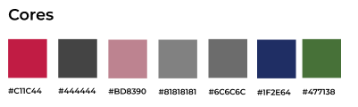
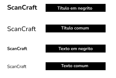
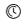
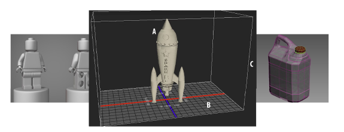
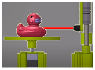
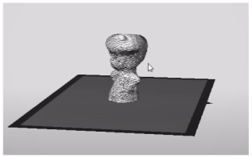
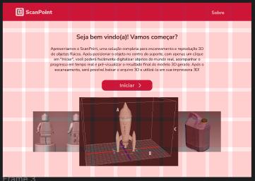

# Documento de Identidade

## Visão geral do produto
O software do ScanPoint é responsável por ser a interface com o usuário  no processo de escaneamento e reprodução 3D de objetos físicos. Além disso, é responsável por receber os pontos coletados, transformá-los em uma malha de pontos e devolver o arquivo stl ao usuário no final do processo.

## Logo e Identidade Visual
A identidade visual do ScanPoint é representada por sua logo distintiva, que encapsula a essência do produto. O design da logo reflete a ideia do produto, que seria uma solução compacta para escanear e disponibilizar escaneamentos.

## Cores
As cores escolhidas para o ScanPoint foram cuidadosamente selecionadas para harmonizar com a logo e trazer uma experiência contínua e homogênea ao experimentar as interfaces do produto. Para isso, foram selecionadas:

## Tipografia
A tipografia desempenha um papel fundamental na comunicação visual do ScanPoint. A escolha da fonte Nunito Sans reflete o compromisso com a clareza e a legibilidade, garantindo uma experiência de usuário agradável e intuitiva.

No ScanPoint a fonte utilizada é a Nunito Sans. Para título as fontes são negritas e de tamanho 32, para paragráfo e textos comuns o tamanho é 20 e para subtítulos as fontes são semi negrito de tamanho 26.

## Ícones e Elementos Gráficos
Os ícones e elementos gráficos utilizados no ScanPoint são projetados para facilitar a compreensão e a navegação do usuário. Cada ícone foi cuidadosamente escolhido para representar uma função específica, garantindo uma experiência de usuário coesa e intuitiva.

Os ícones utilizados no PointScan:

* 
* 
* 
* 
* 
* 
* 
* 

Os elementos utilizados para compor as telas são:

* 
* 
* 
* 

## Layout e Grid:

Para manter o padrão em todas as telas foi utilizado o um grid com 6 linhas e 11 colunas.

## Componentes de Interface do Usuário

### Botões
* 
* 
* 
* 
* 
* 

### Barras de progresso

## Navegação

Com o objetivo de melhorar a experiência do usuário na aplicação foi criada uma barra de navegação no topo da tela para falicitar a transição entre as telas sobre e do processo em si, como demostrado na imagem abaixo:

## Responsividade

A responsividade é uma característica fundamental do ScanPoint, garantindo uma experiência consistente e otimizada em uma variedade de tamanhos de tela. A interface do usuário foi projetada para se adaptar dinamicamente às diferentes resoluções e proporções, garantindo que os usuários possam acessar e utilizar o ScanPoint de forma eficaz, apesar de não poder utilizar em dispositivos diferentes de desktop.

## Tabela de versionamento

| Versão| Data | Descrição | Responsável|
|-------|------|-----------|------------|
| 0.1 | 27/04/2024 | Criação da estrutura do documento | Carla R. Cangussú |
| 0.2 | 27/04/2024 | Feito até Ícones e Elementos Gráficos | Carla R. Cangussú |
| 0.3 | 29/04/2024 | Finalização do documento | Carla R. Cangussú |
| 0.4 | 29/04/2024 | Ajuste de formatação | Carla R. Cangussú |
| 0.5 | 29/04/2024 | Ajuste no caminho de algumas imagens | Carla R. Cangussú |
| 1.0 | 29/04/2024 | Arrumando paths, imagens, textos e formatação | Brenda Santos |