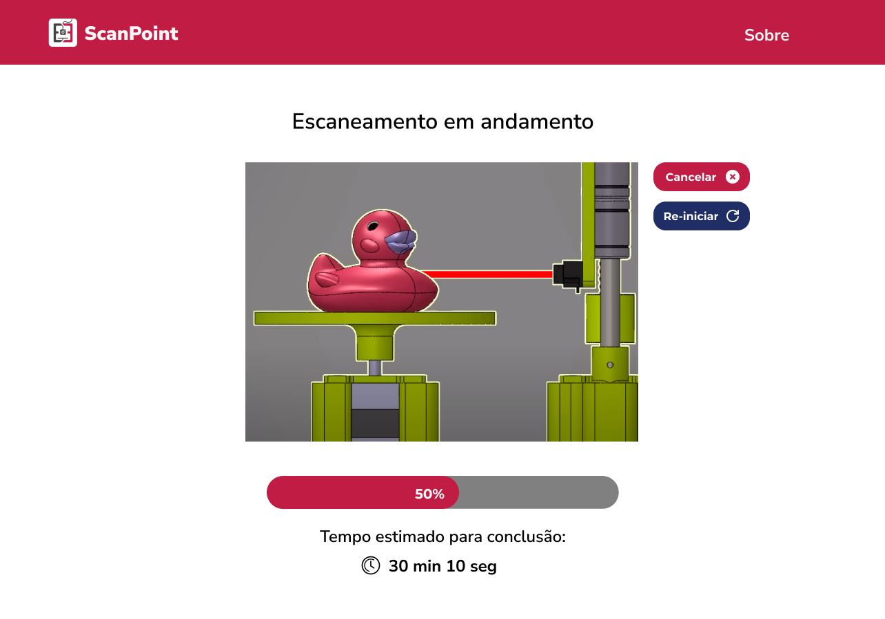

# Protótipo de alta fidelidade

Este documento tem como objetivo apresentar uma representação detalhada do protótipo de alta fidelidade, que servirá como uma visualização tangível do produto final em relação ao software que será disponibilizado para interação com usuário. Ao proporcionar uma visão abrangente das interfaces e funcionalidades do ScanPoint, este documento visa garantir a compreensão clara e precisa de sua aparência e operação. Por meio do protótipo de alta fidelidade, os stakeholders terão a oportunidade de revisar e validar os elementos-chave do ScanPoint, contribuindo assim para o refinamento e aprimoramento contínuos do projeto.

[Link para o protótipo](https://www.figma.com/file/vCmfCgivle5xlXUYDElVrE/Identidade-visual?type=design&node-id=0%3A1&mode=design&t=DbKNrVOWZH43kGEs-1)

## Tela inicial

Telas desenhadas para fornecer uma breve introdução ao usuário sobre o produto e permitir que inicie o processo de escaneamento da forma correta.

<figure>
  
  <figcaption>
  
  **Figura 1:** Tela inicial 1
  Fonte: Autoria própria</figcaption>
</figure>

<figure>
  
  <figcaption>
  
  **Figura 2:** Tela inicial 2
  Fonte: Autoria própria</figcaption>
</figure>

## Tela de processamento

Tela idealizada para manter o usuário atualizado em relação ao tempo restante para finalizar o processamento e permitir que o processo seja interrompido ou re-iniciado, caso seja detectado algum problema no momento do processamento.

<figure>
  
  <figcaption>
  
  **Figura 3:** Tela de processamento
  Fonte: Autoria própria</figcaption>
</figure>

## Tela de erro

Tela desenhada para indicar que houve algum erro durante o processamento, indicando possíveis ações para que o processamento possa ser realizado apesar do erro e a causa provável. 

<figure>
  
  <figcaption>
  
  **Figura 4:** Tela de erro
  Fonte: Autoria própria</figcaption>
</figure>

## Tela de conclusão

Tela que informa que o processo foi concluído com sucesso. A tela mostra uma breve pré-visualização do esquema escaneado e permite que o usuário reinicie o processo, caso não esteja satisfeito com o resultado, baixe o arquivo resultante ou volte à tela inicial da aplicação.

<figure>
  
  <figcaption>
  
  **Figura 5:** Tela de conclusão
  Fonte: Autoria própria</figcaption>
</figure>

## Sobre

Tela informativa sobre a idealização do projeto e sobre a equipe envolvida no desenvolvimento. 

<figure>
  
  <figcaption>
  
  **Figura 6:** Tela de sobre
  Fonte: Autoria própria</figcaption>
</figure>

## Tabela de versionamento

**Tabela 1:** Tabela de versionamento do documento Protótipo de alta fidelidade

| Versão| Data | Descrição | Responsável|
|-------|------|-----------|------------|
| 1.0 | 02/05/2024 | Criação do documento | Brenda Vitória |
| 1.1| 03/05/2024 | Refatoração do documento| Pedro Menezes Rodiguero |
