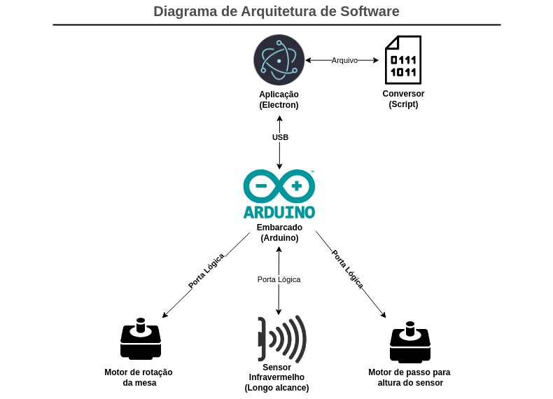

# Arquitetura do Subsistema de Software

## Arquitetura de Software
A arquitetura do software está definida no diagrama abaixo, sendo dividido no aplicativo, no conversor, no embarcado, sensor infravermelho e dois motores:

Para atingir os objetivo será utilizado três tecnologias: Electron, para o aplicativo, Python para o processamento da nuvem de pontos e Arduino, para o embarcado.
Mais detalhes na pagina de [Arquitetura de Software](arquitetura.md)

* **Aplicação ScanPoint:** A aplicação desktop será responsável pelo controle do processo de criação do STL. Ela que será responsável por chamar o software de processamento do pointcloud para a conversão para STL e interagir com o usuário final.

* **Arduino:** responsável por receber dados provenientes dos sensores, realizando o processamento necessário e transmitindo essas informações para a aplicação Electron. Além disso, assume o controle dos motores, gerenciando seu funcionamento e movimentação de acordo com as instruções fornecidas pela aplicação. No âmbito operacional, o Arduino opera como uma unidade mestra, coordenando e controlando o fluxo de dados entre os diferentes componentes do sistema.

* **Script para processamento de pointcloud:** Responsável pela leitura dos pontos do objeto devolvidos pelo arduíno fazendo a modelagem do objeto através desses pontos, sendo assim, por fim, gerando o arquivo STL ou g-code.

## Interface

### Guia de estilo
Foi desenvolvido um guia de estilo que irá elucidar sobre os padrões e a estilagem da interface principal da aplicação que será desenvolvida em Electron.
Mais detalhes na pagina de [Documento de identidade](identidade.md)

### Protótipo de alta fidelidade
Com sentido de orientar sobre o formato das telas e disposição de seus elementos como descrição de comportamento e interação da interface, foi desenvolvido um protótipo de alta fidelidade.
Mais detalhes na pagina de [Protótipo de alta fidelidade](prototipo.md)

### Tecnologia utilizada
O Electron é um framework open-source para criar aplicações Desktop usando tecnologias web para Windows, mac e Linux, com base no Chromium e Node.js. Seu lançamento completa 10 anos o que já demonstra uma certa robustez, apesar de recente ainda possui material para ser utilizado como base. [[1]](../software/subsistema-software.md#ref1)

## Script de processamento PointCloud

Após a leitura de todos os pontos de distância feito pelos sensores ligados ao arduíno, o arquivo .txt gerado deve ser passado por um script de conversão desenvolvido em Python, usando a biblioteca NumPy.

No geral ele irá ler todos os valores de distância do arquivo txt e irá processar os dados, aplicando a distância do sensor ao ponto de leitura, transformar em uma matrix de rotação e depois em pontos catesianos. Em seguida elimina todos os pontos fora de alcance do sensor e passa todos os valores para ser convertido em STL.

## Comunicação com arduíno

A comunicação será feita principalmente, e unicamente, através de um cabo USB. Sendo mandado os sinais por parte da interface para interação com o scanner (exemplo: início do motor, ligar o infravermelho, e etc), como a transmissão, por parte do arduíno, do arquivo .txt contendo os pontos do objeto lidos pelo infravermelho.

## Software embarcado
Pela parte embarcada será utilizada a linguagem C. Sendo feito o controle dos motores, leitura do infravermelho, gravação no arquivo .txt e envio.

## Referências

>[1][What is Electron? Acesso em 28 de abril de 2024.](https://www.electronjs.org/docs/latest/)

## Tabela de versionamento

| Versão| Data | Descrição | Responsável|
|-------|------|-----------|------------|
| 0.1 | 29/04/2024 | Criação do documento | Artur Vieira |
| 0.2 | 30/04/2024 | Adição da comunicação com arduíno | Guilherme Basílio |
| 0.3 | 30/04/2024 | Adição da tecnologia utilizada | Ciro Araújo |
| 1.0 | 02/05/2024 | Formatação e adição do software embarcado | Denniel William |
