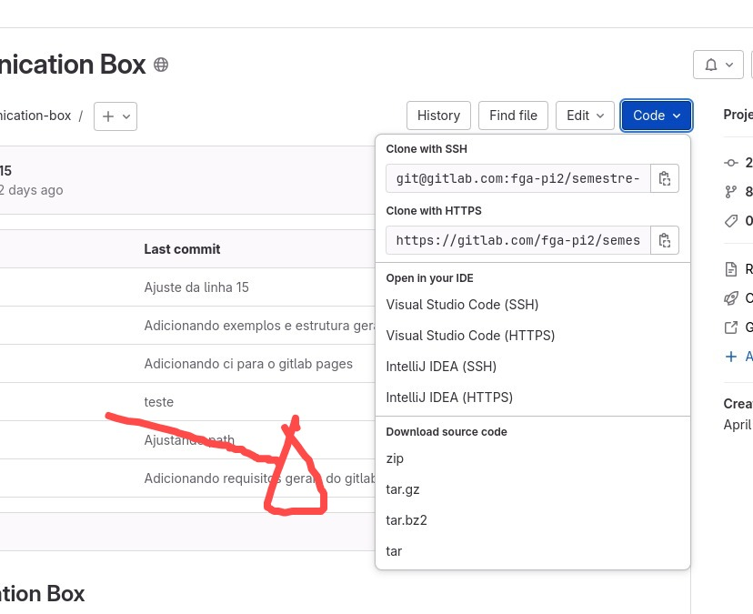

# Como Rodar os documentos

## Requisitos
O único requisito é o [Python 3](https://www.python.org/downloads/) e um terminal ou linha de comando para rodar os comandos de instalação. Ex: Gitbash, CMD, powershell, etc.

**OBS:** Precisaremos do [PIP](https://pip.pypa.io/en/stable/installation/) que é um gerenciador de pacotes do Python normalmente ele já vem instalado.

## Clonando o repositório

O repositório pode ser baixado como um arquivo compatado ou clonado usando git

Para baixar o repositório usando git é sõ executar essa linha de comando

```bash
 $ git clone https://gitlab.com/lappis-unb/fga-pi2/semestre-2024-1/grupo-08/scanpoint.git
```

Para fazer dowload do repositório é clicar em clone depois no formato desejado e depois extrair




## Intalando e rodando

Depois de baixado entre na pasta do repositório e execute os seguintes comandos

```bash
# Cria um ambiente virtual
$ python3 -m venv venv

# Entra no ambiente virtual
$ source venv/bin/activate

# Instala as dependencias
$ pip install -r requirements.txt

# Rodando os docs

$ mkdocs serve

```
 Depois do ultimo commando os documentos irão estar disponíveis no http://localhost:8000

**OBS:** Para sair do ambiente virtual do python basta digitar
```bash

$ deactivate 

```